---
# Page settings
layout: default
keywords:
comments: false

# Hero section
title: COMP140 - Lecture Materials 2

# Author box
author:
    title: Matt Watkins
    description: Lecturer in Computing at Falmouth University

# Micro navigation
micro_nav: true

# Page navigation
page_nav:
    prev:
        content: Electrical Circuits
        url: '../electrical-circuits-lm'
    next:
        content: OOP
        url: '../oop-lm'
---

# Arduino TEST

The following materials are derived from the *Arduino lecture*. The video lecture is included at the bottom of the [document](#video-lecture).
{: .callout .callout--warning}

In this lecture we will look at Arduino in subsequent lectures we will explore the other elements of the workflow. TEST

## Introduction to the Arduino UNO  
The Arduino UNO is a single board microcontroller designed to be used as a controller for robotics and electronics projects.

### The Board

The Arduino is essentially a microcontroller with a range of peripherals attached to a **PCB** (printed circuit board) that allow for differnet externals to interface with the microcontroller these include things like: power, usb serial port for uploading firmware programs from a computer, a clock and most importantly it uses **pin** inputs so sensors and actuators can communicate with the controller.

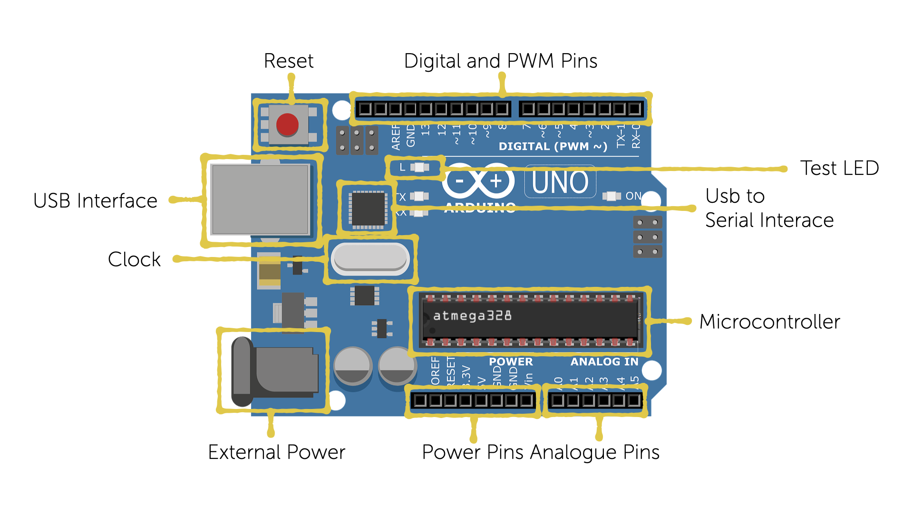
*fig1. - Arduino Board Layout*

### The Micro Controller

A micro controller is different from a microprocessor that consists of only a Central Processing Unit, whereas a Micro Controller has a range of other components and peripherals.

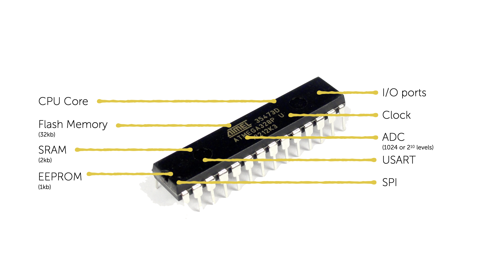
*fig2. - Microcontroller Features*

- **CPU** - The main function of the CPU Core is to ensure the correct program execution. The CPU must therefore be able to access memories, perform calculations, control peripherals, and handle interrupts.
- **Flash Memory** - Program Space. This is where the program you will write known as a ‘sketch’ is stored. There is 32kb of Flash Memory
- **SRAM** - (Static Random Access memory This is where the sketch creates and manipulates variables when it runs. The SRAM is only 2kb
- **EEPROM** - is memory space that programmers can use to store long term information. You are probably familiar with the term ROM from previous studies. EEPROM is only 1024 bytes
- **I/O Ports** - These are bi directional ports to manage communication between the CPU and peripherals.
- **Clock** - The clock can run at 16 MHz or 16 million cycles a second.
- **ADC** = 10 bit ADC means it has the ability to manage 1,024(2 to the power of 10) discrete analog levels. We will look at analogue later in this presentation.
- **USART** - Universal synchronous and asynchronous receiver transmitter - Used for communication between the microcontroller and computers on other devices
- **SPI** - Serial Peripheral Interface allows high speed synchronous data transfer between the device and peripheral units, or between several AVR devices, the CPU on the ATmega is AVR

### Form Factor

The controller is the essential bit you could make your own board up by adding the other peripherals manually, as in the example below, but the Arduino board is a cheap effective and less time consuming alternative to building your own.

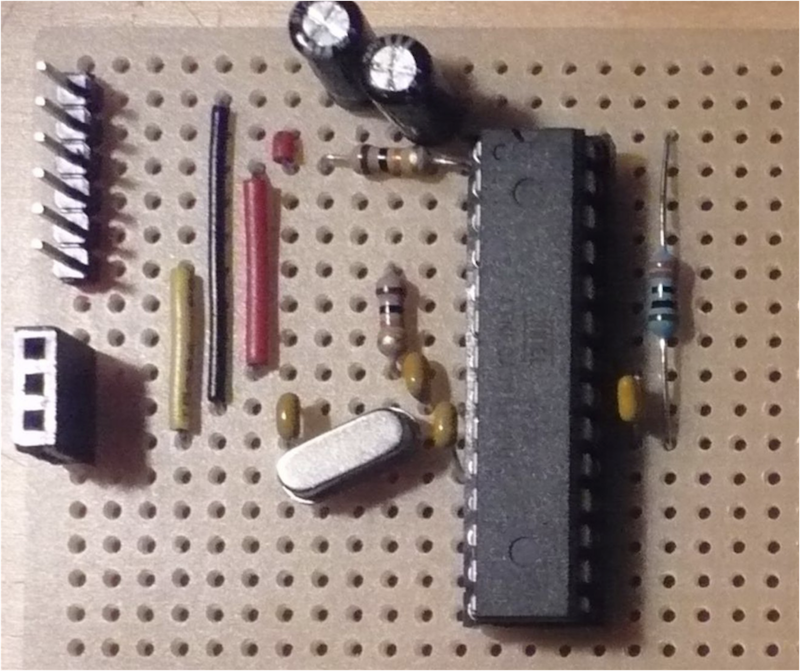
*fig3. - Home Made Arduino Board*

## What is the purpose of an Arduino Board?

It's a rapid prototyping board. It gives you the ability to quickly plug pins from the Arduino to devices and components on a bread board to rapidly prototype creative electronic projects.

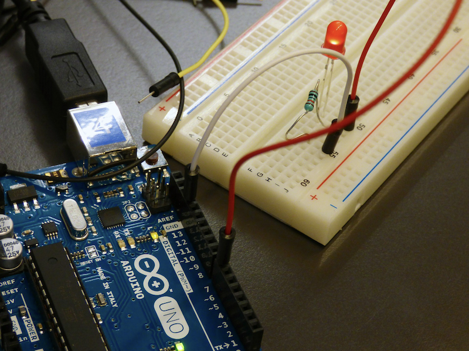
*fig4. - Arduino, breadboard, LED and resistor*

Arduino is often thought of as the preserve of hobbyists and creative makers, but it has other more serious applications.

| ArduSat  | OceanBot |
|--|--|
|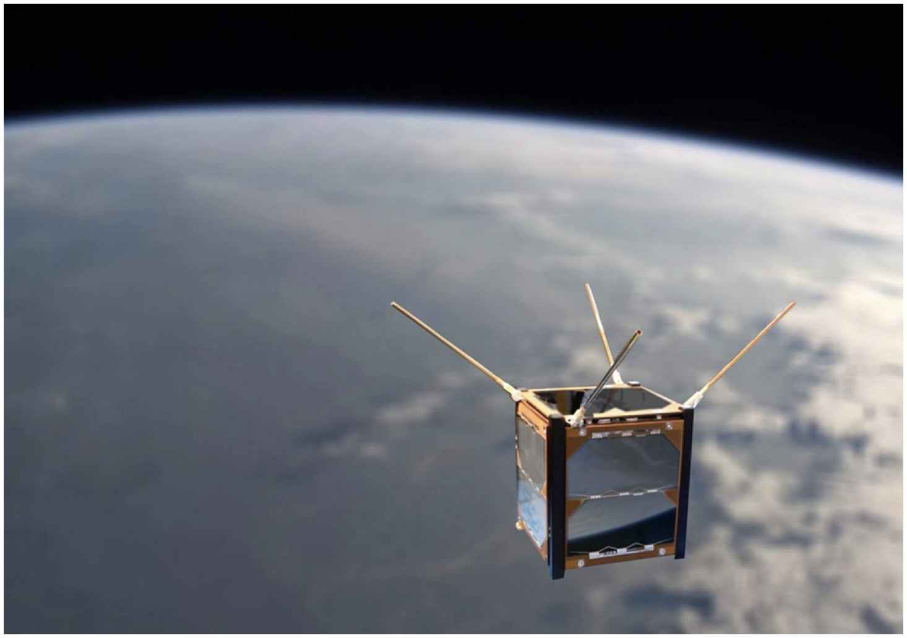|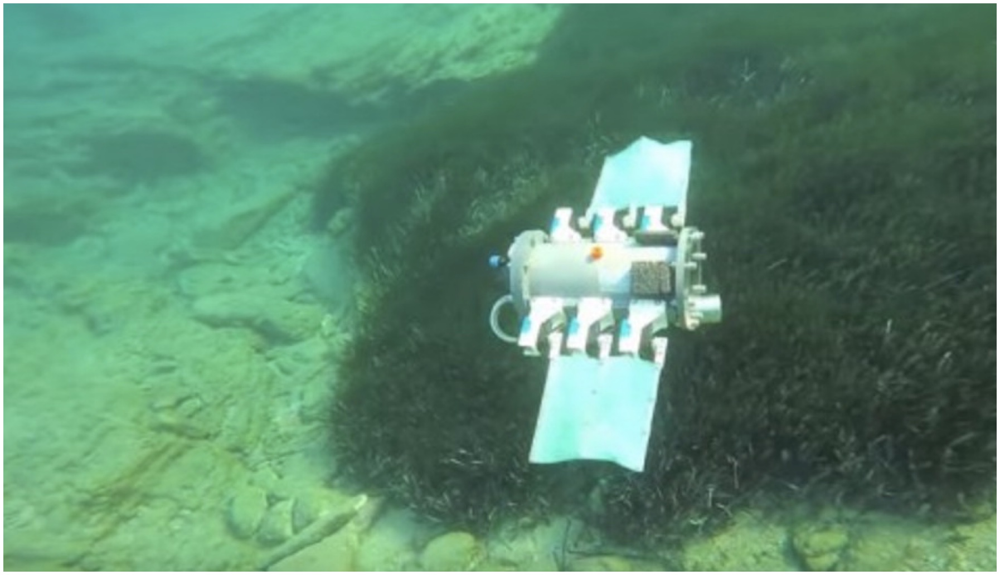|
| The **ArduSat** satellites are powered by the Arduino Uno. It  follows cube satellite (CubeSat) standards to build  compact 10 cm cubes that can easily be sent to orbit. The company has "the goal to democratize access to space". | This robot prototype swims underwater and is propelled by fins, it was developed at the Control Systems and Robotics  Laboratory of the **Technological Educational Institute of  Crete**, in Heraklion (Greece) and it’s controlled by an  Arduino Mega. |

## Principles of Robotics
To further understand how to apply Arduino in your own practice it is useful to think of the 3 key principles of robotics and engineering this is also referred to as **Process Control**:

- **Sensing** - measuring an input, like a button press or change in light levels.
- **Controlling**- adjusting an *actuator* in response to the measurement from the *sensor*
- **Actuating**- manipulation in order to cause an action

A common example of this is the humble **toilet**. The sensor is the ballcock or float in the cistern that measures the level of the water. If the water is too low it will open the valve to allow more water into the cistern. The valve is the actuator as it manipulates a mechanism to cause an action - to allow or to prevent the flow of water. The controller is a small screw that allows the user to adjust the height that the float reaches before opening the valve.

<iframe width="100%" height="400" src="https://www.youtube.com/embed/v_kMOMYq0MU" title="YouTube video player" frameborder="0" allow="accelerometer; autoplay; clipboard-write; encrypted-media; gyroscope; picture-in-picture" allowfullscreen></iframe>

*fig 5. - Petit Mal by Simon Penny*

The above video showcases a robot designed by Simon Penny in 1996. The goal of 'Petit Mal' is to produce a robotic artwork which is truly autonomous.  This example is particularly relevant to the above principles. The robot is **sensing** using an array of ultrasound sensors to detect the presence of a human and responding by getting close and then backing away. Its **actuators** - the motors are being driven in different directions by the **controller** which in turn is adapting to the input from the sensors. This is a constant feedback loop.

Simon Penny its creator describes the robot as being: 

> *"..nimble and charming; sensing and exploring architectural space and pursuing and reacting to people; giving the impression of intelligence but displaying a behavior which is neither anthropomorphic nor zoomorphic, but which is unique to its physical and electronic nature."*

This is something to think about with your projects. how can you create a project that defies the usual expectations of interaction. How can we challenge our assumptions about human or animal interfaces with machines. How robots can appear to convey emotions like curiosity or aggression. Robots are different beings with a very different situated intelligence.

In another lecture I will introduce **cybernetics** and we will look at the concept of *situated intelligence* in more detail.

## Control Systems

To create a system relevant to this module you need to define what sensors, controllers and actuators are needed to realise your particular experience. I have provide some examples here that can form the building blocks for your system. I have listed some examples but there are many more that you could use. These come in the form of components that are easily bought very cheaply, some can also be found in common consumer devices.

As **Unity** is part of this project we can consider it as either a sensor because we can detect changes in a virtual environment - for instance a ball colliding with the ground or we can see it as an actuator it can make game object appear or move in a rendered scene.

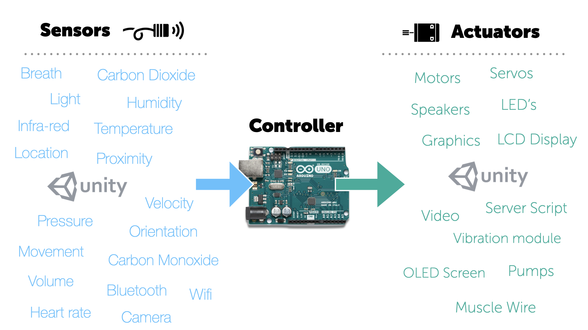

*fig6. - Different types of sensor and actuator*

Here are a couple of examples of custom control systems for games. 

<iframe width="640" height="360" src="https://web.microsoftstream.com/embed/video/102cf50c-8b78-46f8-8f6b-6d8667799120?autoplay=true&showinfo=false" allowfullscreen style="border:none;"></iframe>

IN the first example a large exercise ball is being used as a control system for a game about world domination. This has the interesting effect of literally giving you the feeling of having the whole world in your hands. The use of rotary encoders to map relative rotation of the ball in both a vertical and horizontal direction to a virtual globe in the game is very effective. 

<iframe width="640" height="360" src="https://web.microsoftstream.com/embed/video/edfc0c55-7464-45f4-a503-87a6176ab470?autoplay=true&showinfo=false" allowfullscreen style="border:none;"></iframe>

In the second example here are some of my friends playing *Samba de Amigo* designed for the **Wii controller** in 1999. The Wii controller makes use of an infrared bar that detects the position of the controller in vertical and horizontal space and accelerometers in the hand controller which detect the nature and speed of the movement in 3d space. The Wii controllers had this maracca wrap around to enhance the immersion in this frenetic rhythm game.

## How the Arduino Processes the World

The Arduino can only process electronic signals. This means that stimuli from the physical world needs to be transduced  to electrical signals before they can be processed from within your code. Any *actuators* or *sensors* need to be plugged into the specific pins on the board so it can function as a *controller* for your system.

-   14 **Digital** IO pins (0-14)
-   6 **Analogue in** pins(0-5)
-   6 **Analogue out** pins(3,5,6,9,10, and 11)

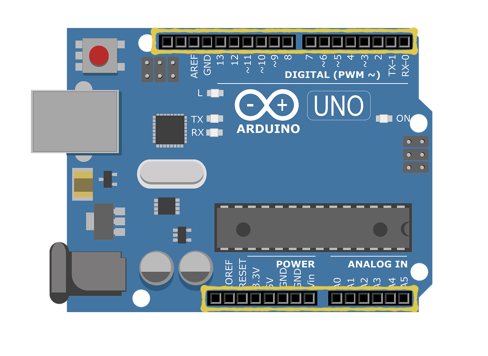
*fig 7. - Pins on an Arduino*

### Analogue vs Digital
Analogue waves are smooth and continuous, digital waves are stepping, square, and discrete. When you are were processing audio waves in COMP120 you probably encountered this issue.

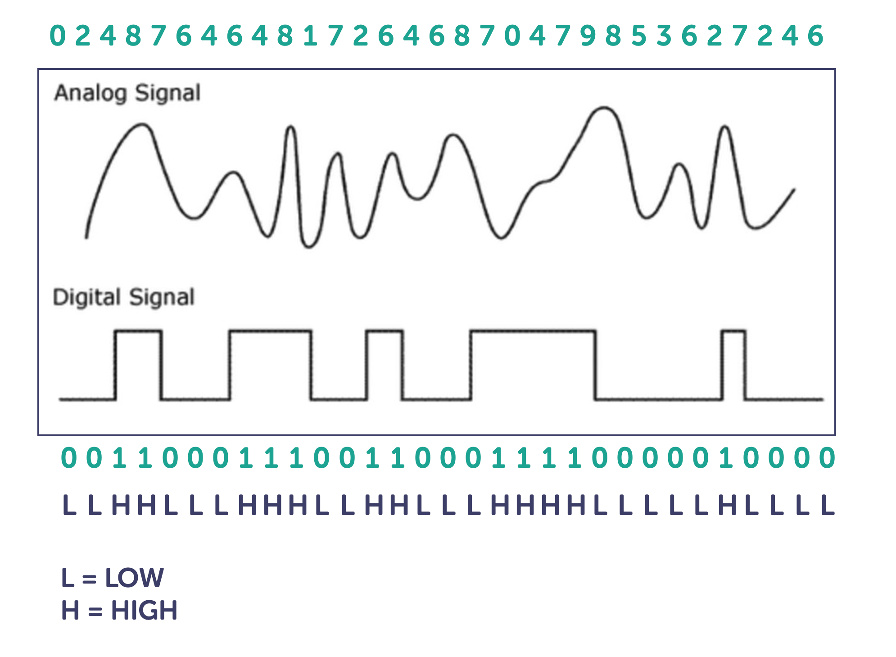
*fig 8. - The Difference between Analogue and Digital Signals*

- A **light switch** is on or off of we can say that the electrical signal is LOW or HIGH That is a **digital device**, and gets connected to a digital pin.

- A **humidity sensor** can have a range of resistances from none to some maximum value. Depending on the amount of moisture in contact with the sensor. That is an **analogue device**, and gets connected to an analog pin.

### Pulse Width Modulation (PWM)

Pulse width modulation (PWM) is a modulation technique that generates variable-width pulses to represent the amplitude of an analog input signal. ... PWM is widely used in ROV (remotely operated vehicle) applications to control the speed of a DC motor and/or the brightness of a lightbulb in a dimmer switch for example, or control the rotated position of a servo motor.

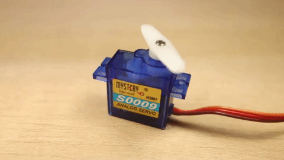

*fig 9. - Servo motor being controlled with PWM*

Pulse width modulation is a great method of controlling the amount of power delivered to a load without dissipating any wasted power. PWM is ideal control the speed of a fan or to dim the brightness of DC lamps or LED's. If you need to control it, then use Pulse Width Modulation to do it.

Essentially, it's using electrical pulses like morse code to transmit a specific message through the electrical power itself.

If you are using a PWM device with Arduino you connect them to the pins marked with **~**. In figure 8 you can see them as pins - 3,5,6,9,10 and 11.

## Power

Arduino is an autonomous system that you can use independently of your computer, however once disconnected from your computers USB serial port it requires power. This can be provided through either:

- DC power supply such as a 9v battery
- DC mains adaptor

### Driving Large Loads

You may want to control heavy duty electrical items like industrial motors or AC powered lights. You will need to use a transistor which is a semiconductor device or more commonly known as a transistor used to amplify or switch electronic signals and electrical power. You will need to be careful here as this is where there is a danger of frying your Arduino or yourself. We will examine the role of transistors in a later lecture.

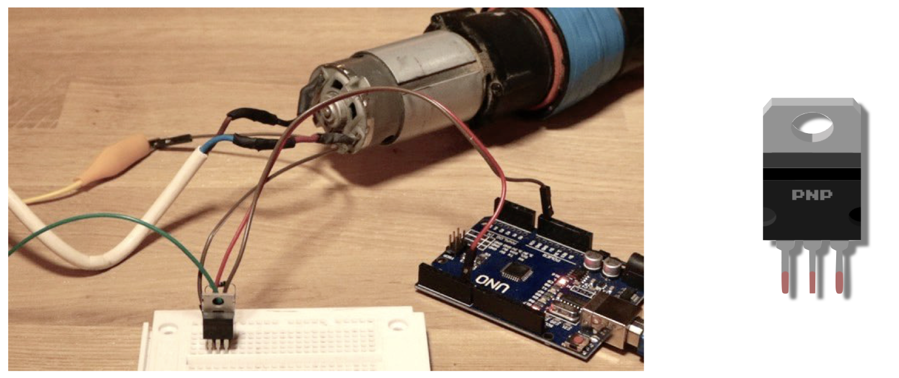
*fig 10. - Using Large Loads with Arduino using a Transistor*

## Communicating with Arduino

### Serial Comms
Serial is used for communication between the Arduino board and a computer or other devices.

Serial communication on pins TX/RX uses TTL logic levels (5V or 3.3V depending on the board).
It communicates on digital pins **0** (RX) and **1** (TX) as well as with the computer **via USB**. If you use these functions,  you cannot also use pins 0 and 1 for digital input or output.

### Programming for Arduino

The Arduino language is merely a set of **C/C++** functions that can be called from your code. Your sketch undergoes minor changes (e.g. automatic generation of function prototypes) and then is passed directly to a C/C++  compiler (avr-g++).

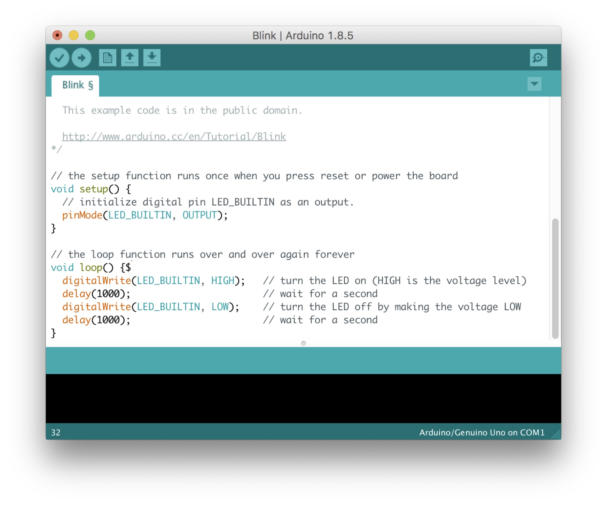
*fig 11. - Arduino IDE*

The Arduino IDE provides a software interface with your Arduino where you can program and upload your code. There also other applications that can interface with the Arduino.

## Extending Arduino

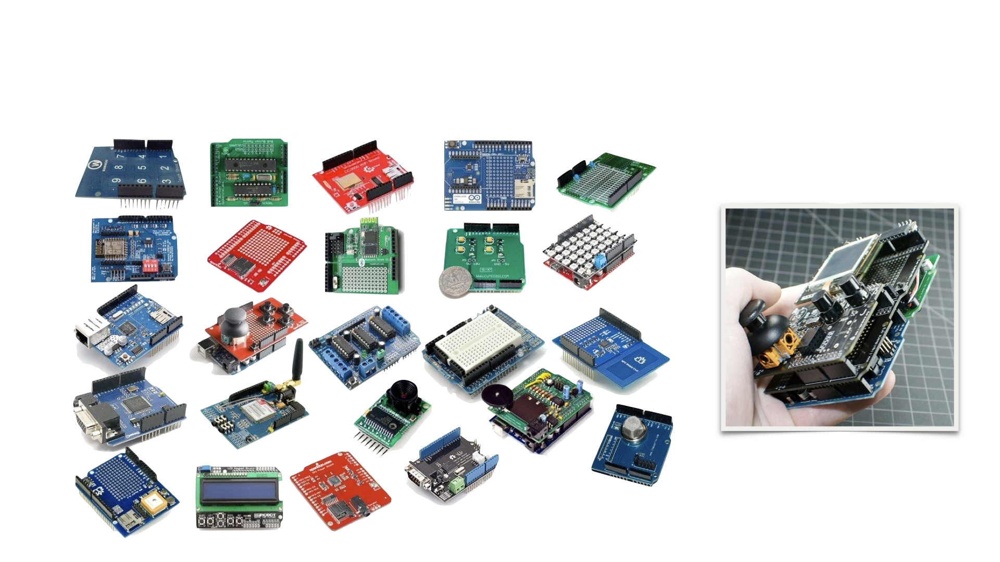
*fig 12. - Some Different Types of Shield*

You can extend the function of your Arduino with the use of **shields**. Shields are boards that can be plugged on top of the Arduino PCB extending its capabilities. The different shields follow the same philosophy as the original toolkit: they are easy to mount, and cheap to produce. For instance their is a shield that turns your Arduino into an Open Source Game Boy Clone. But there are also shields to allow your Arduino to connect to a **wi-fi router** or to use a **full colour OLED display**.

## Other Microcontrollers

As you become more familiar with using Arduino you may find you want to diversify and use other microcontrollers.  The **Microbit** is another microcontroller board similar to Arduino and is developed by the BBC. It is smaller in size and has a built  in led display and can perform many functions that the Arduino can and is programmed using Python rather than C++. It is probably not as supported with peripherals as Arduino but it is still a major competitor and the differences in performance are negligible. If you are looking to create more miniature, compact or portable systems the **ATTiny** is another option it has a limited memory and only 3 analogue and 2 PWM pins but at 1.5 cm in size it can be very useful in certain projects.

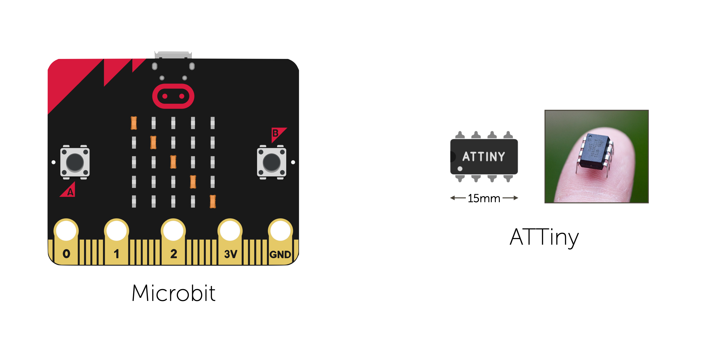
*fig 12. - Other Microcontrollers*

For those of you, particularly robotics students that want to explore their use. Please contact me to discuss how they might be relevant to your work.

## Conclusion

In this lecture I have outlined some of the key features of the Arduino and how it relates to use in robotics and in custom game controller design. In future lectures we will look at how to create programs for Arduino to control sensors and actuators.

## Video Lecture

### Lecture - Arduino 
<iframe width="640" height="360" src="https://web.microsoftstream.com/embed/video/a3e1a802-20e3-48f5-86f5-be2645beb6a7?autoplay=false&showinfo=true" allowfullscreen style="border:none;"></iframe>
<!--stackedit_data:
eyJoaXN0b3J5IjpbMjEyMzI1NTM3MCwxNTIyMjI0MTA2LDE4MT
M2MzA1MTQsMTk4MDk0MDU4NiwtMjEwNDU0NjQ0NiwxNDU0MjY1
OTUsLTE0MTM4MjkzMzMsNjk2NDMwNTU3LDU3MjA2NjQwMCwxMT
czNzcyMTgxLDc5NTQyODI2Miw5MTg5OTA3NzMsMTc2MzQ5MDAs
NTM4OTY0NjkxLDYwNzE4NjUzMiwtNDc2Nzk0NjIwLDEwMjAwMz
gyMzQsLTIwNzM1MDUwNDksMTA3NjE0NDIwOCwxMDE3NzE4Njcx
XX0=
-->
