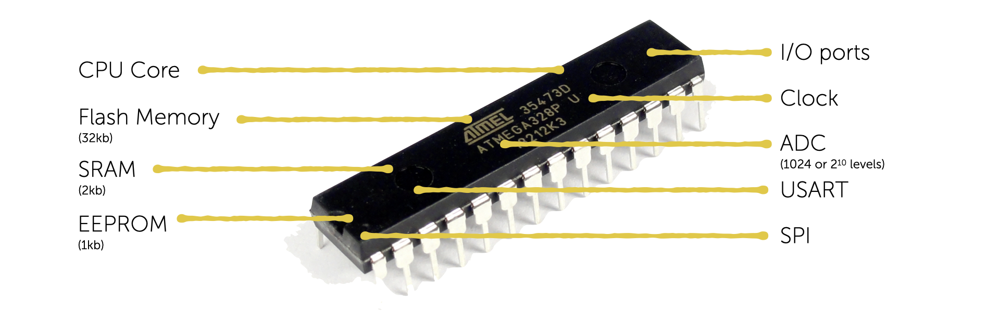

---
# Page settings
layout: default
keywords:
comments: false

# Hero section
title: COMP140 - Lecture Materials 1

# Author box
author:
    title: Matt Watkins
    description: Lecturer in Computing at Falmouth University

# Micro navigation
micro_nav: true

# Page navigation
page_nav:
    next:
        content: OOP
        url: '../oop-lm'
---

# Arduino

The following materials are derived from the *Arduino lecture*. The video lecture is included at the bottom of the [document](#video-lecture).
{: .callout .callout--warning}

In this lecture we will look at Arduino in subsequent lectures we will explore the other elements of the workflow.

## Introduction to the Arduino UNO  
 The arduino is a single board microcontroller designed to be used a controller for robotics and electronics projects.
 It is comprised of a 

### The Board

The Arduino is essentially a microcontroller with a range of peripherals attached to a **PCB** (printed circuit board) that allow for differnet externals to interface with the microcontroller these include things like: power, usb serial port for uploading firmware programs from a computer, a clock and most importantly it uses **pin** inputs so sensors and actuators can communicate with the controller.

*fig1. - Arduino Board Layout*

### The Micro Controller

A micro controller is different from a microprocessor that consists of only a Central Processing Unit, whereas a Micro Controller has a range of other components and peripherals.

*fig2. - Microcontroller Features*

- **CPU** - The main function of the CPU Core is to ensure the correct program execution. The CPU must therefore be able to access memories, perform calculations, control peripherals, and handle interrupts.
- **Flash Memory** - Program Space. This is where the program you will write known as a ‘sketch’ is stored. There is 32kb of Flash Memory
- **SRAM** - (Static Random Access memory This is where the sketch creates and manipulates variables when it runs. The SRAM is only 2kb
- **EEPROM** - is memory space that programmers can use to store long term information. You are probably familiar with the term ROM from previous studies. EEPROM is only 1024 bytes
- **I/O Ports** - These are bi directional ports to manage communication between the CPU and peripherals.
- **Clock** - The clock can run at 16 MHz or 16 million cycles a second.
- **ADC** = 10 bit ADC means it has the ability to manage 1,024(2 to the power of 10) discrete analog levels. We will look at analogue later in this presentation.
- **USART** - Universal synchronous and asynchronous receiver transmitter - Used for communication between the microcontroller and computers on other devices
- **SPI** - Serial Peripheral Interface allows high speed synchronous data transfer between the device and peripheral units, or between several AVR devices, the CPU on the ATmega is AVR

### Form Factor

The controller is the essential bit you could make your own board up by adding the other peripherals manually, as in the example below, but the Arduino board is a cheap effective and less time consuming alternative to building your own.

*fig3. - Home Made Arduino Board*

## So what is an Arduino Board?

It's a rapid prototyping board. It gives you the ability to quickly plug pins from the Arduino to devices and components on a bread board to rapidly prototype creative electronic projects.

*fig4. - Arduino, breadboard with LED and resistor*
<!--stackedit_data:
eyJoaXN0b3J5IjpbMjA3ODg3MDY3MSwzMDU5NDMzMzMsLTE3NT
E5MTIwOTcsMjEwNDEyMzYwOCwxODAyNDU1MzU5LDQ3OTIzOTgy
OCwxNzA5OTk4NjIsLTEwODM1ODE1NzksLTEyMDU0Njg3MzddfQ
==
-->