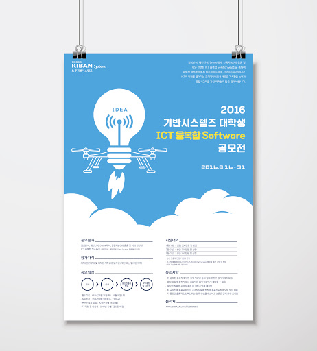

---
# Page settings
layout: default
keywords:
comments: false

# Hero section
title: Worksheet 2
description: COMP140 - Worksheet 2

# Author box
author:
    title: Matt Watkins
    description: Lecturer in Computing at Falmouth University

# Micro navigation
micro_nav: true

# Page navigation
page_nav:
    prev:
        content: OOP
        url: '../oop-ws'
    next:
        content: Research Week
        url: '../research-week-ws'
---

# 2. Software Architecture

This workshop is divided into to 2 parts where we will explore the use of code in Visual Studio and Unity. Complete each task in your own time. We will review solutions at the halfway point.

## Exercise 1 - Research
### SOLID Principles

In your assigned group of 4-5 research a SOLID principle. Prepare your research in a clear and explanatory way. Provide examples and information that you think will help your colleagues gain an insight into these specific approaches to improving programming in OOP environments.

In your designated space on a **Mural board** (Get the link in the Workshop) create a poster that explains the specific principle to your peers. You should include: 

 1. Text explanation
 2. Diagrams
 3. Images
 4. Code examples (include commenting)

 Be creative, articulate your understanding of the concept and be prepared to share your understanding with the group in a review mid session.

## EXERCISE 2 - Applying Solid Principles
### Design A Basic Mario Platformer

Based on your insight into SOLID with specific reference to: **Single Responsibility Principle, Open Closed Principle** and **Liskov Substitution principle** work in teams of 4-5 to design and develop a platformer based on the following image

*Attribution: A screenshot from Nintendo's 1985 classic video game Super Mario Bros.*

You are not designing Mario, but you are using it as a template.
 
1. Develop a design specification document for your game. Break down all the key functionality into encapsulated classes. You should design the key classes and relationships that would be in the platformer
2. We are not expecting you to use any formal notation at this stage but we expect you to  develop a diagram that represents an overview of all the relationships. We will explore the use of UML in a later session but for now try out the basics here at [Lucidchart](https://www.lucidchart.com/pages/landing/uml-diagram-software?utm_source=google&utm_medium=cpc&utm_campaign=_en_tier1_desktop_search_nb_bmm_&km_CPC_CampaignId=2083917481&km_CPC_AdGroupID=76741944236&km_CPC_Keyword=+uml&km_CPC_MatchType=b&km_CPC_ExtensionID=&km_CPC_Network=g&km_CPC_AdPosition=&km_CPC_Creative=442382659825&km_CPC_TargetID=aud-837074142685:kwd-305198913839&km_CPC_Country=9045282&km_CPC_Device=c&km_CPC_placement=&km_CPC_target=&mkwid=sSoDWCDED_pcrid_442382659825_pkw_+uml_pmt_b_pdv_c_slid__pgrid_76741944236_ptaid_aud-837074142685:kwd-305198913839_&gclid=Cj0KCQiAvP6ABhCjARIsAH37rbT2UVD-nQlLtSu2B7g6-dp2-eFK4rESbf5GRYqzqHPcDZirgpHV-1waAj5YEALw_wcB)
3. Please think about the classes, variables and functions that will support the game  
4. Develop a basic prototype of your game (one level) in Unity that uses the specification outlined in the document. 
5. Your game should employ the class structure and hierarchy from your document.
6. Please use the following assets in your game - [Kenney Assets](https://kenney.nl/assets?s=platformer)

<!--stackedit_data:
eyJoaXN0b3J5IjpbMTM5MDM3NDMwNiw2ODM5NDYyOCwtMTY2OT
U0MTM3OCwxMDIzMzU4ODk3LDk1Mjk4OTY3OF19
-->