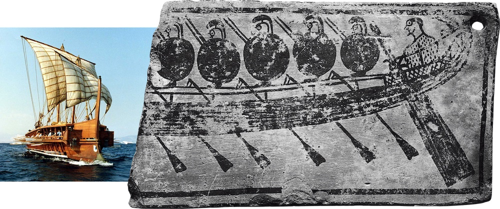

---
# Page settings
layout: default
keywords:
comments: false

# Hero section
title: 9. States & Transitions
description: COMP140 - Lecture Materials 9

# Author box
author:
    title: Matt Watkins
    description: Lecturer in Computing at Falmouth University

# Micro navigation
micro_nav: true

# Page navigation
page_nav:
    prev:
        content: Design Patterns
        url: '../design-patterns-lm'
    next:
        content: Optimisation & Performance
        url: '../optimisation-lm'
---

# 9. States & Transitions
## An Introduction to Cybernetics

In this lecture I plan to outline some key theories but also their application in the field of Cybernetics. Cybernetics is commonly applied to robotics but its applications are relevant to all areas of computing and design and especially realtime systems like computer games where we are dealing with the transformations between the states of a system.

This can be useful in thinking about both the physical and virtual components of your system but also the human interface with the experience you intend to develop.

### Learning Outcomes

-   Outline the meaning and application of **cybernetics**
-   Explain and apply **transformations** between states using **kinematics**
-   Define the role of **transistors** as simple neurone in electronic control systems
-   Identify uses of **signal processing** in embedded systems
-   Apply cybernetics to electronics projects in the form of **finite state machines**

## What is Cybernetics?

_“Cybernetics is the study of human/machine interaction guided by the principle that numerous different types of systems can be studied according to principles of feedback, control, and communications. The field has a quantitative component, inherited from feedback control and information theory, but is primarily a qualitative, analytical tool – one might even say a philosophy of technology.”_ - David A Mindell - MIT

*The steersman of a Greek Fighting Ship*

Cybernetics comes from the Greek word - **kybernetes** which means ‘_steersman_’ and relates to the principle of controlling or directing of a system. The ancient Greeks dominance of the classical world was in part due to their mastery of machines. Specifically fast fighting ships, packed with Spartan warriors. Consequently the **kybernetes** who steered them throughout the Mediterranean sea had a very important role to play.

<!--stackedit_data:
eyJoaXN0b3J5IjpbMzk0Njg3MzI2XX0=
-->