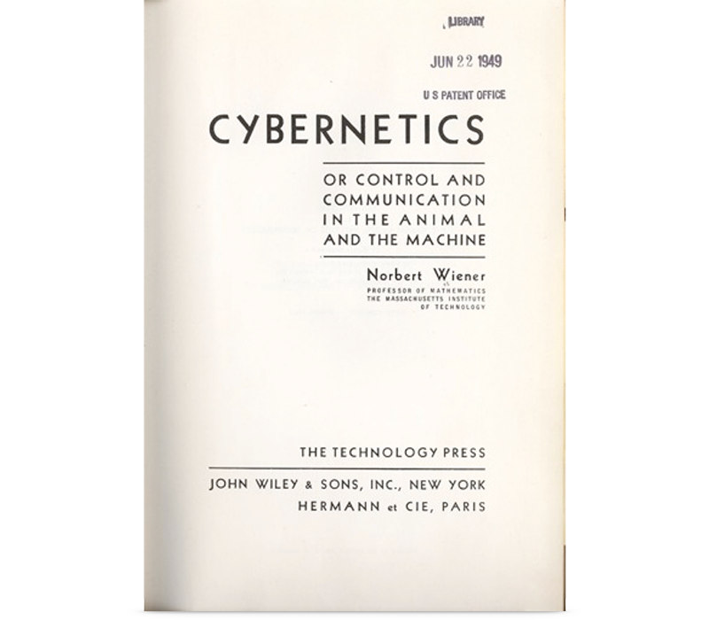
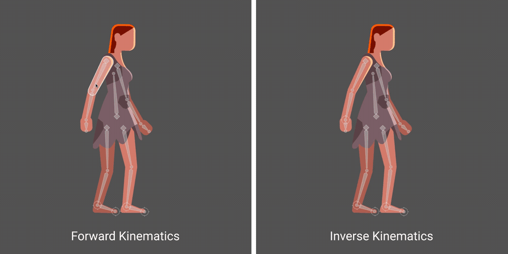
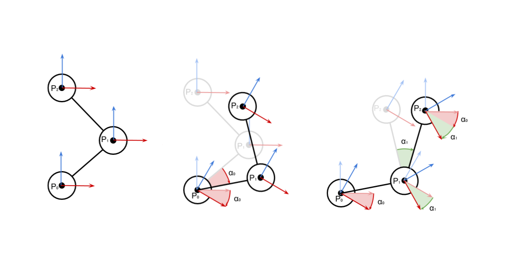
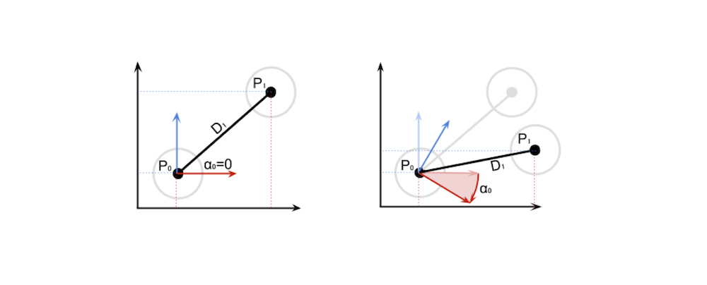
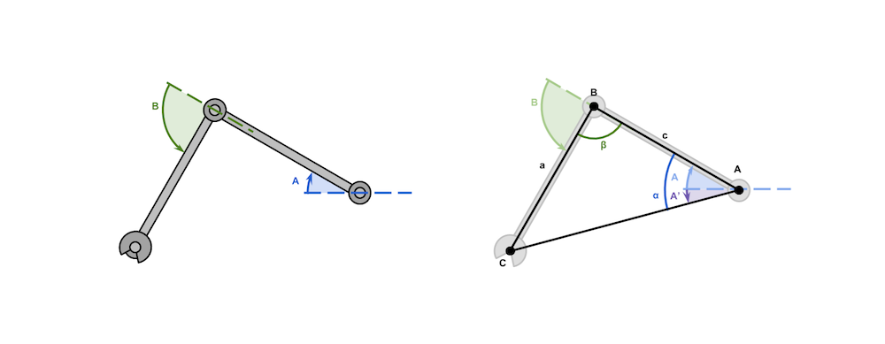

---
# Page settings
layout: default
keywords:
comments: false

# Hero section
title: 9. States & Transitions
description: COMP140 - Lecture Materials 9

# Author box
author:
    title: Matt Watkins
    description: Lecturer in Computing at Falmouth University

# Micro navigation
micro_nav: true

# Page navigation
page_nav:
    prev:
        content: Design Patterns
        url: '../design-patterns-lm'
    next:
        content: Optimisation & Performance
        url: '../optimisation-lm'
---

# 9. States & Transitions
## An Introduction to Cybernetics


In this lecture I plan to outline some key theories but also their application in the field of Cybernetics. Cybernetics is commonly applied to robotics but its applications are relevant to all areas of computing and design and especially realtime systems like computer games where we are dealing with the transformations between the states of a system.

This can be useful in thinking about both the physical and virtual components of your system but also the human interface with the experience you intend to develop.

### Learning Outcomes

-   Outline the meaning and application of **cybernetics**
-   Explain and apply **transformations** between states using **kinematics**
-   Define the role of **transistors** as simple neurone in electronic control systems
-   Identify uses of **signal processing** in embedded systems
-   Apply cybernetics to electronics projects in the form of **finite state machines**

### What is Cybernetics?

_“Cybernetics is the study of human/machine interaction guided by the principle that numerous different types of systems can be studied according to principles of feedback, control, and communications. The field has a quantitative component, inherited from feedback control and information theory, but is primarily a qualitative, analytical tool – one might even say a philosophy of technology.”_ - David A Mindell - MIT


*Fig. 1 - Greek Fighting Ship and tablet from circa 800 BC*

Cybernetics comes from the Greek word - **kybernetes** which means ‘_steersman_’ and relates to the principle of controlling or directing of a system. The ancient Greeks dominance of the classical world was in part due to their mastery of machines. Specifically fast fighting ships, packed with Spartan warriors. Consequently the **kybernetes** who steered them throughout the Mediterranean sea had a very important role to play.


*Fig. 2 - Cybernetics book*

The seminal text on the subject is *Cybernetics or Control and Communication in the Animal and the Machine* By Norbert Weiner who is considered the father of cybernetics.

Wiener described the field like this: 

*"Control and communication in the animal and the machine"*

Cybernetics is also about learning processes from animals and plants and using robotic simulations to gain a better understanding of complex natural systems.

\
*fig. 3 - Attribution Source: [www.9fail.com](http://www.9fail.com/post/96689672071/lemur-gif)*

We are used to associating robots with the imitation of humanoid behaviour but sometimes a simpler form of perambulation like, that we see in lemurs overcomes some of the complexity of attempting to move through an environment. If a robot can constantly jump it resolves the need to have complex feet or wheels, springs and differentials to adapt to changing terrain. When it hits any surface it jumps, if it is suitably well balanced it can stay mobile. 

<iframe width="100%" height="315" src="https://www.youtube.com/embed/xvIk39rkkiU" title="YouTube video player" frameborder="0" allow="accelerometer; autoplay; clipboard-write; encrypted-media; gyroscope; picture-in-picture" allowfullscreen></iframe>

This example ‘Salto’ by USC Berkeley’s robotics lab shows how study of an animal jumping process can help to develop better robotic locomotion and navigation. We will return to this idea of mimicry later, but first let’s address some fundamentals.

### Early Cybernetics


*fig. 4 - Norbert Wiener - Image Attribution: [Arshake](https://www.arshake.com/en/norbert-wiener/)*

In its early years in the 1920s and 30s cybernetics was concerned with the problem of tracking targets (optically and then with radar), predicting their future positions, calculating ballistics, and directing guns to fire to destroy the targets. Norbert Wiener, a brilliant but eccentric MIT mathematician, already had a successful career in which he made numerous contributions to mathematics particularly to fields like harmonic (Fourier) analysis and stochastic processes. However Wiener’s work proved to have little application to wartime problems (it generated ponderous, complex solutions) but it did lead him to produce an important paper that paved the way for the modern theories of optimal estimation and signal processing. He created a general theory of smoothing and predicting any problem expressed as a discrete series of data. This generalization, from a specific human/machine problem to any aspect of the world that can be expressed as time-series data, presented an early glimpse of the strategies that would define cybernetics.


*fig. 5 - Photo by [NASA](https://unsplash.com/@nasa?utm_source=unsplash&utm_medium=referral&utm_content=creditCopyText) on [Unsplash](https://unsplash.com/s/photos/earth?utm_source=unsplash&utm_medium=referral&utm_content=creditCopyText)*

Weiner’s work on measuring natural systems with time series data lead the scientist James Lovelock to propose The Gaia hypothesis which posits that the Earth is a self-regulating complex system involving the biosphere, the atmosphere, the hydrospheres and the pedosphere, tightly coupled as an evolving system. The hypothesis contends that this system as a whole, called Gaia, seeks a physical and chemical environment optimal for contemporary life. Cybernetics can be used to measure all life as we know it.

### The Cybernetics Loop


*fig. 6 - Cybernetic Loop*

**Sensing**, **Controlling** and **Actuating**. Any computational system that is effected by the real world must have a way to sense it in some way, maybe it’s a button, a camera, a microphone, or a light sensor. The data from the sensor is then measured and processed by the controller this is usually a computer but it can be simpler (as we well address later) and depending on the how the data is interpreted an actuator is started. This could be a motor turning a wheel, a pump or even moving a virtual object in a game or storing data point in a database. This process is a continuous feedback loop, The actuation may well effect the state of the sensor data, and so the process returns to the start to begin all over again.  Cybernetics is also highly relevant to thinking about control scheme’s and player feedback in games. In games design one of the fundamental principles is the game feedback loop which is derived from Cybernetic principles.


*fig. 7 - Causal Systems*

Cybernetics explains how circular causal systems work or what we call single loops. So as well as defining the inputs and outputs we also need to factor in the goal of the **actor** and how factors in the **environment** can cause **disturbances** to the achievement of that **goal**.


*fig. 8 - Steering a ship into port*

If we return to our steersman in Ancient Greece.  We can see that the **goal** is to reach a safe port, and the input of rowing and wind in the sails should push the boat along its course. But the tide or wind of a real system like the sea can disturb the smooth procession of the vessel. The steersman has to measure the **disturbance** and apply a **correction** to overcome the error created by the **environment**.

### The Determinate Machine

Cybernetics is concerned with the concept of determinate machines. Maths and physics is chiefly concerned with systems that are continuous and linear, but most natural systems are not linear and often not continuous and sometimes not even metrical ie not expressible in numbers. Therefore in order to understand these complex systems we have to define their states and the transformations and operands that occur between these states. A determinate machine is a simplification of a natural systems.

 
*fig. 9 - Insect mating behaviour*

In this example of a study of insect mating behaviour one state proceeds to the next. Although the insect behaviour vary slightly. We can work on the basis that each state is relatively stable and will proceed in some fashion to the next.

### Calculating Transformations

It is an important function of cybernetics to calculate the transformations in states. In this example we have a single operand - doubling and this behaves in a linear procedural way.

*A culture medium is inoculated with a thousand bacteria. Their number doubles every 30 minutes. How do we express corresponding transformations?*

**$$n' = 2n$$**

But what if we have multiple operands?

Ross Ashby another key figure in Cybernetics whose book - *An introduction to Cybernetics* in 1956 described the machine with input and how multiple operands can change states. So he abstracted states and their transisitions we can have transformations **R1, R2** and **R3** and they change the states of a machine from **a** to **b** or **c** or d they can be measured in a table like this:
\
$$\begin{matrix}
 \downarrow & a & b & c\\
\hline
 R_{1} & b & a & d\\
 R_{2} & c & d & d\\
 R_{3} & b & a & d\\
\end{matrix}
$$
```c#
Vector3  movementMonster = new  Vector3(-4, 9, 0);
monster1.transform.Translate(movementMonster);
monster1.transform.Translate(movementMonster * Time.deltaTime);
```
This logical thinking underpins the way we manage transitions in matrices in computer generated imagery. Vector transforms are a good example of this thinking.

## Applying Cybernetics

### Forward & Inverse Kinematics

<iframe width="100%" height="315" src="https://www.youtube.com/embed/6E0Ajxm2q4c" title="YouTube video player" frameborder="0" allow="accelerometer; autoplay; clipboard-write; encrypted-media; gyroscope; picture-in-picture" allowfullscreen></iframe>
Fig. 10 - Pain by Deck Nine, San Diego Studio (2007)*

When we want to transform from one state to the next we need to apply some maths and physics to make things move effectively. Many robots and a lot of games are trying to mimic the movement of real world creatures. Most animals have joints and their movement is based on the rotation of numerous bones around various joints.


*Image Attribution - Rive Software IK Help Centre*

This process of moving around a joint is called Forward Kinematics when it is directly moving a joint to a position or inverse kinematics when the joint is being moved based on it’s relationship to the end effector. IN the example above the end effector is the characters hand.
 

*Fig. 12 - Rain World | Videocult (2017)*

In this example of a game Rainworld. The creators use procedural animation that uses Kinematics and more specifically Inverse Kinematics to achieve flowing interactions of objects. Having joints and limbs weighted by physics creates a life-like effect to the characters and their movement. As the characters move the environment impacts and alters their bodies as it might in real life.

### Forward Kinematics


*Fig.13 -Joints and end effector of a robot arm*

I am going to briefly touch on the maths and some code we apply to machines in order to make them move realistically.
A robot arm may have 3 joints and an end effector (this is the name used to describe the claw or gripper on the end).
If the arm moves around it’s joints we have to calculate the movement and rotations between each bone and it’s joint.


*Fig.14 - Angles and Rotations of a robot arm*

From the previous diagrams it should be clear to solve the problem of forward kinematics, we need to be able to calculate the position of nested objects due to their rotation.

Let’s see how this is calculated with just **two joints**. Once solved for two, we can just replicate it in sequence to solve chains of any length.

In this example we will start with the easy case, the one in which the first joint is in its starting position. This means that $$\alpha_0=0$$, like in the following diagram.


*Fig.14 - Angles and positions of nested objects*

This means that, simply: 

$$ P_1 = P_0 + D_1$$

When $$\alpha_0=0$$ is not zero, what we have to do is rotate the distance vector at rest $$D1$$ around $$P0$$ by $$\alpha_0$$ degrees:

Mathematically we can write this as:CLICK

$$P_1 = P_0 + rotate\left(D_1, P_0, \alpha_0\right)$$

By replicating the same logic, we can derive the equation for P_2:

 $$P_2 = P_1 + rotate\left(D_2, P_1, \alpha_0 + \alpha_1\right)$$

And finally, the general equation:

$$P_{i} = P_{i-1} + rotate\left(D_i, P_{i-1}, \sum_{k=0}^{i-1}\alpha_k\right)$$

### Inverse Kinematics (IK)
#### Two Degrees of Freedom


*Fig.15 - Two Degress of Freedom*

In this scenario, we have a robot arm with 2 degrees of freedom. We are going to create simple 2D inverse kinematics implementation.

The length of the arms, lower case **c** and **a**, is a known. If the point we have to reach is C, then the configuration becomes a triangle in which all sides are known. We have then derived the equations for the angles A and B, which controls the rotation of the robotic arms’ joints.

*Equation A.*
$$A = \underset{\alpha}{\underbrace{\cos^{-1}{\left(\frac{b^2+c^2-a^2}{2bc}\right)}}} + \underset{A'}{\underbrace{\tan^{-1}{\left(\frac{C_Y-A_Y}{C_X-A_X}\right)}}}$$
*Equation B.*
$$B = \pi - \underset{\beta}{\underbrace{\cos^{-1}{\left(\frac{a^2 + c^2 -b^2}{2ac}\right)}}}$$

We can model this in Unity. The concept of “joints” is not something that Unity comes with. However, the parenting system offered by the engine can be exploited to create a **hierarchy** of components that will behave exactly like a robotic arm.

 - Root
	 - Joint 0
	 - Bone 0
		 - Joint 1
		 - Bone 1
		 - Hand

I have modelled an arm using various cubes. You can see how I have named them and parented them in the scene in Unity. In the first part of the script we assign the joints, hands and target as variables that take the transforms of the game objects.


*Fig.15 - Basic rig for IK in Unity*

#### IK Example in Unity

You can see the repo for this example here: [https://github.falmouth.ac.uk/Matt-Watkins/Simple-Inverse-Kinematics](https://github.falmouth.ac.uk/Matt-Watkins/Simple-Inverse-Kinematics)

The code used in the example above is this:

```c#
public class SimpleIK2D : MonoBehaviour
{
    struct IKResult
    {
        public float Angle0;
        public float Angle1;
    }

    [Header("Joints")]
    public Transform Joint0;
    public Transform Joint1;
    public Transform Hand;

    [Header("Target")]
    public Transform Target;

    // Update is called once per frame
    void Update()
    {
        IKResult result;
        IK(out result);
        {
            Vector3 Euler0 = Joint0.transform.localEulerAngles;
            Euler0.z = result.Angle0;
            Joint0.transform.localEulerAngles = Euler0;

            Vector3 Euler1 = Joint1.transform.localEulerAngles;
            Euler1.z = result.Angle1;
            Joint1.transform.localEulerAngles = Euler1;
        }
    }

    private bool IK (out IKResult result)
    {
        float length0 = Vector2.Distance(Joint0.position, Joint1.position);
        float length1 = Vector2.Distance(Joint1.position, Hand.position);
        float length2 = Vector2.Distance(Joint0.position, Target.position);

        // Angle from Joint0 and Target
        Vector2 diff = Target.position - Joint0.position;
        float atan = Mathf.Atan2(diff.y, diff.x) * Mathf.Rad2Deg;

        result = new IKResult();
            
        // Is the target reachable? If not, we stretch as far as possible
        if (length0 + length1 < length2)
        {
            result.Angle0 = atan;
            result.Angle1 = 0f;
            return false;
        }
          
        float cosAngle0 = ((length2 * length2) + (length0 * length0) - (length1 * length1)) / (2 * length2 * length0);
        float angle0 = Mathf.Acos(cosAngle0) * Mathf.Rad2Deg;

        float cosAngle1 = ((length1 * length1) + (length0 * length0) - (length2 * length2)) / (2 * length1 * length0);
        float angle1 = Mathf.Acos(cosAngle1) * Mathf.Rad2Deg;

        // So they work in Unity reference frame
        result.Angle0 = atan + angle0;
        result.Angle1 = 180f + angle1;

        return true;
    }
}
```

In the first part of the script we assign the joints, hands and target as variables that take the transforms of the game objects. We also create a struct to contain the angle values of the 2 joints. 

The joints are rotated by accessing the localEulerAngles property of the joints’ Transform component. Unfortunately, it is not possible to change the z angle directly, so the vector needs to be copied, edited and replaced.

The equations derived from knowing the length of the first two bones (called c and a, respectively). Since the length of the bones is not supposed to change, it can be calculated in the IK bool in the floats _length

 What happens if the target is unreachable? The solution is to fully stretch the arm in the direction of the target. Such a behaviour is consistent with the reaching movement that we are trying to simulate. The code detects if the target is out of reach by checking if the distance from the root is greater than that the total length of the arm. 

Finally we have to calculate the angles. If we translate equations (A) and (B) directly to code, we end up with something like this. The mathematical functions $$cos^{-1}$$ and $$tan^{-1}$$ are called Mathf.Acos and Mathf.Atan2 in Unity. Also, the final angles are converted to degrees using Mathf.Rad2Deg, since the Transform component accepts degrees, instead of radians.

  

———-

  

The principle of Inverse Kinematics is at the heart of both robotic movement but also virtual movement in games. We have explored it here to demonstrate how
<!--stackedit_data:
eyJoaXN0b3J5IjpbLTE5NDk1MjQ5MDUsLTExMTg0MjQ1OTMsLT
g3MTEwMjI5MywyMDExNzI2NTI2LC0yMDEwNTEwOTgxLC04MDE0
NTcyMTEsMTY3NDU0Mjc3Myw4ODA2OTI1MjcsMTY5MzYyMzU5OS
wyMDU2MTIzNjEzLC00NjA3NzM0ODQsMTQyMjI0NjAzMSw5NTgx
Nzc0ODksMTUyMjMzMDgyNywxNzMyNTMxNjY4LC0zNTgwNDEwOT
YsLTgwMzkzNTU0NiwtNDUxNzgzMzMzLC0yMDY0NDI5NzIsLTEw
MDcwMjc4MzBdfQ==
-->