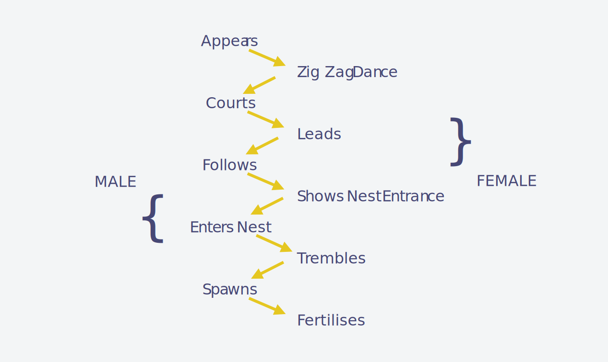

---
# Page settings
layout: default
keywords:
comments: false

# Hero section
title: 9. States & Transitions
description: COMP140 - Lecture Materials 9

# Author box
author:
    title: Matt Watkins
    description: Lecturer in Computing at Falmouth University

# Micro navigation
micro_nav: true

# Page navigation
page_nav:
    prev:
        content: Design Patterns
        url: '../design-patterns-lm'
    next:
        content: Optimisation & Performance
        url: '../optimisation-lm'
---

# 9. States & Transitions
## An Introduction to Cybernetics


The following materials are derived from the *States & Transitions lecture*. The video lecture is included at the bottom of the [**page**](#video-lecture).
{: .callout .callout--warning}

In this lecture I plan to outline some key theories but also their application in the field of Cybernetics. Cybernetics is commonly applied to robotics but its applications are relevant to all areas of computing and design and especially realtime systems like computer games where we are dealing with the transformations between the states of a system.

This can be useful in thinking about both the physical and virtual components of your system but also the human interface with the experience you intend to develop.

### Learning Outcomes

-   Outline the meaning and application of **cybernetics**
-   Explain and apply **transformations** between states using **kinematics**
-   Define the role of **transistors** as simple neurone in electronic control systems
-   Identify uses of **signal processing** in embedded systems
-   Apply cybernetics to electronics projects in the form of **finite state machines**

### What is Cybernetics?

_“Cybernetics is the study of human/machine interaction guided by the principle that numerous different types of systems can be studied according to principles of feedback, control, and communications. The field has a quantitative component, inherited from feedback control and information theory, but is primarily a qualitative, analytical tool – one might even say a philosophy of technology.”_ - David A Mindell - MIT


*Fig. 1 - Greek Fighting Ship and tablet from circa 800 BC*

Cybernetics comes from the Greek word - **kybernetes** which means ‘_steersman_’ and relates to the principle of controlling or directing of a system. The ancient Greeks dominance of the classical world was in part due to their mastery of machines. Specifically fast fighting ships, packed with Spartan warriors. Consequently the **kybernetes** who steered them throughout the Mediterranean sea had a very important role to play.


*Fig. 2 - Cybernetics book*

The seminal text on the subject is *Cybernetics or Control and Communication in the Animal and the Machine* By Norbert Weiner who is considered the father of cybernetics.

Wiener described the field like this:  *"Control and communication in the animal and the machine"*

Cybernetics is also about learning processes from animals and plants and using robotic simulations to gain a better understanding of complex natural systems.

\
*fig. 3 - Attribution Source: [www.9fail.com](http://www.9fail.com/post/96689672071/lemur-gif)*

We are used to associating robots with the imitation of humanoid behaviour but sometimes a simpler form of perambulation like, that we see in lemurs overcomes some of the complexity of attempting to move through an environment. If a robot can constantly jump it resolves the need to have complex feet or wheels, springs and differentials to adapt to changing terrain. When it hits any surface it jumps, if it is suitably well balanced it can stay mobile. 

<iframe width="100%" height="315" src="https://www.youtube.com/embed/xvIk39rkkiU" title="YouTube video player" frameborder="0" allow="accelerometer; autoplay; clipboard-write; encrypted-media; gyroscope; picture-in-picture" allowfullscreen></iframe>

This example ‘Salto’ by USC Berkeley’s robotics lab shows how study of an animal jumping process can help to develop better robotic locomotion and navigation. We will return to this idea of mimicry later, but first let’s address some fundamentals.

### Early Cybernetics


*fig. 4 - Norbert Wiener - Image Attribution: [Arshake](https://www.arshake.com/en/norbert-wiener/)*

In its early years in the 1920s and 30s cybernetics was concerned with the problem of tracking targets (optically and then with radar), predicting their future positions, calculating ballistics, and directing guns to fire to destroy the targets. Norbert Wiener, a brilliant but eccentric MIT mathematician, already had a successful career in which he made numerous contributions to mathematics particularly to fields like harmonic (Fourier) analysis and stochastic processes. However Wiener’s work proved to have little application to wartime problems (it generated ponderous, complex solutions) but it did lead him to produce an important paper that paved the way for the modern theories of optimal estimation and signal processing. He created a general theory of smoothing and predicting any problem expressed as a discrete series of data. This generalization, from a specific human/machine problem to any aspect of the world that can be expressed as time-series data, presented an early glimpse of the strategies that would define cybernetics.


*fig. 5 - Photo by [NASA](https://unsplash.com/@nasa?utm_source=unsplash&utm_medium=referral&utm_content=creditCopyText) on [Unsplash](https://unsplash.com/s/photos/earth?utm_source=unsplash&utm_medium=referral&utm_content=creditCopyText)*

Weiner’s work on measuring natural systems with time series data lead the scientist James Lovelock to propose The Gaia hypothesis which posits that the Earth is a self-regulating complex system involving the biosphere, the atmosphere, the hydrospheres and the pedosphere, tightly coupled as an evolving system. The hypothesis contends that this system as a whole, called Gaia, seeks a physical and chemical environment optimal for contemporary life. Cybernetics can be used to measure all life as we know it.

### The Cybernetics Loop


*fig. 6 - Cybernetic Loop*

**Sensing**, **Controlling** and **Actuating**. Any computational system that is effected by the real world must have a way to sense it in some way, maybe it’s a button, a camera, a microphone, or a light sensor. The data from the sensor is then measured and processed by the controller this is usually a computer but it can be simpler (as we well address later) and depending on the how the data is interpreted an actuator is started. This could be a motor turning a wheel, a pump or even moving a virtual object in a game or storing data point in a database. This process is a continuous feedback loop, The actuation may well effect the state of the sensor data, and so the process returns to the start to begin all over again.  Cybernetics is also highly relevant to thinking about control scheme’s and player feedback in games. In games design one of the fundamental principles is the game feedback loop which is derived from Cybernetic principles.


*fig. 7 - Causal Systems*

Cybernetics explains how circular causal systems work or what we call single loops. So as well as defining the inputs and outputs we also need to factor in the goal of the **actor** and how factors in the **environment** can cause **disturbances** to the achievement of that **goal**.


*fig. 8 - Steering a ship into port*

If we return to our steersman in Ancient Greece.  We can see that the **goal** is to reach a safe port, and the input of rowing and wind in the sails should push the boat along its course. But the tide or wind of a real system like the sea can disturb the smooth procession of the vessel. The steersman has to measure the **disturbance** and apply a **correction** to overcome the error created by the **environment**.

### The Determinate Machine

Cybernetics is concerned with the concept of determinate machines. Maths and physics is chiefly concerned with systems that are continuous and linear, but most natural systems are not linear and often not continuous and sometimes not even metrical ie not expressible in numbers. Therefore in order to understand these complex systems we have to define their states and the transformations and operands that occur between these states. A determinate machine is a simplification of a natural systems.

 
*fig. 9 - Insect mating behaviour*

In this example of a study of insect mating behaviour one state proceeds to the next. Although the insect behaviour may vary slightly. We can work on the basis that each state is relatively stable and will proceed in some fashion to the next.

### Calculating Transformations

It is an important function of cybernetics to calculate the transformations in states. In this example we have a single operand - doubling and this behaves in a linear procedural way.

*A culture medium is inoculated with a thousand bacteria. Their number doubles every 30 minutes. How do we express corresponding transformations?*

**$$n' = 2n$$**

But what if we have multiple operands?

Ross Ashby another key figure in Cybernetics whose book - *An introduction to Cybernetics* in 1956 described the machine with input and how multiple operands can change states. So he abstracted states and their transisitions we can have transformations **R1, R2** and **R3** and they change the states of a machine from **a** to **b** or **c** or d they can be measured in a table like this:
\
$$\begin{matrix}
 \downarrow & a & b & c\\
\hline
 R_{1} & b & a & d\\
 R_{2} & c & d & d\\
 R_{3} & b & a & d\\
\end{matrix}
$$
```c#
Vector3  movementMonster = new  Vector3(-4, 9, 0);
monster1.transform.Translate(movementMonster);
monster1.transform.Translate(movementMonster * Time.deltaTime);
```
This logical thinking underpins the way we manage transitions in matrices in computer generated imagery. Vector transforms are a good example of this thinking.

## Applying Cybernetics

### Procedural Movement Generation

<iframe width="100%" height="315" src="https://www.youtube.com/embed/6E0Ajxm2q4c" title="YouTube video player" frameborder="0" allow="accelerometer; autoplay; clipboard-write; encrypted-media; gyroscope; picture-in-picture" allowfullscreen></iframe>
Fig. 10 - Pain by Deck Nine, San Diego Studio (2007)*

When we want to transform from one state to the next we need to apply some maths and physics to make things move effectively. Many robots and a lot of games are trying to mimic the movement of real world creatures. Most animals have joints and their movement is based on the rotation of numerous bones around various joints.


*Image Attribution - Rive Software IK Help Centre*

This process of moving around a joint is called Forward Kinematics when it is directly moving a joint to a position or inverse kinematics when the joint is being moved based on it’s relationship to the end effector. IN the example above the end effector is the characters hand.
 

*Fig. 12 - Rain World | Videocult (2017)*

In this example of a game Rainworld. The creators use procedural animation that uses Kinematics and more specifically Inverse Kinematics to achieve flowing interactions of objects. Having joints and limbs weighted by physics creates a life-like effect to the characters and their movement. As the characters move the environment impacts and alters their bodies as it might in real life.

### Forward Kinematics


*Fig.13 -Joints and end effector of a robot arm*

I am going to briefly touch on the maths and some code we apply to machines in order to make them move realistically.
A robot arm may have 3 joints and an end effector (this is the name used to describe the claw or gripper on the end).
If the arm moves around it’s joints we have to calculate the movement and rotations between each bone and it’s joint.


*Fig.14 - Angles and Rotations of a robot arm*

From the previous diagrams it should be clear to solve the problem of forward kinematics, we need to be able to calculate the position of nested objects due to their rotation.

Let’s see how this is calculated with just **two joints**. Once solved for two, we can just replicate it in sequence to solve chains of any length.

In this example we will start with the easy case, the one in which the first joint is in its starting position. This means that $$\alpha_0=0$$, like in the following diagram.


*Fig.14 - Angles and positions of nested objects*

This means that, simply: 

$$ P_1 = P_0 + D_1$$

When $$\alpha_0=0$$ is not zero, what we have to do is rotate the distance vector at rest $$D1$$ around $$P0$$ by $$\alpha_0$$ degrees:

Mathematically we can write this as:CLICK

$$P_1 = P_0 + rotate\left(D_1, P_0, \alpha_0\right)$$

By replicating the same logic, we can derive the equation for P_2:

 $$P_2 = P_1 + rotate\left(D_2, P_1, \alpha_0 + \alpha_1\right)$$

And finally, the general equation:

$$P_{i} = P_{i-1} + rotate\left(D_i, P_{i-1}, \sum_{k=0}^{i-1}\alpha_k\right)$$

### Inverse Kinematics (IK)
#### Two Degrees of Freedom


*Fig.15 - Two Degress of Freedom*

In this scenario, we have a robot arm with 2 degrees of freedom. We are going to create simple 2D inverse kinematics implementation.

The length of the arms, lower case **c** and **a**, is a known. If the point we have to reach is C, then the configuration becomes a triangle in which all sides are known. We have then derived the equations for the angles A and B, which controls the rotation of the robotic arms’ joints.

*Equation A.*\
$$A = \underset{\alpha}{\underbrace{\cos^{-1}{\left(\frac{b^2+c^2-a^2}{2bc}\right)}}} + \underset{A'}{\underbrace{\tan^{-1}{\left(\frac{C_Y-A_Y}{C_X-A_X}\right)}}}$$\
*Equation B.* \
$$B = \pi - \underset{\beta}{\underbrace{\cos^{-1}{\left(\frac{a^2 + c^2 -b^2}{2ac}\right)}}}$$

We can model this in Unity. The concept of “joints” is not something that Unity comes with. However, the parenting system offered by the engine can be exploited to create a **hierarchy** of components that will behave exactly like a robotic arm.

 - *Root*
	 - *Joint 0*
	 - *Bone 0*
		 - *Joint 1*
		 - *Bone 1*
		 - *Hand*

I have modelled an arm using various cubes. You can see how I have named them and parented them in the scene in Unity. In the first part of the script we assign the joints, hands and target as variables that take the transforms of the game objects.


*Fig.15 - Basic rig for IK in Unity*

#### IK Example in Unity

You can see the repo for this example here: **[Example IK Repo](https://github.falmouth.ac.uk/Matt-Watkins/Simple-Inverse-Kinematics)**

Let's break down the code used in the example above:

```c#
public class SimpleIK2D : MonoBehaviour
{
    struct IKResult
    {
        public float Angle0;
        public float Angle1;
    }

    [Header("Joints")]
    public Transform Joint0;
    public Transform Joint1;
    public Transform Hand;

    [Header("Target")]
    public Transform Target;

    // Update is called once per frame
    void Update()
    {
        IKResult result;
        IK(out result);
        {
            Vector3 Euler0 = Joint0.transform.localEulerAngles;
            Euler0.z = result.Angle0;
            Joint0.transform.localEulerAngles = Euler0;

            Vector3 Euler1 = Joint1.transform.localEulerAngles;
            Euler1.z = result.Angle1;
            Joint1.transform.localEulerAngles = Euler1;
        }
    }

    private bool IK (out IKResult result)
    {
        float length0 = Vector2.Distance(Joint0.position, Joint1.position);
        float length1 = Vector2.Distance(Joint1.position, Hand.position);
        float length2 = Vector2.Distance(Joint0.position, Target.position);

        // Angle from Joint0 and Target
        Vector2 diff = Target.position - Joint0.position;
        float atan = Mathf.Atan2(diff.y, diff.x) * Mathf.Rad2Deg;

        result = new IKResult();
            
        // Is the target reachable? If not, we stretch as far as possible
        if (length0 + length1 < length2)
        {
            result.Angle0 = atan;
            result.Angle1 = 0f;
            return false;
        }
          
        float cosAngle0 = ((length2 * length2) + (length0 * length0) - (length1 * length1)) / (2 * length2 * length0);
        float angle0 = Mathf.Acos(cosAngle0) * Mathf.Rad2Deg;

        float cosAngle1 = ((length1 * length1) + (length0 * length0) - (length2 * length2)) / (2 * length1 * length0);
        float angle1 = Mathf.Acos(cosAngle1) * Mathf.Rad2Deg;

        // So they work in Unity reference frame
        result.Angle0 = atan + angle0;
        result.Angle1 = 180f + angle1;

        return true;
    }
}
```

In the first part of the script we assign the joints, hands and target as variables, for example ``public Transform Joint0;`` that take the transforms of the game objects. We also create a `struct` to contain the angle values of the two joints. 

The joints are rotated by accessing the `localEulerAngles` property of the joints’ Transform component. Unfortunately, it is not possible to change the z angle directly, so the vector needs to be copied, edited and replaced. `Euler0.z = result.Angle0;` for example

The equations derived from knowing the length of the first two bones (called c and a, respectively). Since the length of the bones is not supposed to change, it can be calculated in the `bool IK` in the floats `length`.

What happens if the target is unreachable? The solution is to fully stretch the arm in the direction of the target. Such a behaviour is consistent with the reaching movement that we are trying to simulate. The code detects if the target is out of reach by checking if the distance from the root is greater than that the total length of the arm. 

Finally we have to calculate the angles. If we translate equations (A) and (B) directly to code, we end up with something like this. The mathematical functions $$cos^{-1}$$ and $$tan^{-1}$$ are called `Mathf.Acos` and `Mathf.Atan2` in Unity. Also, the final angles are converted to degrees using `Mathf.Rad2Deg`, since the Transform component accepts degrees, instead of radians.

The principle of Inverse Kinematics is at the heart of both robotic movement but also virtual movement in games. We have explored it here to demonstrate how it is relevant both to robotics students because it's about moving physical objects and how they move in three dimensional or two dimensional space. In the next section we will explore the states of a system and how they can be controlled.

## The Transistor


*Fig.14 - Modern PNP and MOSFET transistors and a 1930's vacuum transistor*

The digital revolution owes its success to one small component which is standard in all electronic devices - the transistor. The first Transistors were made in glass vacuum tubes in 1907(the above example is from the 1930s) however the first solid state transistor was not invented until 1947.

A transistor is a miniature electronic component that can do two different jobs. It can work either as an amplifier or a switch. As an amplifier, it takes in a tiny electric current at one end (an input current) and produces a much bigger electric current (an output current) at the other. In other words, it's a kind of current booster. That comes in really useful in things like radios where a small sound signal needs boosting. In the 50s and 60s radios were often referred to as ‘transistors’.

It’s other use is as a switch. A tiny electric current flowing through one part of a transistor can make a much bigger current flow through another part of it. In other words, the small current switches on the larger one. Another way of imagining this is to say we use electrical current rather than a finger to flick a switch. A modern memory chip contains hundreds of millions or even billions of transistors, each of which can be switched on or off individually. Since each transistor can be in two distinct states, it can store two different numbers, zero and one. If something can be in 2 states it is like a very small very primitive brain.


*Fig.15 -Layers of silicon in a transistor and a transistorin its ON and OFF state*

A transistor is comprised of 3 layers of silicon in a sandwich. The layers are comprised of either an **n** or a **p** type of silicon and so transistors are often called either **NPN** or **PNP** transistors, because of the order the materials are sandwiched. To understand the difference of the layers we can say that the n-type has a surplus of electrons, the p-type has holes where electrons should be. The layers have pins attached to them that are called the emitter, the base and the collector. Let’s look at this arrangement from a different angle. Normally, the holes in the base act like a barrier, preventing any significant current flow from the emitter to the collector while the transistor is in its "off" state.

A transistor works when the electrons and the holes start moving across the two junctions between the n-type and p-type silicon. If we connect the transistor up to some power. CLICK and we attach a small positive voltage to the base, make the emitter negatively charged, and make the collector positively charged. Electrons are pulled from the emitter into the base through these holes—and then from the base into the collector. And the transistor switches to its "on" state:

When there is no current to the base, little or no current flows between the collector and the emitter. Turn on the base current and a big current flows. So the base current switches the whole transistor on and off. So then we have a binary switch

If a transistor acts as an electronic automated switch or a single neuron we can use them in concert with more transistors to create more states in the machine. Effectively by having a range of different gates - AND, OR  and NOT we can control more complex states, like what part of seven segmented digital display is on simply by feeding a binary number sequence like 1,1,1,0.

I won’t go into great detail as you have already touched on the theory of this in COMP110 with the application of truth tables. Let’s look at a practical example in **TinkerCAD**:

#### Logic Gate Circuits Example

**[TinkerCAD circuit example](https://www.tinkercad.com/things/6pURQwx2YsP-logic-gates/editel?sharecode=CsmNu6uMDJCwxejR--CdsJP7_1qkLjSHwrUugVOw4OA)**

### Braitenburg Vehicles

In the middle of the last century, Valentino Braitenberg proposed a form of robot with simple neurons. Born in Italy, Braitenberg was a neuroscientist and cyberneticist who became the director of the Max Planck Institute for Biological Cybernetics in Tübingen, Germany. He is most famous for his thought experiment the Braitenberg vehicle. A Braitenburg vehicle has:

-   Simple ‘eyes’ sensitive to light
-   These are connected to neurons which respond to the eyes
-   Which are connected to motors which drive the robot’s wheels

The vehicles are put in an environment with lights. The robot’s behaviour is set by how the neurons are connected.

  -  The robot can be a ‘light seeker’
-   Or a ‘light phobe’ (avoids light)
-   Each behaviour can be considered  ‘aggressive’ or ‘shy’

Let’s return to TinkerCAD and look at how we might build a simple robot like this. We’re going to look at the light seeker example. The example below demonstrates how a transister can act in it's role as an amplifier by directly translating the resistance from a light dependent resistor (LDR) to the transistoer which amplifies the current to an LED making it fade in an out as the light changes.

#### Transistor and LDR Dimmer Circuit

**[TinkerCAD Circuit Example](https://www.tinkercad.com/things/gvxdd5giar6-dimmer-with-sensor-and-transistor/editel?sharecode=HrVKHgZyrUCAhjKakZQsVza66zpYiOxcgDQcHcoVTA0)**

To create a Braitenburg vehicle we just repeat the setup of the previous wiring. That just incorporates a second sensor, motor, transistor and two more resistors.

 
*Fig.17 - Schematic for a Braitenburg Vehicle* 

I have used vibration motors the type found in mobile phones. These will vibrate the plastic triangular chassis to produce changes in direction.

 
*Fig.18 - Braitenburg Vehicle in Action* 

What the Braitenburg vehicle demonstrates is that you can have an autonomous agent that can orient itself in space based on a simple set of sensors, a simple controller (2 transistors) that allows for variance in the output of it’s motors that translates directly from the input to it’s sensors. As humans we immediately assign animal like qualities to it’s behaviour. In this instance the robot is aggressive because it is always moving towards the light if we switch the polarity of the motors the robot will interpret less light to mean more power, this will produce a shy behaviour moving away from the light.

 This demonstrates how simple sensing, controlling and actuating can produce complex intriguing behaviour.

## Signal Processing

The Braitenburg example is a simple system and in most of your application for COMP140 you will probably have fairly predictable inputs from your analog sensors. Maybe measuring values that you can easily map to outputs in your game. 


*Fig.19 - Multiple sensor signals in Arduino Serial Plotter. Image Attribution: https://diyrobocars.com* 

But in future you may want to pursue more complex methods of processing incoming signals and measuring more subtle change. This is where signal processing comes in. We can use various algorithmic approaches to detect the mean of a wave, or use **Fourier transforms** and **Finite Impulse Response** to work out patterns in a data set based on their change over time and the sum of their harmonic oscillations. Scientists classically have used this to measure the light from stars to estimate their distance from us.


*Fig.20 - Interpreting data from an accelerometer for use in a Fitbit* 

In embedded systems one of the recent conundrums faced by the designers of Fitbit's and similar health apps that make use of accelerometers is how to take the 3 dimensional vectors outputted by accelerometers and determine the states of activity being undertaken by it’s user.

Are they cycling or running or standing still. This is where Signal Processing helps us to work out the complex variance in the signal produced. Robotics students will study this area in more detail next year.

## Finite State Machines

The final part of our discussion about Cybernetics is to look at an aspect that is directly relevant to your goals in this module.

The world is full of state machines from Traffic lights to thermostats to game controllers to turnstiles. If we consider this example of a coin operated turnstile. A turnstile is locked (the first state) until the user introduces a coin it is then unlocked (the second state) and can pushed. Once it has been pushed it is then locked again and requires another coin. As we have established cybernetics is concerned with **states** and the **transformations** between states - locked to unlocked and how we move between these states using transitions in this case a coin and a push.


*Fig.21 - State Diagram for a coin operated turnstile* 

### Properties of Finite State Machines

-   An FSM consists of a **finite** number of states. At a given time only **one** such state is **active**.
-   Each state defines which state it will **transition** to as an **output**, based on the **sequence** of **inputs** it receives.
-   The output state becomes the **new active state**. In other words, a **state transition** occurs.

Finite State Machines is in abstract method of modelling logic in a machine. It can be a real machine or a virtual one. A UML state diagram in its pure form identifies a numbered state and then assigns numbered transitions to establish the relationship between states. The table illustrates the inputs and transformations to the new states.


*Fig.21 - State Diagram and table for a classic FSM* 

You are probably familiar with seeing them in Unity to manage animations in games. The animation state machine manages states or animation cycles and their transition to others.

### OOP and Finite State Machines

We have covered Object Oriented Design patterns and their application. The state pattern:

*A behavioural design pattern that lets an object alter its behaviour when its internal state changes.*

This pattern is especially useful for defining state machines. Ray Wenderlich has a great [article](https://www.raywenderlich.com/%206034380-state-pattern-using-unity) on using the pattern to control animation states in player characters in Unity. You can also explore the basic implementation of the state at [refactoring guru](https://refactoring.guru/design-patterns/state).


*Fig.22 - State Design Pattern example implementation in Unity\ Image Attribution: raywenderlich.com* 

### State Machines in Arduino

State machines are vital in embedded systems as we have to manage power time and the sequence of control to actuators like motors, servos and lights.

Let’s look at an example in Arduino.


*Fig.23 - Arduino and breadboard set up for our state machine example*

But we are going to focus on creating a Finite State Machine to handle multiple machines in Arduino. It is common in robotics or electronics projects to end up with numerous inputs and outputs and this is all power and resource hungry. We are going to work with this example layout with 3 Led’s and 2 servo’s and a button to create a changes in states.
```c++
#include <Servo.h> 
// VERSION 1 - No Millis
 
// Pin 13 has an LED connected on most Arduino boards.
// give it a name:
int led1 = 13;
int led2 = 12;

Servo myservo;
Servo myservo2;// create servo object to control a servo 
twelve servo objects can be created on most boards
 
int pos = 0;    // variable to store the servo position 
 
void setup() 
{ 
  // initialize the digital pin as an output.
  pinMode(led1, OUTPUT);
  pinMode(led2, OUTPUT);
  myservo.attach(9);
  myservo2.attach(10);// attaches the servo on pin 9 to the servo object 
} 
 
void loop() 
{ 
  digitalWrite(led1, HIGH);   // turn the LED on (HIGH is the voltage level)
  delay(1000);               // wait for a second
  digitalWrite(led1, LOW);    // turn the LED off by making the voltage LOW
  delay(1000);
  digitalWrite(led2, HIGH);   // turn the LED on (HIGH is the voltage level)
  delay(1000);               // wait for a second
  digitalWrite(led2, LOW);    // turn the LED off by making the voltage LOW
  delay(1000);   // wait for a second
  
  for(pos = 0; pos <= 180; pos += 1) // goes from 0 degrees to 180 degrees 
  {                                  // in steps of 1 degree 
    myservo.write(pos);
    myservo2.write(pos);// tell servo to go to position in variable 'pos' 
    delay(15);                       // waits 15ms for the servo to reach the position 
  } 
  for(pos = 180; pos>=0; pos-=1)     // goes from 180 degrees to 0 degrees 
  {                                
    myservo.write(pos); 
    myservo2.write(pos);// tell servo to go to position in variable 'pos' 
    delay(15);                       // waits 15ms for the servo to reach the position 
  } 
}
```
This is a clumsy way to build an effective system that can handle multiple overlapping states so lets build a Finite state machine that is not tied to the loop but is running off the clock this will increase the performance of the system. Effectvely the states and transitions will be tied to `millis()`. The time in milliseconds of the system clock rather than `loop()` and `delay()` which are tied to the execution time.

To do this we will use bit of **OOP** to create **two classes** - **sweeper** and **flasher**. We can then generate instances of these classes to create more state machines.


*Fig.24 - Class Diagram for our state machine*

Note that we have variables to keep track of whether the LED is ON or OFF and method determine whether a servo is attached and running or not.  And variables to keep track of when the last change happened. That is the State part of the State Machine.
```c++
#include <Servo.h> 

// VERSION 2 - Machine with control

class Flasher
{
	// Class Member Variables
	// These are initialized at startup
	int ledPin;      // the number of the LED pin
	long OnTime;     // milliseconds of on-time
	long OffTime;    // milliseconds of off-time

	// These maintain the current state
	int ledState;             		// ledState used to set the LED
	unsigned long previousMillis;  	// will store last time LED was updated

  // Constructor - creates a Flasher 
  // and initializes the member variables and state
  public:
  Flasher(int pin, long on, long off)
  {
	ledPin = pin;
	pinMode(ledPin, OUTPUT);     
	  
	OnTime = on;
	OffTime = off;
	
	ledState = LOW; 
	previousMillis = 0;
  }

  void Update()
  {
    // check to see if it's time to change the state of the LED
    unsigned long currentMillis = millis();
     
    if((ledState == HIGH) && (currentMillis - previousMillis >= OnTime))
    {
    	ledState = LOW;  // Turn it off
      previousMillis = currentMillis;  // Remember the time
      digitalWrite(ledPin, ledState);  // Update the actual LED
    }
    else if ((ledState == LOW) && (currentMillis - previousMillis >= OffTime))
    {
      ledState = HIGH;  // turn it on
      previousMillis = currentMillis;   // Remember the time
      digitalWrite(ledPin, ledState);	  // Update the actual LED
    }
  }
};

class Sweeper
{
  Servo servo;              // the servo
  int pos;              // current servo position 
  int increment;        // increment to move for each interval
  int  updateInterval;      // interval between updates
  unsigned long lastUpdate; // last update of position

public: 
  Sweeper(int interval)
  {
    updateInterval = interval;
    increment = 1;
  }
  
  void Attach(int pin)
  {
    servo.attach(pin);
  }
  
  void Detach()
  {
    servo.detach();
  }
  
  void Update(int extent)
  {
    if((millis() - lastUpdate) > updateInterval)  // time to update
    {
      lastUpdate = millis();
      pos += increment;
      servo.write(pos);
      //Serial.println(pos);
      if ((pos >= extent) || (pos <= 0)) // end of sweep
      {
        // reverse direction
        increment = -increment;
      }
    }
  }
};
 
Flasher led1(11, 123, 400);
Flasher led2(12, 350, 350);
Flasher led3(13, 200, 222);

Sweeper sweeper1(15);
Sweeper sweeper2(25);
 
void setup() 
{ 
  //Serial.begin(9600);
  pinMode(2, INPUT_PULLUP); 
  sweeper1.Attach(9);
  sweeper2.Attach(10);
  
} 
  
void loop() 
{ 
  sweeper1.Update(90);
  if(digitalRead(2) == HIGH)
  {
     sweeper2.Update(180);
     led1.Update();
  }  
  led2.Update();
  led3.Update();
}
```
You can see the complete version of the Finite State Machine here: **[TinkerCAD Example](https://www.tinkercad.com/things/iK5nt1hK1a1-state-machine-v2/editel?sharecode=1rTt9kOGr6jWJCP3FerWqFwGnoi-TieRCMLcAtDSPO0)**

## Conclusion
In this lecture we have looked at:
1.  We have addressed the context and history of **cybernetics**
2.  We have looked at **causal loops** and how self regulating systems apply to procedural motion in games and robots with an example of **inverse kinematics**
3.  We have explored the role of the **transistor** and how it can provide the simplest implementation of a robot control system.
4.  We have touched on **signal processing** and its role in interpreting data from sensors.
5.  Finally we looked at how we can use **finite state machines** to control a series of sensors and actuators that facilitate stable transitions and efficient management of memory and power resources.

## Video Lecture

### Part 1
<iframe width="100%" height="370" src="https://web.microsoftstream.com/embed/video/790e8ac7-ba64-4348-839b-5748852c6d47?autoplay=false&showinfo=true" allowfullscreen style="border:none;"></iframe>

### Part 2
<iframe width="100%" height="370" src="https://web.microsoftstream.com/embed/video/051771dc-cdbe-4afc-a522-1c395abbe8b1?autoplay=false&showinfo=true" allowfullscreen style="border:none;"></iframe>


<!--stackedit_data:
eyJoaXN0b3J5IjpbMzQxNDQ0Njc4LC0yMDk3ODY2NDIzLDE1MT
EyNjQxMjcsLTQwMDc0MTY1NSwtNTk3ODA5NDc2LC03MjExNzM3
MTgsMTc0MDQ2NTAxMSwyNDA4ODA4NzYsLTE2NDM0NTA2ODIsMT
AxMzQ1OTUzNCwtOTQ0ODc1MDIwXX0=
-->