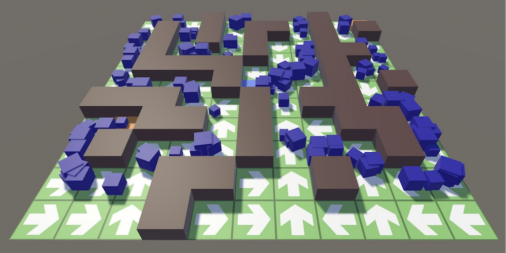
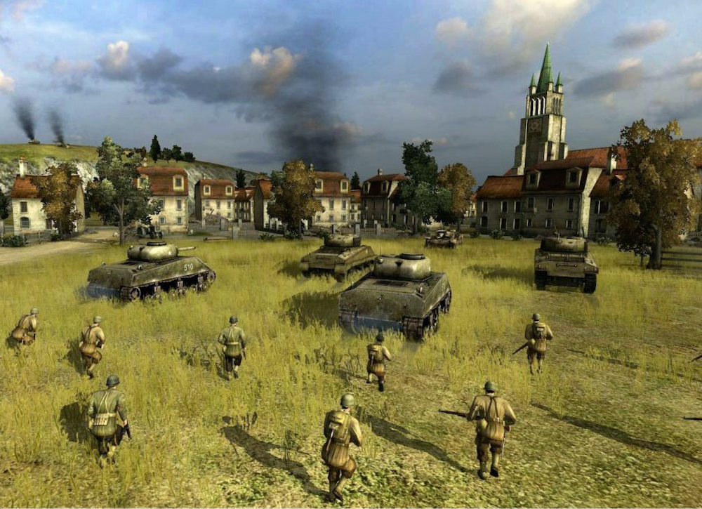
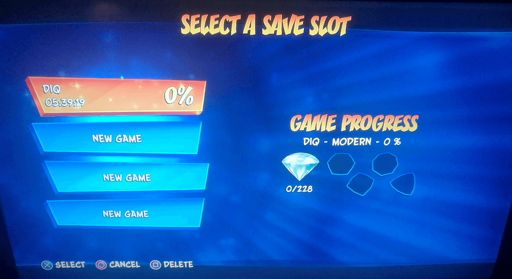

---
# Page settings
layout: default
keywords:
comments: false

# Hero section
title: COMP140 - Lecture Materials 7

# Author box
author:
    title: Matt Watkins
    description: Lecturer in Computing at Falmouth University

# Micro navigation
micro_nav: true

# Page navigation
page_nav:
    prev:
        content: UML
        url: '../uml-lm'
    next:
        content: Design Patterns
        url: '../design-patterns-lm'
---

# Data Structures


The following materials are derived from the *Data Structures lecture*. The video lecture is included at the bottom of the [*document*](#video-lecture).
{: .callout .callout--warning}

-   In programming we have the concept of reusable data structures which can be used to build applications
-   These can be used in order to build larger systems (e.g. Inventory Systems, AI Navigation etc)
-   Most programming languages have these built in
-   Before writing any system you should always examine these data structures and pick the appropriate one for your Use Case

## Big 'O' Notation

*“Measuring programming progress by lines of code is like measuring aircraft building progress by weight.”*
Bill Gates

This famous statement highlights How we want to define our code is based on two simple premises: **Simplicity** and **Purpose**.

### What is Big 'O'?

-   The efficiency of an algorithm can be gauged by how long it takes
-   This is known as *Time Complexity*
-   Big O Notation is used to describe this

One of the ways to make our code efficient is by optimising the search for data within a data set.
Let's consider how we search a data set of 100 items for a single data point. For example in a data set of 100 items, you are searching for an ‘0’ amongst ‘X’s.


*Fig. 1 - 100 data points in a data set*

 - The **best case** for finding the data is **1 iteration**
 - The **worst case** is a **100 iterations**

Big ‘O’ is always based on worse case scenario. 
- So **100 records** would take **100 iterations**
- Therefore **N records** would take **N iterations**.
- This can be written like this:

$$O(N)$$

**Performance** is represented by the **O** and the **N** represents **execution time or space used** - Hence the term Big ‘O’.

## Different Notation in Big 'O'

The previous example is known as:

### Linear Notation - $$O(N)$$

**Pseudo Code**
```c#
FUNCTION  linearSearch(list, value)
	FOR EACH element IN list
		IF (element == value)
			RETURN true
		END IF
	NEXT
		RETURN false
END FUNCTION
```
**Graph**

*Fig. 2 - Linear Notation Graph*

### Constant Notation - $$O(1)$$
**Pseudo Code**
```c#
FUNCTION getFirstElement(list)
	RETURN list[0]
END FUNCTION
```
**Graph**

*Fig. 3 - Constant Notation Graph*

The constant notation describes an algorithm that will always execute in the same execution time regardless of the size of the data set. For instance, an algorithm to retrieve the first value of a data set, will always be completed in one step, regardless of the number of values in the data set.

#### Hashing Tables

A hashing algorithm is an $$O(1)$$ algorithm that can be used to very effectively locate/search a value/key when the data is stored using a hash table.


*Fig. 4 - Hashing Tables*

Source: [https://it.wikipedia.org/wiki/Hash_table](https://it.wikipedia.org/wiki/Hash_table)

A hash table locates the actual data at an address called an index that is always a whole number and therefore is always associated with that record.

A bit like a book in a library its location is always known because of it’s numbering system. It resides at a fixed location no matter if the book is replaced with a newer copy. No sorting is required.

### Polynomial 	Notation - $$O(N^2)$$
**Pseudo Code**
```c#
PROCEDURE emptyChessboardGrid()
	FOR row FROM 0 to 7
		FOR col FROM 0 to 7
			grid[row][col] = 0
		NEXT col
	NEXT row
END PROCEDURE
```
**Graph**

*Fig. 5 - Polynomial Notation Graph*

$$O(N2)$$ represents an algorithm whose performance is directly proportional to the square of the size of the data set. Algorithms which are based on nested loops are more likely to have a quadratic $$O(N2)$$ and so are 2 dimensional arrays like the one above. Where we are plotting the grid of a chessboard.

### Exponential Notation - $$O(2^N)$$
**Pseudo Code**
```c#
FUNCTION  fibonacci(number)
	IF  (number <= 1)
		RETURN  number
	END  IF
	RETURN fibonacci(number - 2) + fibonacci(number -  1)
END FUNCTION
```
**Graph**

*Fig. 6 - Exponential Notation Graph*

The exponential notation O(2N) describes an algorithm whose growth doubles with each addition to the data set.
An example of an $$O(2^N)$$ function is the recursive calculation of Fibonacci numbers:


*Fig. 7 - Fibonacci Number Set*

### Logarithmic Notation - $$O(log(N))$$
**Pseudo Code**
```c#
? // Difficult to define in code. See explanation below.
```
Logarithmic notation is difficult to explain
**Graph**

*Fig. 8 - Logarithmic Notation Graph*

Logarithmic notation works on the basis of elimination. Getting rid of the things we know we are not looking for, that way we can arrive at the item we are searching for much quicker.
- In a data set of **9 items**, you are searching for a **6**


*Fig. 9 - Logarithmic Sample Set*

Linear notation would take 9 iterations
{: .callout .callout--info}

- First **sort** the data.
- In this case **position 4** (fifth item in the set) which has the value: **3**

Logarithmic eliminates data that we don't need by choosing the mid point in the data. 
{: .callout .callout--info}

- We then check to see if the value searched is **higher** than the **midpoint**. 
- If **true** we **remove** all values **below** the midpoint.
- If **false** we **remove** all values **above** the midpoint.
- Continue finding the midpoint and **repeat** until the value is found
- In the example the search is completed in **3 iterations** using logarithmic notation


*Fig. 10 - Logarithmic Sort and Search*

We can better understand the process using a flow chart to explain the logic loop.


*Fig. 11 - Flow of a Logarithmic Sort*

In computer games and other realtime interactive systems there is high frequency tracking of moving objects and statistics on those objects. This requires that we add, update, search, sort and delete data in the scene in real time. As we have previously seen there is a cost in time and memory of all this collection processing.


*Fig. 12 - A lot of sorting is requred in realtime applications*

Data structures form the container for performing and managing these operations.

## Types of Data Structure

We are going to look at **Linear Data structures** -  a data structure is said to be linear if its elements combine to form any specific order. 

### Data Structure Types

1.  Dynamic Arrays
2.  Linked Lists
3.  Queue
4.  Stack
5.  Associative Arrays
6.  Operations on Collection

These are typical to C# but many are also found or have equivalents in other languages.
{: .callout .callout--info}

We are primarily using examples in **Unity game engine using C#**. We will look at specific problems and how a specifc class of data structure can provide a solution through explanation and example.

### 1. Dynamic Arrays

#### The Problem

Arrays in C# are fixed in size. During development you need to know exactly how many item are going to be in the array. If you need to add elements and you don’t have enough space, you will need to carry out the following:

-   Create a **new** array of the appropriate size
-  **Copy** elements from the old array into this new one
-   **Destroy** the old array
-   **Add** in the new element

The above process can be quite costly.

#### The Solution - Dynamic Arrays (Lists)

Luckily in most programming languages we have a Data Structure which grows in size when we require it. In C# we have the `List` class. These classes have the same properties as an array

-   Items are located **contiguously** in memory
-   We can **randomly access** elements using an index
-   We can **iterate** through each element

You should consider using a Dynamic Array over a normal array. 
*One caveat - Dynamic Arrays are slightly more expensive!*

#### Game Development Use Cases

 1. Manage enemies as they are spawned into the scene
 2. Keep track of players as they are added into the game
 3. Manage inventory systems


*Fig. 13 - Manage Spawning Enemies*

#### C# List Example

```c#
List<int> scores = new List<int>();
scores.Add(100);
scores.Add(200);
foreach(int  score  in  scores)	{
	Debug.Log("Score is "+score.ToString());
}
int player1Score = scores[0];
scores.Remove(100);
```
#### Addtional Notes on Lists

-   Try to avoid insertion/deletion in the **middle of the collection**
-   Searching the collection is linear and will increase as more elements are added $$O(n)$$
-   Insertion/deleting at the end of the collection is constant in performance $$O(1)$$

#### Notes on Generic Types

Generic Programming is where you write one piece of code which operates on many different types. This uses a concept called **Templates** which act in **proxy** for the type. The Compiler then generates the code which uses the actual type

**Applying Generic Types to `List`**

In the previous section you would have noticed the following:
-   `List<int>`
-   These are known as generic parameters and you should insert the data type that the collection will handle (including your own data types aka classes and structs)
-   Example: `TypeName<T>` where `T` is a type parameter

You can write your own generic classes and functions but this is beyond the scope of this class. Here are some C# examples - [http://www.tutorialsteacher. com/csharp/csharp-generics](http://www.tutorialsteacher.%20com/csharp/csharp-generics)

Word of warning, it is often difficult to write generic code. If you have errors they are often difficult to isolate as the compiler messages are so cryptic
{: .callout .callout--warning}


### 2. Linked Lists

#### The Problem

You have started using a **dynamic array** and you have noticed performance is poor on adding/removing. You then realise that you are **adding/removing** elements from the **middle** of the collection. You also realise that you **don’t** require **random access** to elements in the collection.

#### The Solution

In this case a Linked List would be a better choice. In C# we have the `LinkedList` class. Linked lists contain elements (called **Nodes**) which usually have a reference to the previous and next Node in the list. This means that there is a slight increase in memory needed when working with lists.

#### Use Case
-   If an AI character has to visit a series of **waypoints**, these could be stored in a list
-   Your Player has a number of **quests** they can try and complete
-   If the AI/Player carries an **action** and a number of **systems** need to be notified of the event


*Fig. 14 - Visiting Waypoints*

#### C# Linked List Example
```c#
LinkedList<Transform> waypoints=new  LinkedList<Transform>();

waypoints.AddLast(GameObject.Find("Waypoint1").Transform);
waypoints.AddLast(GameObject.Find("Waypoint2").Transform);
waypoints.AddLast(GameObject.Find(“Waypoint3”).Transform);

foreach(Transform  t  in  waypoints) {
	Debug.Log("Waypoint Locations “ + t.position.ToString());
}

waypoints.AddFirst(GameObject.Find("Waypoint0").Transform);
LinkedListNode<Transform> waypoint2Node = linked.Find(GameObject.Find("Waypoint2"));
waypoints.AddAfter(waypoint2Node,GameObject.Find("SpecialQuest"));
```
LinkedList give you control over where new items are placed in the list. For instance using methods like `AddLast`, `AddFirst`, `AddBefore` and `AddAfter`. You have a wide variety fo methods to control the placement of items.

#### Addtional Notes on Linked Lists

-   Linked Lists usually support constant time insertions and deletions in the collection $$O(1)$$
-   Also perform better than dynamic arrays for moving elements around the collection
-   This feature means that Linked Lists are a good data structure if you need to sort your data
-   Main drawback of Linked Lists is that you can’t have direct access to elements in the list, it takes linear time $$O(n)$$ to access

### 3. Queue

#### The problem

If you need to visit items in a certain order (e.g front to back). Examples of this could be waypoints or commands to an AI character.

#### The Solution - Queue

-   In C# we have the `Queue` class
-   This is **First-In-Last-Out** (FILO) data structure
-   You add elements to the end of the queue and you remove elements from the start

#### Use Case

-   An Real Time Strategy game where you can add **orders** to a unit, these are then carried out in **sequence**  
-   An RTS where you have a **base** which **produces units**    
-   A **spawning system**, where you have to defeat enemies in a **specific order**


*Fig. 15 - Orders to a Unit*

#### C# Queue Example
```c#
Queue<GameObject> unitsToBuild = new  Queue<GameObject>();

unitsToBuild.Enqeue(soliderPrefab);
unitsToBuild.Enqeue(builderPrefab);
unitsToBuild.Enqeue(tankPrefab);

foreach(GameObject  i  in  unitsToBuild)
{
	Debug.Log("Units to build “ + i.name);
} 
GameObject  nextUnitToBuild = unitsToBuild.Peek();
unitsToBuild.Dequeue();
```
Enqueue() adds an object to the queue. Dequeue() is a method to remove from the beginning of the Queue. The trivial drawback of this system is writing variations on the word Queue with it’s proliferation of U’s and E’s. Typos are always a pain!

### 4. Stack

#### The Problem

-   If you need to manage the state of an AI character
-   If you need to implement a Undo system

#### The Solution - Stack

-   A Stack would be a good choice
-   In C# we have the Stack class
-   This is **Last-In-First-Out** data structure
-   You add elements to the top of the stack and you remove elements from the top

#### C# Stack Example
```c#
Stack<Command> issuedCommands=new  Stack<Command>();
issuedCommands.Push(new  Command(“Edit"));
issuedCommands.Push(new  Command("Create"));
issuedCommands.Push(new  Command(“Update”));  
Debug.Log(“First Command Added” + issuedCommands.Peek());
```
Stack has **3 principle methods**

-   [Push](http://msdn.microsoft.com/en-us/library/6335ax0f%28v=vs.100%29.aspx): add an object on the stack.
-   [Pop](http://msdn.microsoft.com/en-us/library/9say334k%28v=vs.100%29.aspx): remove and return the first object on the stack.
-   [Peek](http://msdn.microsoft.com/en-us/library/1w32446f%28v=vs.100%29.aspx): get the first object without removing it.

### 5. Associative Arrays

#### The Problem
-   If you need to store **one unique copy** of an element
-   You want to access an **element via a key**
-   You are doing **lots of searches** for an element

#### The Solution
-   You should use an Associative array
-   In C# we have the `Dictionary` class
-   These data structures are structured as **key-value pair** eg. - Name & Age
-   It allows you to retrieve the items via the key
-   This makes it a good choice for looking up large data sets

#### Use Case

-   If you are creating a **resource management system** for handling textures, models or other assets
-   **Localisation system**, each language is stored in an Associative Array
-   **Unit Manager**, a class to manage units created in the game
-   **Save Game** System


*Fig. 16 - Save Game System*

#### C# Dictionary Example
```c#
Dictionary<string, int> highScoreTable = new  Dictionary<string, int>();
highScores.Add(“Laura",200);
highScores.Add(“Olu",2000);
highScores[Laura]= 4000;

foreach(KeyValuePair<string, int> pair  in highScoreTable)
{
	Debug.Log("High Score "+pair.Key+" “+pair.Value);
}

if (highScores.ContainsKey("Laura")) {
	int  score = highScores[“Laura”];
}
highScores.Remove(“Laura”);
```
#### Additional Notes
-   Iterating over a map has a slightly **annoying syntax**
-   Associative Arrays tend to have **good performance for retrieval** $$O(log(N))$$
-   If you add an item and its key already exists it may **overwrite** the value

### 6. Operations on Collections

#### Sorting

-   Sorting is where we order the items in a collection in a **specific** **order**
-   There are a whole bunch of sorting algorithms including; Insertion sort, Heap sort, Quick sort (**please read about these!**)
-   In C#, the best sorting algorithm will be picked depending on the size of the collection
-   Most of the common data types don’t need additional work
-   For **custom classes**, we have to write our own sorting algorithm

#### Sorting C#

-   There are few ways to sort a collection
	1.  Provide a **custom delegate** function for the sort
	2.  Provide a custom class which inherits from `IComparer`
	3.  Your own class has to inherit from `IComparable`
-   Often you will use option 3 as the **default sort**
-   Which can then be overridden by option 1

#### C# Example 1 - Sorting with Delegate
```c#
struct  Character {
	string  name;
	int  health;
	int  strength;
}
//Adding omitted!
List<Character> characters = new  List<Character>();

//Sort by health
characters.Sort(delegate (Character  c1, Character  c2) {
	return (c1.health.CompareTo(c2.health));
});
```
Note for those unfamiliar with structs. **Structs** can be used to hold small data values that do not require inheritance, e.g. coordinate points, key-value pairs.
Here you can see that the `delegate` sorts the list of `struct` Characters by their health using `CompareTo`.
 
The following article helps to explains in more detail how to utilise delegates to sort lists:
[https://www.techiedelight.com/sort-list-of-objects-csharp](https://www.techiedelight.com/sort-list-of-objects-csharp)

#### C# Example 2 - Sorting with IComparable
```c#
struct  Character:IComparable<Character>
{
	string  name;
	int  health;
	int  strength;
	// sort by name
	public  int  CompareTo(Character  compareCharacter)
	{
		return  name.CompareTo(compareCharacter.name);
	}
}
//Adding omitted!
List<Character> characters=new  List<Character>();

//Sort will use the CompareTo in the struct or class
characters.Sort()
```
Another approach is to use the interface of `IComparable` which imposes a natural order on things. In `IComparable` the `CompareTo` method is overridden

as in the method which compares the current object with the specified object, as we saw in the previous approach. In `IComparable` the value now returned by the `compareTo()` method decides the relative order of the objects in the sorted list. A negative, zero and a positive value represents if the compared object is less than, equal to or more than the specified object. More on that shortly.

In the following code, the `Character` class implements the `IComparable` interface and overrides its `CompareTo()` method. The List of Characters objects is then sorted using the no-arg `Sort` method.

#### Points to note in C#

The **CompareTo** function returns an **int** which can be the following

-   **Less than zero**: The instance precedes the one passed in
-   **Zero**: The objects are in the same order
-   **Greater than zero**: The instance follows the one passed in  
	- 1: Swap
	- 0: Keep
	- -1: Don't swap

Another way to look at it is like a deck of cards that we shuffling into order based on higher lower principle.

### ICompare vs IComparable

The principle reason for choosing the different options is based on access. If you don’t have access to modify a specific class then implementing through the ICompare interface is recommended.

Find out more: [https://dev.to/digionix/icomparable-vs-icomparer-274f](https://dev.to/digionix/icomparable-vs-icomparer-274f)

## Conclusion

I have outlined the mathematical theory of big O notation which is used to classify algorithms according to how their run time or space requirements grow as the input size grows. I have also outlined a range of example data structures with use cases and examples that you can deploy in your own code and projects.

Here is some addtitional **reference** material to support this lecture:

**Lists and Dictionaries in Unity**
[https://unity3d.com/learn/tutorials/modules/intermediate/scripting/lists-and-dictionaries](https://unity3d.com/learn/tutorials/modules/intermediate/scripting/lists-and-dictionaries)

**Understanding Big ‘O’ Notation**
[https://www.101computing.net/big-o-notation](https://www.101computing.net/big-o-notation)
[http://bigocheatsheet.com/](http://bigocheatsheet.com/)

**Visualise different sorting methods in C#**
[https://www.codeproject.com/Articles/132757/Visualization-and-Comparison-of-sorting-algorithms](https://www.codeproject.com/Articles/132757/Visualization-and-Comparison-of-sorting-algorithms)


## Video Lecture

### Part 1
<iframe width="100%" height="370" src="https://web.microsoftstream.com/embed/video/8f8786c7-82bb-4d21-a5d8-17c7088c0fcc?autoplay=false&showinfo=true" allowfullscreen style="border:none;"></iframe>

### Part 2
<iframe width="100%" height="370" src="https://web.microsoftstream.com/embed/video/620d8fc4-9ce0-41d9-83f0-35ee903040dc?autoplay=false&showinfo=true" allowfullscreen style="border:none;"></iframe>
<!--stackedit_data:
eyJoaXN0b3J5IjpbMTgzMzgyOTIyNCwtMTQxNDAyMzEyNiw1MT
U5MDU1NjAsMTYxNzMxMDQzMCwtNjcwMDM2NTUxLC0xMjU3MzQ1
MTUwLC0xNDU0ODQ0MTY5LDE5NTExNDMwMjgsLTExODc1OTQwNz
csMTk4OTY4ODU0OCwtMTY1NzA0OTE3OSw5ODgyODU3NzUsNjIy
Mjg2NDg3LDQxMzMwOTEyNCwxNjY1NDIxMzE2LC0xNzE3NjYyNj
UzLDk4OTIxNDMwMSwxMTUyMDI4MTI5LC02ODk5NjAyOTgsMzk2
NDQ2MTM4XX0=
-->