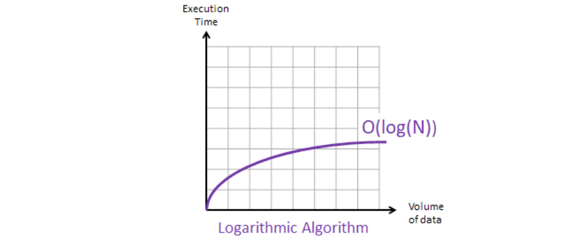

---
# Page settings
layout: default
keywords:
comments: false

# Hero section
title: COMP140 - Lecture Materials 7

# Author box
author:
    title: Matt Watkins
    description: Lecturer in Computing at Falmouth University

# Micro navigation
micro_nav: true

# Page navigation
page_nav:
    prev:
        content: UML
        url: '../uml-lm'
    next:
        content: Design Patterns
        url: '../design-patterns-lm'
---

# Data Structures


The following materials are derived from the *Data Structures lecture*. The video lecture is included at the bottom of the [*document*](#video-lecture).
{: .callout .callout--warning}

-   In programming we have the concept of reusable data structures which can be used to build applications
-   These can be used in order to build larger systems (e.g. Inventory Systems, AI Navigation etc)
-   Most programming languages have these built in
-   Before writing any system you should always examine these data structures and pick the appropriate one for your Use Case

## Big 'O' Notation

*“Measuring programming progress by lines of code is like measuring aircraft building progress by weight.”*
Bill Gates

How we want to define our code is based on two simple premises: **Simplicity** and **Purpose**.

### What is Big 'O'?

-   The efficiency of an algorithm can be gauged by how long it takes
-   This is known as *Time Complexity*
-   Big O Notation is used to describe this

One of the ways to make our code efficient is by optimising the search for data within a data set.
Let's consider how we search a data set of 100 items for a single data point. For example in a data set of 100 items, you are searching for an ‘0’ amongst ‘X’s.


*Fig. 1 - 100 data points in a data set*

 - The **best case** for finding the data is **1 iteration**
 - The **worst case** is a **100 iterations**

Big ‘O’ is always based on worse case scenario. 
- So **100 records** would take **100 iterations**
- Therefore **N records** would take **N iterations**.
- This can be written like this:

$$O(N)$$

**Performance** is represented by the **O** and the **N** represents **execution time or space used** - Hence the term Big ‘O’.

## Different Notation in Big 'O'

The previous example is known as:

### Linear Notation - $$O(N)$$

**Pseudo Code**
```c#
FUNCTION  linearSearch(list, value)
	FOR EACH element IN list
		IF (element == value)
			RETURN true
		END IF
	NEXT
		RETURN false
END FUNCTION
```
**Graph**

*Fig. 2 - Linear Notation Graph*

### Constant Notation - $$O(1)$$
**Pseudo Code**
```c#
FUNCTION getFirstElement(list)
	RETURN list[0]
END FUNCTION
```
**Graph**

*Fig. 3 - Constant Notation Graph*

The constant notation describes an algorithm that will always execute in the same execution time regardless of the size of the data set. For instance, an algorithm to retrieve the first value of a data set, will always be completed in one step, regardless of the number of values in the data set.

#### Hashing Tables

A hashing algorithm is an $$O(1)$$ algorithm that can be used to very effectively locate/search a value/key when the data is stored using a hash table.


*Fig. 4 - Hashing Tables*

Source: [https://it.wikipedia.org/wiki/Hash_table](https://it.wikipedia.org/wiki/Hash_table)

A hash table locates the actual data at an address called an index that is always a whole number and therefore is always associated with that record.

A bit like a book in a library its location is always known because of it’s numbering system. It resides at a fixed location no matter if the book is replaced with a newer copy. No sorting is required.

### Polynomial 	Notation - $$O(N^2)$$
**Pseudo Code**
```c#
PROCEDURE emptyChessboardGrid()
	FOR row FROM 0 to 7
		FOR col FROM 0 to 7
			grid[row][col] = 0
		NEXT col
	NEXT row
END PROCEDURE
```
**Graph**

*Fig. 5 - Polynomial Notation Graph*

$$O(N2)$$ represents an algorithm whose performance is directly proportional to the square of the size of the data set. Algorithms which are based on nested loops are more likely to have a quadratic $$O(N2)$$ and so are 2 dimensional arrays like the one above. Where we are plotting the grid of a chessboard.

### Exponential Notation - $$O(2^N)$$
**Pseudo Code**
```c#
FUNCTION  fibonacci(number)
	IF  (number <= 1)
		RETURN  number
	END  IF
	RETURN fibonacci(number - 2) + fibonacci(number -  1)
END FUNCTION
```
**Graph**

*Fig. 6 - Exponential Notation Graph*

The exponential notation O(2N) describes an algorithm whose growth doubles with each addition to the data set.
An example of an $$O(2^N)$$ function is the recursive calculation of Fibonacci numbers:


*Fig. 7 - Fibonacci Number Set*

### Logarithmic Notation - $$O(log(N))$$
**Pseudo Code**
```c#
? // Difficult to define in code. See explanation below.
```
Logarithmic notation is difficult to explain
**Graph**

*Fig. 8 - Logarithmic Notation Graph*

Logarithmic notation works on the basis of elimination. Getting rid of the things we know we are not looking for, that way we can arrive at the item we are searching for much quicker.
- In a data set of **9 items**, you are searching for a **6**


*Fig. 9 - Logarithmic Sample Set*

Linear notation would take 9 iterations
{: .callout .callout--info}

- First **sort** the data.
- In this case **position 4** (fifth item in the set) which has the value: **3**

Logarithmic eliminates data that we don't need by choosing the mid point in the data. 
{: .callout .callout--info}

- We then check to see if the value searched is **higher** than the **midpoint**. 
- If **true** we **remove** all values **below** the midpoint.
- If **false** we **remove** all values **above** the midpoint.
- Continue finding the midpoint and **repeat** until the value is found
- In the example the search is completed in **3 iterations** using logarithmic notation


*Fig. 10 - Logarithmic Sort and Search*

We can better understand the process using a flow chart to explain the logic loop.


*Fig. 11 - Flow of a Logarithmic Sort*

In computer games and other realtime interactive systems there is high frequency tracking of moving objects and statistics on those objects. This requires that we add, update, search, sort and delete data in the scene in real time. As we have previously seen there is a cost in time and memory of all this collection processing.


\*Fig. 12 - A lot of sorting is requred in realtime applications

Data structures form the container for performing and managing these operations.

## Types of Data Structure

We are going to look at **Linear Data structures** -  a data structure is said to be linear if its elements combine to form any specific order. 

### Data Structure Classes*

1.  Dynamic Arrays
2.  Linked Lists
3.  Queue
4.  Stack
5.  Associative Arrays
6.  Operations on Collection

We are primarily using examples in **Unity game engine using C#**. We will look at specific problems and how a specifc class of data structure can provide a solution through explanation and example.

*These are typical to C# but many are also found or have equivalents in other languages.
{: .callout .callout--info}

### Dynamic Arrays

#### The Problem

Arrays in C# are fixed in size. During development you need to know exactly how many item are going to be in the array. If you need to add elements and you don’t have enough space, you will need to carry out the following:

-   Create a **new** array of the appropriate size
-  **Copy** elements from the old array into this new one
-   **Destroy** the old array
-   **Add** in the new element

The above process can be quite costly.

#### The Solution - Dynamic Arrays (Lists)

Luckily in most programming languages we have a Data Structure which grows in size when we require it. In C# we have the **List** class. These classes have the same properties as an array

-   Items are located **contiguously** in memory
-   We can **randomly access** elements using an index
-   We can **iterate** through each element

You should consider using a Dynamic Array over a normal array. 
*One caveat - Dynamic Arrays are slightly more expensive!*
<!--stackedit_data:
eyJoaXN0b3J5IjpbMjAyNjQ2NDEzMSwzOTY0NDYxMzgsMTc2MT
A4NDA0OCwxMzIwMTkzOTUyLDY2Njk4ODI3MCwtMTY5Mjg4Mjc3
NSwtMjA5MDM2NzM2MCwtMzE2MjI5NjMyLDE0NjY4NDM1NDQsLT
g2NjgxMjIyMiwxMjYyNDU0NDIyLC03NDc0Mjc1NzEsMTM0Njgx
ODk4LC01MjQwMjgxMSwtMzA5MjEwNzI2LC0xNDU2MjE4MTI4LC
0xMTQyMTAzNjc0LDE2MDY0MTQ0MTAsLTY4MTA0NTMwMSwtNDM1
MTE3MTQ2XX0=
-->