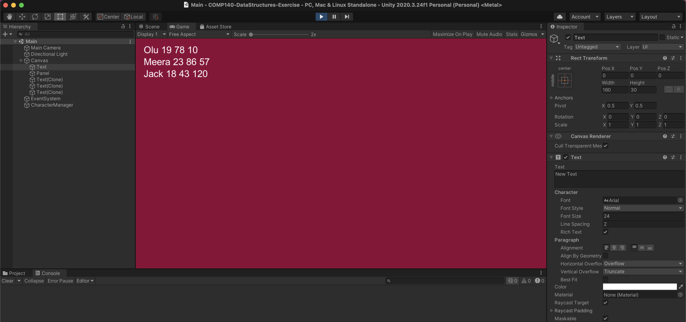

---
# Page settings
layout: default
keywords:
comments: false

# Hero section
title: 5. Data Structures
description: COMP140 - Worksheet 5

# Author box
author:
    title: Matt Watkins
    description: Lecturer in Computing at Falmouth University

# Micro navigation
micro_nav: true

# Page navigation
page_nav:
    prev:
        content: UML
        url: '../uml-ws'
---

# Data Structures

## EXERCISE 1
### Collections
1. Fork the following **[repo](https://github.falmouth.ac.uk/Games-Academy/COMP140-DataStructures-Exercise)**
2. Open the **main** scene in Unity
3. Add at least 20 additional items to the collection
4. Display these to the screen

*Screenshot of Collections Exercise - Start Point*

## EXERCISE 2
### Sorting
1. Write a default sort, so that the items are sorted by **name**
2. Sort the collection when the s key is pressed
3. Write another sort, to sort by **score**, trigger this with a key press
4. Write another sort, to sort by **age**, trigger this with a different key press

## EXERCISE 3
### Searching
5.  Investigate how to **search** for items in collections    
6.  Add code to search for **specific items** in the collections   
7.  Add **visual representation** to show that the search has completed, this could be a colour change or just displaying the found item elsewhere on the screen.

## STRETCH GOAL - ICompare & IComparable

8. Using this **data** set in CSV format.
9. Develop a method to **parse** the data in the file using a **struct** into either **Unity** or **VS Console App**
10. Create a highscore table that sorts the data to only show the first **20 records** with the **highest scores**
11.  Create a button or text input instruction to remove all players that are not members from the highscore.

You may find these articles useful. Find out more: [https://dev.to/digionix/icomparable-vs-icomparer-274f](https://dev.to/digionix/icomparable-vs-icomparer-274f)
[https://unity3d.com/learn/tutorials/modules/intermediate/scripting/lists-and-dictionaries](https://unity3d.com/learn/tutorials/modules/intermediate/scripting/lists-and-dictionaries)
{: .callout .callout--info}

## Tasks for the rest of the week
Consider your individual project and implement a data structure class in your code that processes
a feature of your game/experience. 

For example, you could use them to process:
- enemies
- score
- bullets
- resource management

Please use at least one of these: **Lists, LinkedList, Stack, Queue** or **Dictionary**
Please bring your code to discuss with your programming tutor in your seminar group.

## VIDEO LECTURE

It is assumed that you have watched the video lecture before this workshop. If not you should find time to watch them during the week.
{: .callout .callout--warning}

### Lecture - Data Structures Part 1
<iframe width="640" height="360" src="https://web.microsoftstream.com/embed/video/8f8786c7-82bb-4d21-a5d8-17c7088c0fcc?autoplay=false&showinfo=true" allowfullscreen style="border:none;"></iframe>

### Lecture - Data Structures Part 2
<iframe width="640" height="360" src="https://web.microsoftstream.com/embed/video/620d8fc4-9ce0-41d9-83f0-35ee903040dc?autoplay=false&showinfo=true" allowfullscreen style="border:none;"></iframe>

<!--stackedit_data:
eyJoaXN0b3J5IjpbLTEwMjM5MjYwMzAsLTE0ODQ0NTI0NDYsMz
Y4MTAzMDUsOTU1ODk1NzQ4LC0xMDEzMDYzMDc5XX0=
-->