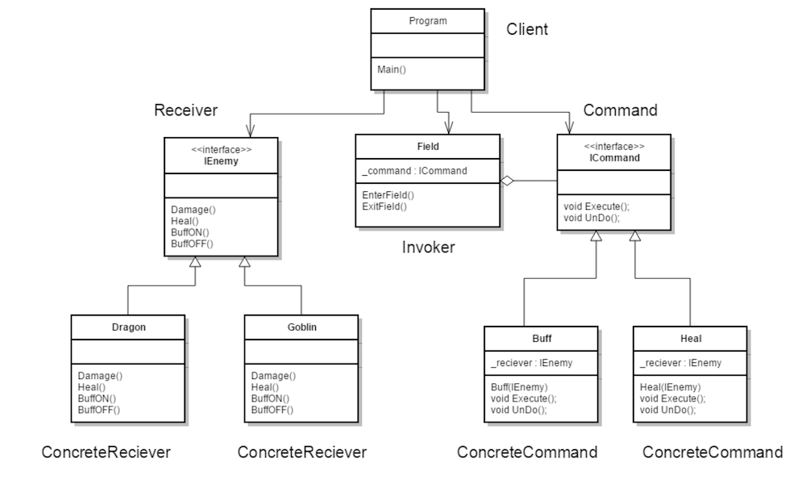
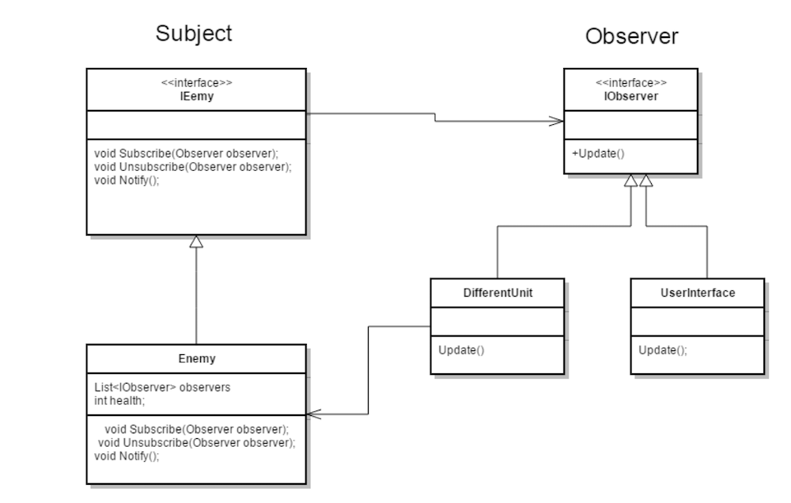
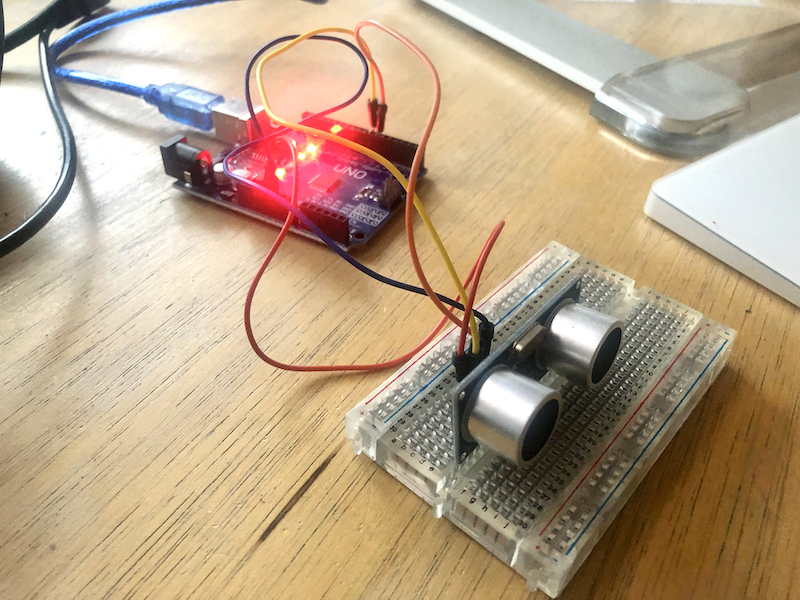
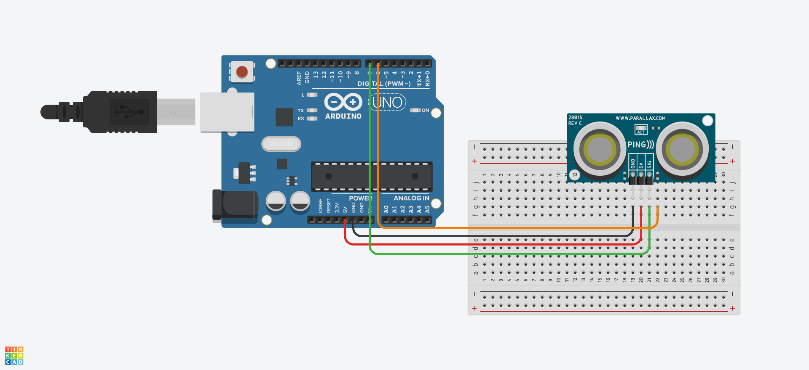
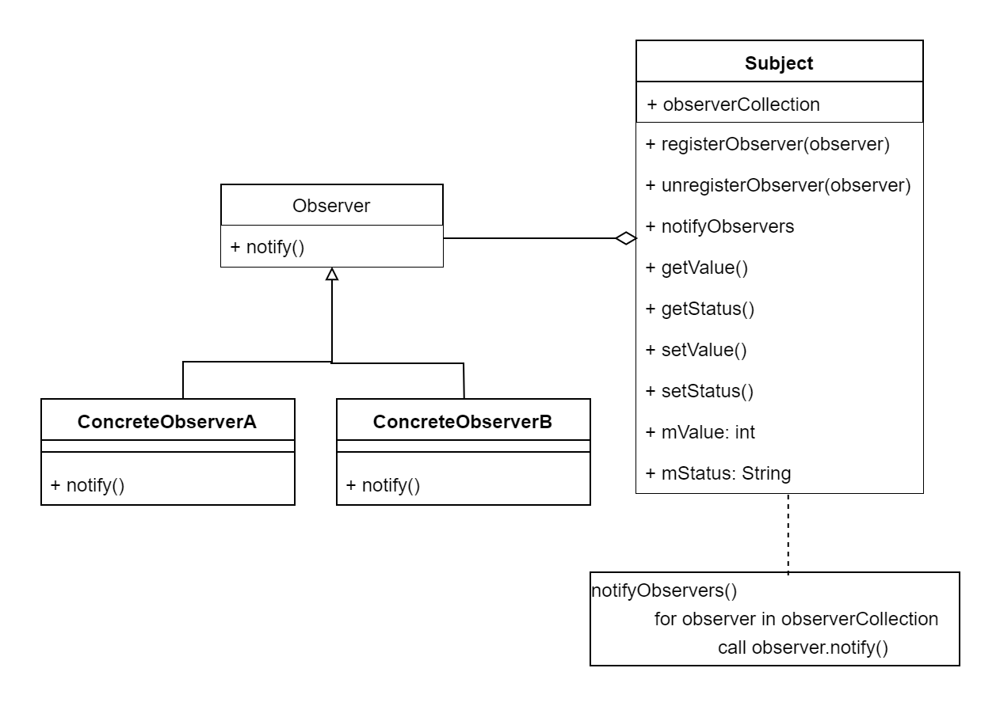

---
# Page settings
layout: default
keywords:
comments: false

# Hero section
title: 8. Design Pattterns
description: COMP140 - Lecture Materials 8

# Author box
author:
    title: Matt Watkins
    description: Lecturer in Computing at Falmouth University

# Micro navigation
micro_nav: true

# Page navigation
page_nav:
    prev:
        content: Data Structures
        url: '../data-structures-lm'
---

# 8. Design Patterns


The following materials are derived from the *Design Patterns lecture*. The video lecture is included at the bottom of the [**document**](#video-lecture).
{: .callout .callout--warning}


## Introduction

Design patterns was written in 1994 by the ‘Gang of Four’ - Erich Gamma, John Vlissides, Richard Helm &  Ralph Johnson. Design patterns are set of procedures or patterns that help to make OOP code more effective and reusable.


*Fig. 1 - The Gang of Four and their book*

Design patterns establish consistency that helps developers build and modify code safely avoiding common architecting problems. 

- Using consistent methods to fix and to avoid issues. 
- Having a shared language to understand common problems
- Adhering to the SOLID principles of object-oriented programming.

### Object Oriented Design Basics

Design Patterns are intended for object orientated systems as they tend to exhibit recurring structures that promote:

-   **Abstraction**
-   **Flexibility**
-   **Modularity**
-   **Elegance**

Abstracts a recurring design structure and comprises class and/or object:

-   **dependencies**
-   **structures**
-   **interactions**
-   **conventions**

Names and specifies the design structure explicitly and thereby distils design experience

### Formalising the Relationship between Objects

Design patterns have some basic similarities there is almost always a **client** that requests something or makes use of the pattern. There is also a **subject** that is usually creating, producing, changing, observing or providing access to the object which is usually a **product** in the system or a game object on screen.


*Fig. 2 - Relationships between objects*


### The Design Pattern Categories

Design patterns are divided into 3 principle types which relate to their role in a process or application.


*Fig. 3 - The 3 main categories of Design Patterns*

Within these categories are the patterns themselves. I have listed the principle ones below. In this lecture we are going to explore a small subset which are highlighted below in ***bold***.

**Creational**|**Structural**|**Behavioural**
:-----:|:-----:|:-----:
***Abstract Factory***|Adapter|Chain of Responsibility
Builder|Bridge|***Command***
***Factory***|Composite|Interpreter
Object|***Decorator***|Iterator
Pool|Facade|Mediator
Prototype|Flyweight|Memento
***Singleton***|Proxy|***Observer***
 | |State
 | |Strategy
 | |Template
 | |Visitor

### How to make use of Design Patterns

- Design patterns are often **tacit knowledge** made **explicit**.
- You will develop tacit knowledge of patterns through **regular design practice**.
- Engage in **constant research** & **reflection** when designing software to learn all these different patterns.
- They will help you **communicate** and design in the future.
- Additional research will be required as the **number of patterns greatly exceeds** those that can be covered in workshops.

## Creational Patterns

### 1. Factory

Factory is used to create an object from instance of another class.  In Factory pattern, we create object without exposing the creation logic. This helps to deal with large and more complex programs. In this pattern, an interface is used for creating an object, but lets subclasses decide which class to instantiate. Creation process is done in run time.

#### UML


fig. 4 - UML for Factory Example 

In this example UML from a typical game where Enemy object is created, and its type is based on random a number. Object is created in run time.

#### Example - The Factory

First let’s create Interface that will be shared between all enemies that can be created with Factory. This will be used by client.

```c#
public interface IFactory
{
	void Damage(int dmg);
}
```
Now we need to create Classes that will inherit this interface. In the example this will be `EnemyType1` and `EnemyType2`.
  
```c#
public  class  EnemyType1 : IFactory
{
	int  _health=100;
	public void  Damage(int  dmg)
	{
		_health -= dmg;
		Console.WriteLine("EnemyType1 health:" + _health.ToString());
	}
}

public class EnemyType2 : IFactory
{
	int _health = 200;
	public  void  Damage(int  dmg)
	{
		_health -= dmg;
		Console.WriteLine("EnemyType2 health:" + _health.ToString());
	}
}
```

#### Example - The Interface

Next we need to create the Interface for factory itself.

```c#
public abstract class EnemyFactory
{
	public abstract IFactory InstantiateEnemy(int type);
}
```

```c#
public class InstantiateEnemyFactory : EnemyFactory
{
	public override IFactory InstantiateEnemy(int  type)
	{
		switch (type)
		{
			case 1:
				return new EnemyType1();
			case 2:
				return new EnemyType2();
			default:
				throw  new  ApplicationException(string.Format("Wrong number"));
		}
	}
}
```
In The factory Class we override the method with `switch` statement that will return the objects based on the input number. As a return type we use interface `IFactory`, this way we can return any object that inherits from it.

#### Example - The Client

```c#
class  Program{
	static void Main(string[] args)
	{
		//random number
		int type = new Random().Next(1, 1000)% 2 + 1;
		//Instance of the class
		EnemyFactory  factory = new  InstantiateEnemyFactory();
		IFactory  newEnemy = factory.InstantiateEnemy(type);
		newEnemy.Damage(20);
		type = new Random().Next(1, 2000)%2 + 1;
		IFactory  newEnemy2 = factory.InstantiateEnemy(type);
		newEnemy2.Damage(20);
		Console.ReadKey();
	}
}
```
The last step is to create the client that will use the factory class. Numbers don’t have to be random. I’m using random numbers to generate random enemies from the factory. In a real world example we would create a list of enemies rather than choosing name for each of them. This pattern is very simple and effective.

Factory defines an interface for creating an object, but lets subclasses decide which class to instantiate. Factory Method lets a class defer instantiation to subclasses.

You can see this example as a **Visual Studio App** in this repo:\
[https://github.falmouth.ac.uk/Matt-Watkins/COMP140-Factory-Example](https://github.falmouth.ac.uk/Matt-Watkins/COMP140-Factory-Example)

### 2. Abstract Factory


fig. 5 - Visualising Abstract Factory

Abstract factory is similar to factory but this time we will encapsulate all classes, by removing the interfaces for Product and Factory. This pattern is also called a factory of factories, because this patterns acts as a super factory which creates other factories. Abstract factory pattern is useful when the client needs to create objects which are somehow related or similar, without specifying the concrete class.  With this pattern objects can interact with each other through common interfaces.

#### UML

In the UML of the code we are about to write, we’ll create Abstract Factory that will spawn enemies and give them a specific weapon and armour.


fig. 6 - Abstract Factory UML diagram

#### Example - The Factory

```c#
interface  IEnemyFactory
{
	IWeapon GetWeapon();
	IArmor GetArmour();
}
```
The first thing is to create the interface for Factory, that will be used to specify the equipment of each enemy.
```c#
class Mage : IEnemyFactory
{
	public IWeapon GetWeapon()
	{
		return new Wand();
	}
	public IArmor GetArmor()
	{
		return new Cloak();
	}
}

class Warrior : IEnemyFactory
{
	public IWeapon GetWeapon()
	{
		return new Sword();
	}
	public IArmor GetArmor()
	{
		return new BodyArmour();
	}
}
```
Concrete classes will be named as the type of enemy that will be created. In the example there are two enemies `Mage` and `Warrior`.

#### Example - The Product

In next step we will create interface for items that will be given to the enemies. Both types share the same types of equipment, weapon and armour. CLICK

```c#
interface IWeapon
{
	string Item();
}

interface IArmour
{
	string Item();
}
```
In Concrete classes methods will return string values  that will be printed to the console.
```c#
class  Sword : IWeapon
{
	public string Item()
	{
		return "Iron Sword";
	}
}

class Wand : IWeapon
{
	public string Item()
	{
		return "Magic Wand";
	}
}

class BodyArmour : IArmour
{
	public string Item()
	{
		return "Iron Body Armor";
	}
}

class Cloak : IArmour
{
	public string Item()
	{
		return "Magic Cloak";
	}
}
```
#### Example - The Client

Client is the last part is to create. Here we will create instance of the factory and spawn our enemies and define their weapons and armour. 

```c#
class  Client
{
	IEnemyFactory factory = null;
	public void SpawnEnemy(string  enemy)
	{
		if (enemy == "Warrior")
		{
			factory = new Warrior();
			Console.WriteLine("New Warrior equipment:");
			Console.WriteLine(factory.GetWeapon().Item());
			Console.WriteLine(factory.GetArmour().Item());
		}
		else if (enemy == "Mage")
		{
			factory = new Mage();
			Console.WriteLine("New Mage equipment: ");
			Console.WriteLine(factory.GetWeapon().Item());
			Console.WriteLine(factory.GetArmour().Item());
		}
		else
		{
			Console.WriteLine("Wrong type");
		}
	}
}
```
```c#
//Main method
static  void  Main(string[] args)
{
	Client client = new Client();
	client.SpawnEnemy("Mage");
	client.SpawnEnemy("Warrior");
	Console.Read();
}
```
Abstract Factory facilitates an interface for creating families of related or dependent objects without specifying their concrete classes. This pattern is very useful but in large projects it may increase the complexity of the code.

### 3. Singleton

Singleton is a basic design pattern is useful because it guarantees that there is only **one instance of a class** and can be accessed globally. This is usually ’lazily’ initialised via a **static function** that satisfies the previous statement. It is used for **manager classes** which track some sort of global state. 

Some programmer’s consider Singletons to be an anti-pattern. Find out more here:
[**https://stackoverflow.com/questions/12755539/why-is-singleton-considered-an-anti-pattern**](https://stackoverflow.com/questions/12755539/why-is-singleton-considered-an-anti-pattern)
{: .callout .callout--info}

Classes implementing Singleton pattern will ensure that only one instance of the object ever exists at any one time.  
It is recommend using Singletons for things that do not need to be copied multiple times during a game. This is great for controller classes like GameManager or AudioController.


fig. 6 - Audio Manager in Unity Inspector

### Example - Simple Implementation
```c#
public class SingletonController : MonoBehaviour {
	public static SingletonController instance;
	private void Awake() {
		if (instance != null)
		{
			Destroy(gameObject);
		} else {
			Instance = this;
		}
	}
}
```
In this example, a `public static` instance of the class is declared at its beginning.

The value of a static field is shared between instances, so if a new instance of this class gets created the `if` will find a reference to the first Singleton object, destroying the new instance (or its game object).
  
This is only the simplest implementation of a singleton. I recommend looking at this article for a range of different singleton approaches to common problems in Unity.
**[http://www.unitygeek.com/unity_c_singleton](http://www.unitygeek.com/unity_c_singleton)**
{: .callout .callout--info}

## Structural Patterns

### 1. Decorator


fig. 7 - Example Decorator Pattern

Decorator pattern allows modification an object dynamically. It simplifies the code by adding new functionality at runtime. Adding new functionality to the object doesn’t effect the initial class structure.

Although I am loathe to use a gun as a model for the example this is a particularly effective diagram at explaining the decorator principle.
{: .callout .callout--info}

### UML


fig. 8 - Example Decorator UML

In the example we’ll simulate the process of enchanting an item in RPG game.

### Example - Component

This interface will be used as base for decorator and concrete items. It contains methods that will return properties of an item - `IItem`.

```c#
public  interface  IItem
{
	string GetName();
	int GetValue();
}
```
Base Items like armour or `Sword` will implement this interface and return fixed values.
```c#
class  Sword : IItem
{
	public  string  GetName()
	{
		return  "Iron Sword";
	}
	public  int  GetValue()
	{
		return 20;
	}
}
```
### Example - Decorator

Below is the key part of the pattern, it maintains a reference to a Component object and defines an interface that conforms to Component’s interface. In the example this will be represented as an `Enchantment` of the item. Decorator will have a form of `abstract class` and will have a protected constructor.
```c#
abstract  class  Enchantment : IItem
{
	IItem _item = null;
	protected  int  _Value = 0;
	protected  Enchantment(IItem  baseItem)
	{
		_item = baseItem;
	}
	public  string  GetName()
	{
		return (_item.GetName() +" +1 ");
	}
	public  int  GetValue()
	{
		return (_item.GetValue() + _Value);
	}
}
```
If you remember the lecture on OOP you will remember a protected member is accessible within its class and by derived class instances

```c#
class  Magic : Enchantment
{
	public  Magic(IItem  baseComponent): base(baseComponent)
	{
		this._Value = 30;
	}
}
```
Then we create a class that extends the Decorator that can change the protected values in parent to eventually change the return values.

### Example - Client

Last part of the application. Here the instance of an item is created and modified. In this example you can see how the values changed after adding the decorator.

```c#
class  Program
{
	static  void  Main(string[] args)
	{
		IItem newItem = new Sword();
		Console.WriteLine(newItem.GetName() + " Value: " + newItem.GetValue().ToString());
		
		newItem = new  Magic(newItem);
		Console.WriteLine(newItem.GetName() + " Value: " + newItem.GetValue().ToString());
		
		Console.ReadLine();
	}
}
```
Decorator can attach additional responsibilities to an object dynamically. Decorators provide a flexible alternative to sub-classing for extending functionality.

## Behavioural Patterns

### 1. Command

**Command pattern** allows you to store list of code that is executed **many times** or at a **later time.** Gives you easy way to implement **Undo()** that can have a opposite effect or undo multiple commands if commands are stored in list.

-   This pattern is supports **encapsulation**
-   Command involves **multiple classes**

-   **Receiver** – performs the Action associated with the request.
-   **Invoker** – asks the command to carry out the request
-   **Command** – an interface which specifies the Execute and/or Undo operation.
-   **Client** – creates instance of an invoker, command and receiver and connects them.


fig. 8 - Example Command Pattern UML

In the example a simulation is created where an enemy `IEnemy` can enter the `Field` on the battlefield that can `Heal` her or it can add a `Buff`. I have two types of enemies `Goblin` and `Dragon`, just to demonstrate the example of multiple receivers. When enemy exits the field the opposite action is triggered.

#### Example - Receiver
```c#
interface IEnemy
{
	string Damage();
	string Heal();
	string BuffON();
	string BuffOFF();
}
```

```c#
class Goblin : IEnemy
{
	public string BuffOFF()
	{
		return  "Goblin enters the field-Buff is ON";
	}
	public string BuffON()
	{
		return  "Goblin exits the field-Buff is OFF";
	}
	public string Damage()
	{
		return  "Goblin exits the field- takes damage";
	}
	public string Heal()
	{
		return  "Goblin enters the field- heals";
	}
}
```

Let's start by creating the interface for Enemies. Every enemy that implements this interface can either take damage - `Damage()` , heal - `Heal()`, and turn buff off and on - `BuffOfF()` `BuffON()`
  
Each method will return a string with message about current status - `return "string"`

This shows the implementation of the interface for one of the Enemy Classes. The second one for Dragon is very similar, but we won’t go into it here.
{: .callout .callout--info}

#### Example - Command
```c#
interface ICommand
{
	void Execute();
	void UnDo();
}
```

```c#
class Heal : ICommand
{
	IEnemy _receiver;
	// Constructor
	public Heal(IEnemy receiver)
	{
		_receiver = receiver;
	}
	public void Execute()
	{
		Console.WriteLine(_receiver.Heal());
	}

	public void Undo()
	{
		Console.WriteLine(_receiver.Damage());
	}
}
```

This interface will specify how `_reciever` will respond to `Execute()` and `Undo()` commands. CLICK

implementation of this interface requires an instance of an IEnemy receiver, in class constructor we pass the receiver that will be manipulated by the command. 

Again I’m showing here just one of two Classes, because both are identical.
{: .callout .callout--info}

#### Example - Invoker
```c#
class Field
{
	private ICommand _command;
	public void SetCommand(ICommand  command)
	{
		this._command = command;
	}
	public void EnterField()
	{
		_command.Execute();
	}
	public  void  ExitField()
	{
		_command.UnDo();
	}
}
```

When an enemy enters the field `Field` on the map, that invokes the commands - `_command` In the invoker `EnterField()` we pass an instance of command that we want to occur - `Execute()` or `Undo()`.

#### Example - Client

```c#
static void Main()
{
	// Create receiver, command, and invoker
	IEnemy receiver = new Goblin();
	ICommand command = new Heal(receiver);
	Field invoker = new Field();

	// Set and execute command
	invoker.SetCommand(command);
	invoker.EnterField();
	invoker.ExitField();
	Console.ReadKey();

}
```
This is the last part of the program that connects everything together. In this specific example I chose the situation when Enemy Goblin `new Goblin()` enters the Field new `Field()`, that triggers the Heal command - `new Heal(receiver)`. After leaving the field `invoker.ExitField()` Goblin Takes Damage. CLICK

This was just a simple demonstration of the pattern, one way of extending the functionality of it is to store command in the generic list, this way we can undo multiple commands or execute command already executed in the past.

### 2. Observer

This is a very popular pattern and I have created an example repo in C# using Unity for you look at.

 The Observer Pattern is a pattern where the important objects are “observed” or **watched for changes.** This pattern is useful when we want to **pass messages** from one **object(subject)** to **multiple objects(observers)**. Observers are **not related to each other**, but every one of them needs to inherit from IObserver interface.


fig. 9 - Example Observer Pattern UML

#### Example - Observer 

```c#
public  interface  IObserver
{
	void Update();
}
```
```c#
public  class  UserInterface : IObserver
{
	public  void  Update()
	{
		Console.WriteLine("Interface Updated");
	}
}

public  class  DifferentUnit : IObserver
{
	public  void  Update()
	{
		Console.WriteLine("Relation Updated");
	}
}
```

First we need to create `IObserver` Interface that will be used as a base for Concrete Classes, e.g - `UserInterface : IObserver` .

Simple as that. Next we need to write implementation of this Interface in Concrete Classes.

In this example we don’t need any extra parameters, just implementation of an `Update()` method.

To demonstrate the implementation of the pattern we’ll use an Enemy Class  sending message to Subscriber CLICK when health is changed. The message will be sent to UserInterface and DifferentUnit Classes.

#### Example - Subject 
```c#
interface  IEnemy
{
	void Subscribe(IObserver observer);
	void Unsubscribe(IObserver observer);
	void Notify();
}	
```
So now let’s look at the subject. Subject interface need methods for **subscribing** and **unsubscribing** Observers. And a method for **Notifying** the Listeners about the change.
```c#
public class Enemy : IEnemy
{
	private List<IObserver> observers = new List<IObserver>();
	private  int  _health = 10;
	public  int  Health
	{
		get { return _health; }
		set
		{
			_health = value;
			Notify();
		}
	}

	public void Notify()
	{
		observers.ForEach(x => x.Update());
	}
	public void Subscribe(IObserver observer)
	{
		observers.Add(observer);
	}
	public void Unsubscribe(IObserver observer)
	{
		observers.Remove(observer);
	}
}
```
Enemy class inherits from IEnemy interface. It contains generic list of Observers - `List<IObserver>`,  using interface as an object -`Enemy : IEnemy` allows you to store objects of any class that inherits from IObserver interface.  
`Notify()` is called whenever health value is changing. A Lambda (`=>`) expression is used to determine the change at each position in the list with the `Update`.
Subscribe and Unsubscribe methods are using methods from `List` library - `Add` and `Remove`.

#### Example - Client
```c#
class Program
{
	static void Main(string[] args)
	{
		Enemy subject = new Enemy();
		IObserver observer1 = new UserInterface();
		subject.Subscribe(observer1);
		subject.Subscribe(new  DifferentUnit());
		subject.Health++;
		Console.WriteLine("--------------------");
		subject.Unsubscribe(observer1);
		subject.Health--;
		Console.ReadLine();
	}
}
```
Last part of implementation contains Client Class that will be used to create instances of Enemy Class - `Enemy subject` and to display the final output.

Here you can see that two Concrete Classes are added to the Observer List by calling subscription method - `subject.Subscribe(observer1)`. Changing health value causes `Notify()` method that prints the values to the console. Later we unsubscribe one item from Observer and I’m changing the value once again, this time by decrementing the health value - `subject.Health--`.

To conclude, Observer pattern defines a **one-to-many dependency** between objects so that when one object changes state, all its **dependants** are **notified** and **updated automatically**.

## Design Patterns in Unity

In this extensive repo desgined by Erik Nordeus (aka Habrador), he explores a range of Design Patterns and how they can be applied to different contexts in Unity:\

**Repo**
[https://github.com/Habrador/Unity-Programming-Patterns](https://github.com/Habrador/Unity-Programming-Patterns)\

**Documentation Site**
[https://www.habrador.com/tutorials/programming-patterns/3-observer-pattern/](https://www.habrador.com/tutorials/programming-patterns/3-observer-pattern/)

## Design Patterns in Embedded Systems


fig. 10 - Set up for the Observer pattern example

I have created a simple example of the **Observer pattern** being used in Arduino. It is especially useful for determining the threshold of a sensor and to map whether it is within range of something

Be warned that what we are doing is not a fully–fledged observer design pattern. We can’t assign multiple observers for this code. We can only assign only one observer for now. We are not going to add multiple observers here to make the observer pattern as simple as possible. However, adding/removing multiple observers can be done using object array and proper tracking of objects.


fig. 11 - Schematic using a Distance Sensor


fig. 12 - Class Diagram


### Example - Repo

The example using the observer pattern to instantiate a subject everytime the distance sensor detects a change and to observe
```c++
#include "ObserverTester.h"
#include "Observer.h"
#include "Subject.h"
Subject subject;
ObserverTester observerTester;

int cm = 0;
const int sensorMin = 0; // sensor minimum, discovered through experiment
const int sensorMax = 30;
void setup()
{
Serial.begin(9600);
observerTester.attachSubject(&subject);
}

void loop()
{
	// measure the ping time in cm
	cm = 0.01723 * readUltrasonicDistance(7, 6);
	delay(100); // Wait for 100 millisecond(s)
	// determine ranges in the distance measurement using some mapping
	int range = map(cm, sensorMin, sensorMax, 0, 6);
	// Adds the distance and the specfic bark line to a set of switch cases. These are attached to the Subject class

	switch (range) {
		case 0:
		subject.setVal(cm);
	subject.setStatus("Boiling");

break;

case 1:

subject.setVal(cm);

subject.setStatus("Very Hot");

break;

case 2:

subject.setVal(cm);

subject.setStatus("Hot");

break;

case 3:

subject.setVal(cm);

subject.setStatus("Lukewarm");

break;

case 4:

subject.setVal(cm);

subject.setStatus("Cold");

break;

case 5:

subject.setVal(cm);

subject.setStatus("Very Cold");

break;

case 6:

subject.setVal(cm);

subject.setStatus("Freezing");

break;

}

// Register or unregister the observer if an object is in/out range of the sensor

if (cm > sensorMin && cm < sensorMax) {

subject.registerObserver(&observerTester);

} else {

subject.unregisterObserver();

Serial.println("Stop Observing");

}

}

// Measure time difference between trigger and echo on the Ultrasonic sensor

long readUltrasonicDistance(int triggerPin, int echoPin)

{

pinMode(triggerPin, OUTPUT); // Clear the trigger

digitalWrite(triggerPin, LOW);

delayMicroseconds(2);

digitalWrite(triggerPin, HIGH); // Sets the trigger pin to HIGH state for 10 microseconds

delayMicroseconds(10);

digitalWrite(triggerPin, LOW);

pinMode(echoPin, INPUT); // Reads the echo pin, and returns the sound wave travel time in microseconds

return pulseIn(echoPin, HIGH);

}
```
[https://github.falmouth.ac.uk/Matt-Watkins/Arduino-Observer-Pattern](https://github.falmouth.ac.uk/Matt-Watkins/Arduino-Observer-Pattern)


## Further Research

-   **Design Patterns Unity** - [https://www.habrador.com/ tutorials/programming-patterns](https://www.habrador.com/%20tutorials/programming-patterns/)
-   **Game Programming Patterns** - [http://gameprogrammingpatterns.com/contents.html](http://gameprogrammingpatterns.com/contents.html)
-   **What Design Patterns are useful for games** - [https://gamedev.stackexchange.com/questions/4157/what-are-some-programming-design-patterns-that-are-useful-in-game-development](https://gamedev.stackexchange.com/questions/4157/what-are-some-programming-design-patterns-that-are-useful-in-game-development)
-   **Singleton** - [http://wiki.unity3d.com/index.php/Singleton](http://wiki.unity3d.com/index.php/Singleton)
-   **State Pattern** - [https://www.raywenderlich.com/ 6034380-state-pattern-using-unity](https://www.raywenderlich.com/%206034380-state-pattern-using-unity)
-   **Indie Dev Art** - [https://indiedevart.wordpress.com](https://indiedevart.wordpress.com/)

## Video Lecture

### Part 1
<iframe width="100%" height="370" src="https://web.microsoftstream.com/embed/video/4519bcbc-c02f-4153-84f3-1b7917fdc939?autoplay=false&showinfo=true" allowfullscreen style="border:none;"></iframe>

### Part 2
<iframe width="100%" height="370" src="https://web.microsoftstream.com/embed/video/404e9e03-5795-4635-8d69-088be751928d?autoplay=false&showinfo=true" allowfullscreen style="border:none;"></iframe>
<!--stackedit_data:
eyJoaXN0b3J5IjpbMTEzNDUyOTM3MCwyNjY2NjgyMjEsLTEyNj
M0MjU0NTMsLTQ4NjAxODksLTE5NjEwNzQ1NTgsMTYyNDUyNzg3
NCwtMTY3MDY3NDMyMywtMjAyNTg3ODc4LC0xMTE3MjE2OTk4LC
0xNTY2MDgwNDU0LDEyNDc1MzgyMDUsLTE4NjY3Njk2MDgsMTA5
ODA3NDQ5MSwtMTAxOTU5NjE0Miw5NzY0MjEzOTEsLTcwNjkzNT
U1LDIwMjM1MzYzMzcsLTE1NzE0OTI2OTQsOTY5MzAyMjAsLTUx
NjI2NzIwOF19
-->