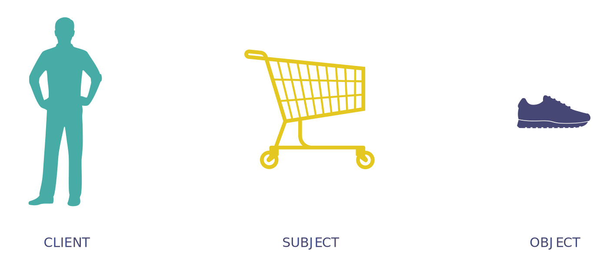

---
# Page settings
layout: default
keywords:
comments: false

# Hero section
title: COMP140 - Lecture Materials 8

# Author box
author:
    title: Matt Watkins
    description: Lecturer in Computing at Falmouth University

# Micro navigation
micro_nav: true

# Page navigation
page_nav:
    prev:
        content: Data Structures
        url: '../data-structures-lm'
---

# Design Patterns


The following materials are derived from the *Design Patterns lecture*. The video lecture is included at the bottom of the [*document*](#video-lecture).
{: .callout .callout--warning}


## Introduction

Design patterns was written in 1994 by the ‘Gang of Four’ - Erich Gamma, John Vlissides, Richard Helm &  Ralph Johnson. Design patterns are set of procedures or patterns that help to make OOP code more effective and reusable.

Design patterns establish consistency that helps developers build and modify code safely avoiding common architecting problems. 

- Using consistent methods to fix and to avoid issues. 
- Having a shared language to understand common problems
- Adhering to the SOLID principles of object-oriented programming.

### Object Oriented Design Basics

Design Patterns are intended for object orientated systems as they tend to exhibit recurring structures that promote:

-   **Abstraction**
-   **Flexibility**
-   **Modularity**
-   **Elegance**

Abstracts a recurring design structure and comprises class and/or object:

-   **dependencies**
-   **structures**
-   **interactions**
-   **conventions**

Names and specifies the design structure explicitly and thereby distils design experience

### Formalising the Relationship between Objects

Design patterns have some basic similarities there is almost always a **client** that requests something or makes use of the pattern. There is also a **subject** that is usually creating, producing, changing, observing or providing access to the object which is usually a **product** in the system or a game object on screen.


*Fig. 1 - Relationships between objects*


### The Design Pattern Categories

Design patterns are divided into 3 principle types which relate to their role in a process or application.


*Fig. 2 - The 3 main categories of Design Patterns*

Within these categories are the patterns themselves. I have listed the principle ones below. In this lecture we are going to explore a small subsection which are in ***bold***.

**Creational**|**Structural**|**Behavioural**
:-----:|:-----:|:-----:
***Abstract Factory***|Adapter|Chain of Responsibility
Builder|Bridge|***Command***
***Factory***|Composite|Interpreter
Object|***Decorator***|Iterator
Pool|Facade|Mediator
Prototype|Flyweight|Memento
***Singleton***|Proxy|***Observer***
 | |State
 | |Strategy
 | |Template
 | |Visitor

### How to make use of Design Patterns

- Design patterns are often **tacit knowledge** made **explicit**.
- You will develop tacit knowledge of patterns through **regular design practice**.
- Engage in **constant research** & **reflection** when designing software to learn all these different patterns.
- They will help you **communicate** and design in the future.
- Additional research will be required as the **number of patterns greatly exceeds** those that can be covered in workshops.

## Creational Patterns

### Factory

Factory is used to create an object from instance of another class.  In Factory pattern, we create object without exposing the creation logic. This helps to deal with large and more complex programs. In this pattern, an interface is used for creating an object, but lets subclasses decide which class to instantiate. Creation process is done in run time.

#### UML


fig. 3 - UML for Factory Example 

In this example UML from a typical game where Enemy object is created, and its type is based on random a number. Object is created in run time.

#### E

First let’s create Interface that will be shared between all enemies that can be crated with Factory. This will be used by client.

```c#
public  interface  IFactory
{
	void Damage(int dmg);
}
```
Now we need to create Classes that will inherit this interface. In the example this will be enemyType1 and 2.
  
```c#
public  class  EnemyType1 : IFactory
{
	int  _health=100;
	public  void  Damage(int  dmg)
	{
		_health -= dmg;
		Console.WriteLine("EnemyType1 health:" + _health.ToString());
	}
}

public  class  EnemyType2 : IFactory
{
	int _health = 200;
	public  void  Damage(int  dmg)
	{
		_health -= dmg;
		Console.WriteLine("EnemyType2 health:" + _health.ToString());
	}
}
```
<!--stackedit_data:
eyJoaXN0b3J5IjpbLTE4NDM1NDM1OTgsNDkwNTI1MzM5LDk5Mj
Y5MTIxMywtMTQzOTQwMjM2MCwtOTM2MjA4NTQyLC0zMzg3NDEz
NDIsLTIwNzQ3NDc5OTMsLTk3NTg3ODI3OCwtNTEzNjA5NjUwLC
02NTgyNjUyOTgsMTkwODQ2NTgxMywtMjAyODE4Mjk2MiwtMjEz
MDY1OTk1NV19
-->