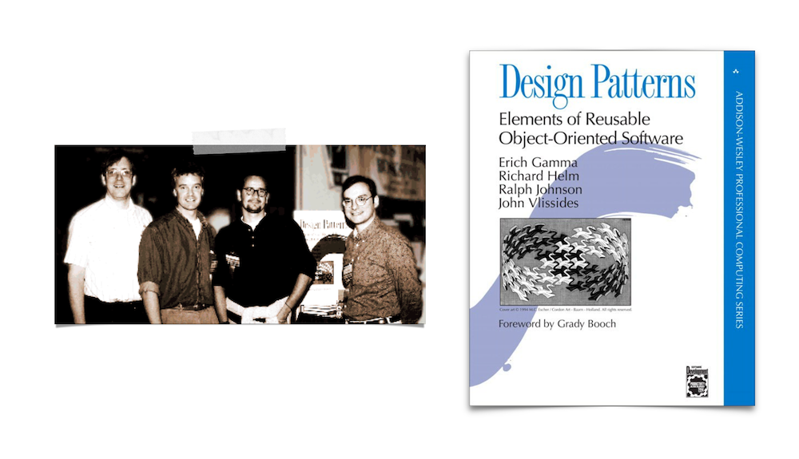

---
# Page settings
layout: default
keywords:
comments: false

# Hero section
title: COMP140 - Lecture Materials 8

# Author box
author:
    title: Matt Watkins
    description: Lecturer in Computing at Falmouth University

# Micro navigation
micro_nav: true

# Page navigation
page_nav:
    prev:
        content: Data Structures
        url: '../data-structures-lm'
---

# Design Patterns


The following materials are derived from the *Design Patterns lecture*. The video lecture is included at the bottom of the [**document**](#video-lecture).
{: .callout .callout--warning}


## Introduction

Design patterns was written in 1994 by the ‘Gang of Four’ - Erich Gamma, John Vlissides, Richard Helm &  Ralph Johnson. Design patterns are set of procedures or patterns that help to make OOP code more effective and reusable.


*Fig. 1 - The Gang of Four and their book*

Design patterns establish consistency that helps developers build and modify code safely avoiding common architecting problems. 

- Using consistent methods to fix and to avoid issues. 
- Having a shared language to understand common problems
- Adhering to the SOLID principles of object-oriented programming.

### Object Oriented Design Basics

Design Patterns are intended for object orientated systems as they tend to exhibit recurring structures that promote:

-   **Abstraction**
-   **Flexibility**
-   **Modularity**
-   **Elegance**

Abstracts a recurring design structure and comprises class and/or object:

-   **dependencies**
-   **structures**
-   **interactions**
-   **conventions**

Names and specifies the design structure explicitly and thereby distils design experience

### Formalising the Relationship between Objects

Design patterns have some basic similarities there is almost always a **client** that requests something or makes use of the pattern. There is also a **subject** that is usually creating, producing, changing, observing or providing access to the object which is usually a **product** in the system or a game object on screen.


*Fig. 2 - Relationships between objects*


### The Design Pattern Categories

Design patterns are divided into 3 principle types which relate to their role in a process or application.


*Fig. 3 - The 3 main categories of Design Patterns*

Within these categories are the patterns themselves. I have listed the principle ones below. In this lecture we are going to explore a small subset which are highlighted below in ***bold***.

**Creational**|**Structural**|**Behavioural**
:-----:|:-----:|:-----:
***Abstract Factory***|Adapter|Chain of Responsibility
Builder|Bridge|***Command***
***Factory***|Composite|Interpreter
Object|***Decorator***|Iterator
Pool|Facade|Mediator
Prototype|Flyweight|Memento
***Singleton***|Proxy|***Observer***
 | |State
 | |Strategy
 | |Template
 | |Visitor

### How to make use of Design Patterns

- Design patterns are often **tacit knowledge** made **explicit**.
- You will develop tacit knowledge of patterns through **regular design practice**.
- Engage in **constant research** & **reflection** when designing software to learn all these different patterns.
- They will help you **communicate** and design in the future.
- Additional research will be required as the **number of patterns greatly exceeds** those that can be covered in workshops.

## Creational Patterns

### 1. Factory

Factory is used to create an object from instance of another class.  In Factory pattern, we create object without exposing the creation logic. This helps to deal with large and more complex programs. In this pattern, an interface is used for creating an object, but lets subclasses decide which class to instantiate. Creation process is done in run time.

#### UML


fig. 4 - UML for Factory Example 

In this example UML from a typical game where Enemy object is created, and its type is based on random a number. Object is created in run time.

#### Example - The Factory

First let’s create Interface that will be shared between all enemies that can be created with Factory. This will be used by client.

```c#
public interface IFactory
{
	void Damage(int dmg);
}
```
Now we need to create Classes that will inherit this interface. In the example this will be `EnemyType1` and `EnemyType2`.
  
```c#
public  class  EnemyType1 : IFactory
{
	int  _health=100;
	public void  Damage(int  dmg)
	{
		_health -= dmg;
		Console.WriteLine("EnemyType1 health:" + _health.ToString());
	}
}

public class EnemyType2 : IFactory
{
	int _health = 200;
	public  void  Damage(int  dmg)
	{
		_health -= dmg;
		Console.WriteLine("EnemyType2 health:" + _health.ToString());
	}
}
```

#### Example - The Interface

Next we need to create the Interface for factory itself.

```c#
public abstract class EnemyFactory
{
	public abstract IFactory InstantiateEnemy(int type);
}
```

```c#
public class InstantiateEnemyFactory : EnemyFactory
{
	public override IFactory InstantiateEnemy(int  type)
	{
		switch (type)
		{
			case 1:
				return new EnemyType1();
			case 2:
				return new EnemyType2();
			default:
				throw  new  ApplicationException(string.Format("Wrong number"));
		}
	}
}
```
In The factory Class we override the method with `switch` statement that will return the objects based on the input number. As a return type we use interface `IFactory`, this way we can return any object that inherits from it.

#### Example - The Client

```c#
class  Program{
	static void Main(string[] args)
	{
		//random number
		int type = new Random().Next(1, 1000)% 2 + 1;
		//Instance of the class
		EnemyFactory  factory = new  InstantiateEnemyFactory();
		IFactory  newEnemy = factory.InstantiateEnemy(type);
		newEnemy.Damage(20);
		type = new Random().Next(1, 2000)%2 + 1;
		IFactory  newEnemy2 = factory.InstantiateEnemy(type);
		newEnemy2.Damage(20);
		Console.ReadKey();
	}
}
```
The last step is to create the client that will use the factory class. Numbers don’t have to be random. I’m using random numbers to generate random enemies from the factory. In a real world example we would create a list of enemies rather than choosing name for each of them. This pattern is very simple and effective.

Factory defines an interface for creating an object, but lets subclasses decide which class to instantiate. Factory Method lets a class defer instantiation to subclasses.

You can see this example as a **Visual Studio App** in this repo:\
[https://github.falmouth.ac.uk/Matt-Watkins/COMP140-Factory-Example](https://github.falmouth.ac.uk/Matt-Watkins/COMP140-Factory-Example)

### 2. Abstract Factory


fig. 5 - Visualising Abstract Factory

Abstract factory is similar to factory but this time we will encapsulate all classes, by removing the interfaces for Product and Factory. This pattern is also called a factory of factories, because this patterns acts as a super factory which creates other factories. Abstract factory pattern is useful when the client needs to create objects which are somehow related or similar, without specifying the concrete class.  With this pattern objects can interact with each other through common interfaces.

#### UML

In the UML of the code we are about to write, we’ll create Abstract Factory that will spawn enemies and give them a specific weapon and armour.


fig. 6 - Abstract Factory UML diagram

#### Example - The Factory

```c#
interface  IEnemyFactory
{
	IWeapon GetWeapon();
	IArmor GetArmour();
}
```
The first thing is to create the interface for Factory, that will be used to specify the equipment of each enemy.
```c#
class Mage : IEnemyFactory
{
	public IWeapon GetWeapon()
	{
		return new Wand();
	}
	public IArmor GetArmor()
	{
		return new Cloak();
	}
}

class Warrior : IEnemyFactory
{
	public IWeapon GetWeapon()
	{
		return new Sword();
	}
	public IArmor GetArmor()
	{
		return new BodyArmour();
	}
}
```
Concrete classes will be named as the type of enemy that will be created. In the example there are two enemies `Mage` and `Warrior`.

#### Example - The Product

In next step we will create interface for items that will be given to the enemies. Both types share the same types of equipment, weapon and armour. CLICK

```c#
interface IWeapon
{
	string Item();
}

interface IArmour
{
	string Item();
}
```
In Concrete classes methods will return string values  that will be printed to the console.
```c#
class  Sword : IWeapon
{
	public string Item()
	{
		return "Iron Sword";
	}
}

class Wand : IWeapon
{
	public string Item()
	{
		return "Magic Wand";
	}
}

class BodyArmour : IArmour
{
	public string Item()
	{
		return "Iron Body Armor";
	}
}

class Cloak : IArmour
{
	public string Item()
	{
		return "Magic Cloak";
	}
}
```
#### Example - The Client

Client is the last part is to create. Here we will create instance of the factory and spawn our enemies and define their weapons and armour. 

```c#
class  Client
{
	IEnemyFactory factory = null;
	public void SpawnEnemy(string  enemy)
	{
		if (enemy == "Warrior")
		{
			factory = new Warrior();
			Console.WriteLine("New Warrior equipment:");
			Console.WriteLine(factory.GetWeapon().Item());
			Console.WriteLine(factory.GetArmour().Item());
		}
		else if (enemy == "Mage")
		{
			factory = new Mage();
			Console.WriteLine("New Mage equipment: ");
			Console.WriteLine(factory.GetWeapon().Item());
			Console.WriteLine(factory.GetArmour().Item());
		}
		else
		{
			Console.WriteLine("Wrong type");
		}
	}
}
```
```c#
//Main method
static  void  Main(string[] args)
{
	Client client = new Client();
	client.SpawnEnemy("Mage");
	client.SpawnEnemy("Warrior");
	Console.Read();
}
```
Abstract Factory facilitates an interface for creating families of related or dependent objects without specifying their concrete classes. This pattern is very useful but in large projects it may increase the complexity of the code.

### 3. Singleton

Singleton is a basic design pattern is useful because it guarantees that there is only **one instance of a class** and can be accessed globally. This is usually ’lazily’ initialised via a **static function** that satisfies the previous statement. It is used for **manager classes** which track some sort of global state. 

Some programmer’s consider Singletons to be an anti-pattern. Find out more here:
{: .callout .callout--info}
[**https://stackoverflow.com/questions/12755539/why-is-singleton-considered-an-anti-pattern**](http://www.apple.com/uk)

Classes implementing Singleton pattern will ensure that only one instance of the object ever exists at any one time.  
It is recommend using Singletons for things that do not need to be copied multiple times during a game. This is great for controller classes like GameManager or AudioController.


fig. 6 - Audio Manager in Unity Inspector

```c#
public class SingletonController : MonoBehaviour {
	public static SingletonController instance;
	private void Awake() {
		if (instance != null)
		{
			Destroy(gameObject);
		} else {
			Instance = this;
		}
	}
}
```
In this example, a `public static` instance of the class is declared at its beginning.

The value of a static field is shared between instances, so if a new instance of this class gets created the `if` will find a reference to the first Singleton object, destroying the new instance (or its game object).
  
This is only the simplest implementation of a singleton. I recommend looking at this article for a range of different singleton approaches to common problems in Unity.
**[http://www.unitygeek.com/unity_c_singleton](http://www.unitygeek.com/unity_c_singleton)**
{: .callout .callout--info}

## Structural Patterns

### 1. Decorator


fig. 7 - Example Decorator Pattern

Decorator pattern allows modification an object dynamically. It simplifies the code by adding new functionality at runtime. Adding new functionality to the object doesn’t effect the initial class structure.

Although I am loathe to use a gun as a model for the example this is a particularly effective diagram at explaining the decorator principle.
{: .callout .callout--info}


fig. 8 - Example Decorator UML

In the example we’ll simulate the process of enchanting an item in RPG game. CLICK

```c#

<!--stackedit_data:
eyJoaXN0b3J5IjpbLTIwMzM5MzM0NjgsLTczMjYzNjUyLDE0NT
Q0NDAxMzMsLTk2MzU5MTU3LC04MDk1NjE4MDYsMzUyODI0OTUz
LDQ5NjcyMDE1MCwxNzY0MTY4OTE4LC04MTE1MTY4OTMsLTEwNT
g4MjQ3OTIsNjI2NDk1NTU4LDY4MzY0OTE3MiwxMzkxMjczNzEx
LDg0NjM0NTMxMiwtMTg1ODE5NDg3NCwtMTU1OTg2MTkzMSwtMj
A3NzE0Mzc1NCwxMjc5NzY3MDYsMzkyODgxOTEzLC04MzkzOTUx
MjRdfQ==
-->