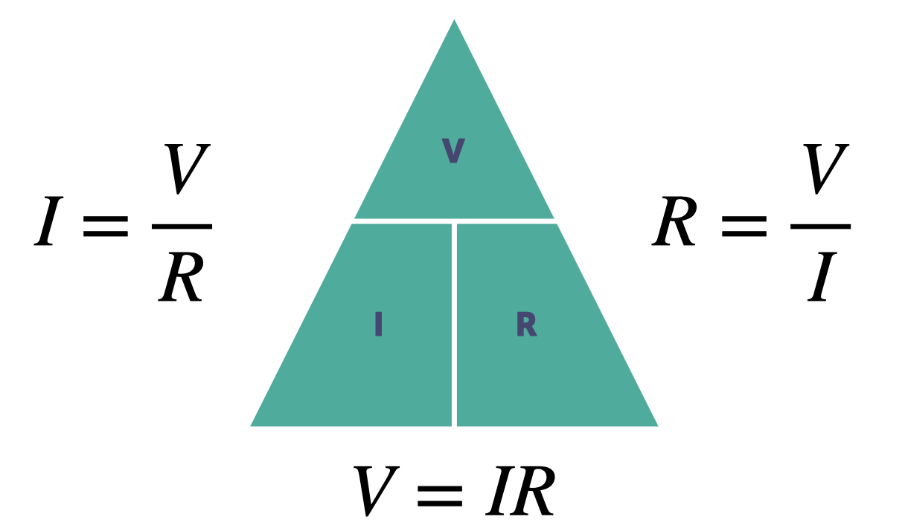
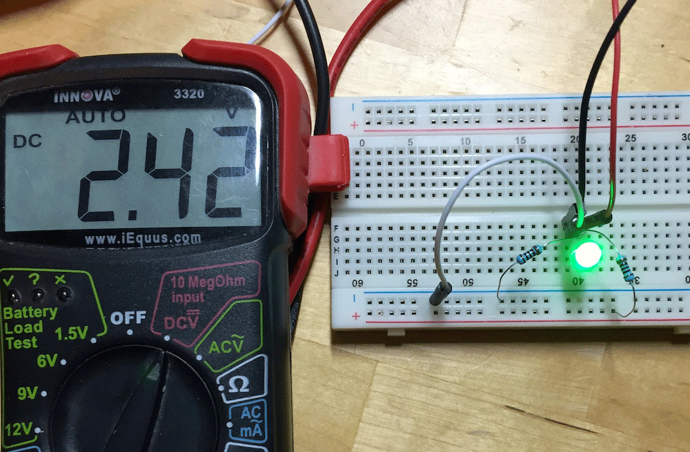

---
# Page settings
layout: default
keywords:
comments: false

# Hero section
title: COMP140 - Lecture Materials 1

# Author box
author:
    title: Matt Watkins
    description: Lecturer in Computing at Falmouth University

# Micro navigation
micro_nav: true

# Page navigation
page_nav:
    next:
        content: Arduino
        url: '../arduino-lm'
---

# Electrical Circuits

The following materials are derived from the *Electrical Circuits lecture*. The video lecture is included at the bottom of the [document](#video-lecture).
{: .callout .callout--warning}

In this lecture we will look at Electrical Circuits and the basics of making  in subsequent lectures we will explore the other elements of the workflow.

## What is electrical current?

Consider a copper wire: matter filled with countless copper atoms. A free electron is floating in a space between atoms, it's pulled and prodded by surrounding charges in that space. In this chaos the free electron eventually finds a new atom to latch on to; in doing so, the negative charge of that electron ejects another electron from the atom. Now a new electron is drifting through free space looking to do the same thing. This chain effect can continue on and on to create a flow of electrons called electric current.

*Fig. 1 - Animation showing the flow of electrons*

In a circuit we have a flow of electrons through a closed circuit for instance a wire or another components, that is induced by an electric field (battery).

*Fig. 2  - Direction of flow*

source:https://learn.sparkfun.com/tutorials/what-is-electricity/allrmar

It is often assumed that electrons flow from the positive end of an electrical field but in fact they flow from the negative end (see Fig.2). We can see how a simple switch can be used to control the flow of electrons in a circuit.

## The Basic Characteristics of Electricity

-   **Voltage ( V )** - The relative level of electrical energy between any two points in a circuit. Voltage is measured in Volts(V).
-   **Current ( I )** - The amount of electrical energy passing through any point in a circuit. Current is measured in Amps(A).
-   **Resistance ( R )** - The amount that any component in the circuit resists the flow of current. Resistance is measured in Ohms(Ω).

*Fig. 3 - Water Analogy*

Like water electricity needs something to drive it and it’s energy is subject to decay over time. The electrical field generated by the battery (1) acts as a pump to drive electrons round the circuit, like a pump in domestic water system. A resistor is like a (2) an upper tank that effectively creates pressure in the system allowing the electrons to flow faster. A bulb or any component that is drawing power for a purpose, this is also known as a load on the system (3), is like a water wheel or a turbine that is drawing energy but at the same time is dissipating it, (4) and then the cycle begins again, with the depleted electrons returning to the battery or pump to be released again with charge.

*Fig. 4 - Water Analogy - Voltage, Current and Resistance*

In this second analogy we can imagine voltage as the head of water in the system creating the pressure. meanwhile the Amps (click) are the amount of energy passing a particular point. The wider the pipe the more energy can flow at one time, but it will also lose power quicker. Resistance (click) is another method to increase the pressure but slow down the flow, this is why resistors are used to control the amount of electrons reaching a component or load. Specifically to stop that component burning out.

## Schematics

Here you can see the simple diagram from earlier being interpreted into a schematic. Each elements has a specific symbol in the circuit and it has text notation to define type and value. In this example I am replacing the light bulb (as seen in the drawing) with an LED as this is what we will be using in our Arduino circuits.

| Fig. 5 - Circuit Drawing  | Fig. 6 - Schematic |
|--|--|
|||

Wiring quickly becomes chaotic and complex and unlike a purely digital project if you make a mistake you can’t control Z or restore a previous version so having a good schematic or diagram is vital to keep track of your set-up as you develop your project.

*Fig. 7 - A Complex Wiring Set-up*

## Components

### Component Types

As you start to develop your own custom circuits you will become familiar with these common components and how to use them. Each component has a corresponding symbol on a schematic.

*Fig. 7 - Some Commonly used components*

- **Resistors** - are used to reduce current flow, adjust signal levels, and to divide voltages
- **LED's** - are a semiconductor that emits light when current flows through it.
- **Diodes** - conduct electricity easily in one direction, and stops flow in the other direction.
- **Switches** - are an electrical component that can disconnect or connect the conducting path in an Electrical circuit, interrupting the current or diverting it from one conductor to another.
- **Transistors** - is a semiconductor device used to amplify and switch electronic signals and electrical power.
- **Jumper Leads** -  are easy pluggable cables that act as the wire between components in bread board setups. We will look at bread boards in more detail in a future lecture.

###  Using Schematics with Components

Here are some rule when putting together a schematic. We will look at some basic examples in the following section.

-   Positive voltages are uppermost
-   Things happen left to right
-   All components have a name and values
-   Remember symbols
-   Dots show that the wires are connected
-   Nets: Inferred connection based on symbol or name

All components have their corresponding symbol in a circuit diagram. 

*Fig. 8 - Components as schematic symbols*

If you want to experiment with putting schematics together you can make a start by looking at the diagram above and making your own account here: **[circuit-diagram.org](https://crcit.net/c/82ffa9aa0f564eabaf0fea65de580e14)**. You will become more familiar with using them as the module progresses.

## Ohms Law

**Ohm's law**  states that the current through a conductor between two points is directly proportional to the voltage across the two points. To be able to make meaningful statements about these quantities in circuits, we need to be able to describe their quantities in the same way that we might quantify mass, temperature, volume, length, or any other kind of physical quantity. For mass, we might use the units of “kilogram” or “gram.” Ohm expressed his discovery in the form of a simple equation, describing how voltage, current, and resistance interrelate:

$$voltage(v) = current(I)*resistance(R)$$

or

$$V = IR$$

### Ohms Law - Example 1

The wonderful thing about Ohms law is if you have **2 values in the circuit you can work out the missing one**.

In this case  we have the current, **0.24 amps** (**I**) and the resistance, **150 ohms** (**Ω**) even though we don’t know the voltage. Consequently to work out the voltage we  times the amps by the ohms and we get the answer **36 volts**.

$$V = IR$$\
$$? = 0.24*150 $$\
$$V = 0.24 * 150$$\
$$ANSWER = 36 V (Volts)$$

### Ohms Law - Example 2

In this case we have the current, 0.3 amps and the voltage, 3 volts even though we don’t know the resistance. To work out the resistance we divide the amps by the volts and we get the answer 10 ohms.

$$V = IR$$\
$$0.3 = 3 * ? $$\
$$R =\frac {3} {0.3}$$\
$$ANSWER = 10\Omega (Ohms)$$

### Ohms Triangle

The simplest way to apply Ohms low is to consider it as a triangle. We can use a triangle to show the equal relationship between the values. So if we are looking to calculate V (volts) from the other 2 values we use V=IR  if we are looking to calculate I (Amps) we use V over R and if want to calculate R (Resistance) we use V over I.

*Fig. 9 - Ohms Triangle*

## Resistance in Series & Parallel

*Fig. 10 - Resistors wired in series and parallel*

It is possible to wire components in either series , which is where each component is wired end to end or parallel where the components are wired in parallel tracks. This has an effect on the resistance in a circuit. Wiring solar panels in ether configuration has an effect on the voltage or current when you try to harvest the combined electricity they produce.

### Example 1 - Series

*Fig. 11 - Example 1 - Resistors in series*

In this example of series, when calculating the collective resistance of multiple resistors we simply add all the resistors together to get the resistance total. 10+10+6+100 equals 4.8 kilo ohms

$$ R_{T} = R_{1}+R_{2}+R_{3}+R_{4}$$\
$$Resistance Total = 10 + 10 + 6 + 100$$\
$$ANSWER = 126\Omega(Ohms)$$

### Example 1 - Parallel

*Fig. 12 - Example 1 - Resistors in parallel*

Working out the overall resistance in a parallel configuration is slightly more complicated. The total is the sum of all the resistor values as a fraction. The numerator is always one and the denominator is the value of the resistors.

$$\frac {1} {R_{T}}=\frac {1} {R_{1}}+\frac {1} {R_{2}}+\frac {1} {R_{3}}+\frac {1} {R_{4}}$$

In this example, we have 4 resistors, 10, 10, 6 and 100. Therefore the equation is 1/10 + 1/10 + 1/6 + 1/100. Remember to do this as a sum of the fractions. The total is the then 1 divided by 0.376 (the sum of the fractions) which means the total resistance is 2.65 ohms.

$$R1 = 10\Omega$$\
$$R2 = 10\Omega$$\
$$R3 = 6\Omega$$\
$$R4 = 100\Omega$$

$$\frac {1} {R}=\frac {1} {10}+\frac {1} {10}+\frac {1} {6}+\frac {1} {100}$$\
$$\frac {1} {R}=\frac {1}{0.376}$$\
$$R_{T} = 2.65\Omega$$

## Power Dissipation (Watts)

Similar to current, Power is a measure of change over time. Instead of charge, power is the amount of energy converted into heat over time.

$$P= I*R$$\
$$P= V^2/R$$

-   When the flow of current is resisted, heat is generated
-   Calculated by measuring the voltage across a load times the current flowing through it

### Example 1 - Power Dissipation

*Fig. 13 - Example 1 - Resistors in parallel*

In this example we can use **ohms law** to calculate the current by dividing the voltage with the resistance which in this instance is 4. Using the equation for getting the Watts we times the Voltage( V ) by the Resistance( I ) therefore the power dissipation or Watts ( P ) is **48** .

$$I = \frac{V}{R}$$\
$$P = I*V$$ or more simply
$$P = IV$$ 

$$I = \frac{12}{3}$$\
$$I = 4$$\
$$P = 4*3$$\
$$P = 48$$\
$$Power Dissipation = 48 Watts$$

## Voltage Dividers

*Fig. 14 - Voltage Divider Circuit in a Bread board*

A voltage divider circuit is a very common circuit that takes a higher voltage and converts it to a lower one by using a pair of resistors. In practice this kind of circuit is used to step down a higher voltage to a lower one.

$$Vout = \frac{V_S * R_2}{R_1 + R_2}$$

It involves a pair of resistors The formula for calculating the output voltage is based on Ohms Law.  

- **VS** is the source voltage, measured in volts (V),
- **R1** is the resistance of the 1st resistor, measured in Ohms (Ω).
- **R2** is the resistance of the 2nd resistor
- **Vout** is the output voltage, measured in volts (V),

### Example - Voltage Divider

*Fig. 15 - Voltage Divider Example Schematic*

In the example, the source voltage 9v is multiplied by the second resistor value 3 kilo ohms. Then resistor value 1 is added to resistor value 2 and finally the top value 27000 is divided by the bottom value 4000 to get 6.75 volts.

$$Vout = \frac{9 * 3000}{1000 + 3000}$$

9v x 3000 ohms = 27000\
1000 + 3000 = 4000\
27000 ÷ 4000 = **6.75 volts**

## Conclusion

In this lecture I have introduced the principle of electricity and how to create simple circuits using some basic components and using a series of formulae and equations we have demonstrated how the characteristics and properties of electricity can be measured in these circuits.

Future lectures will address how to make these circuits but also how to use them in concert with a microcontroller like the Arduino.

## Video Lecture

### Lecture - Arduino 
<iframe width="100%" height="480" src="https://web.microsoftstream.com/embed/video/a3e1a802-20e3-48f5-86f5-be2645beb6a7?autoplay=false&showinfo=true" allowfullscreen style="border:none;"></iframe>

<!--stackedit_data:
eyJoaXN0b3J5IjpbLTExNjAxMjEzOTIsLTE5NTIzNjQ5MzAsMT
E2NzAxMjk4OCwtNzY4MzcxMDM2LC0yMDkzMTgwMjY5LC0yMDQ3
NDc2NDAyLC0xNTY2Mjg5MjI3LC0xNzAyNDQyNjY0LDExNTU2NT
c5OTcsMTQ4NDY4MjA5MCwtNTkzNzE5NjU0LDE2ODExNTY0Nzks
OTEyMDE4MTY2LC0xMTIzNjQxNDQyLC0xMTc4MTQ5OTY0LDIwMj
kzOTUyMTgsLTE3MDQzMzcyNjAsLTE3NTk2MTg5MjAsLTExMDA0
Njg1NDIsLTIwMDEyMzAzNjZdfQ==
-->