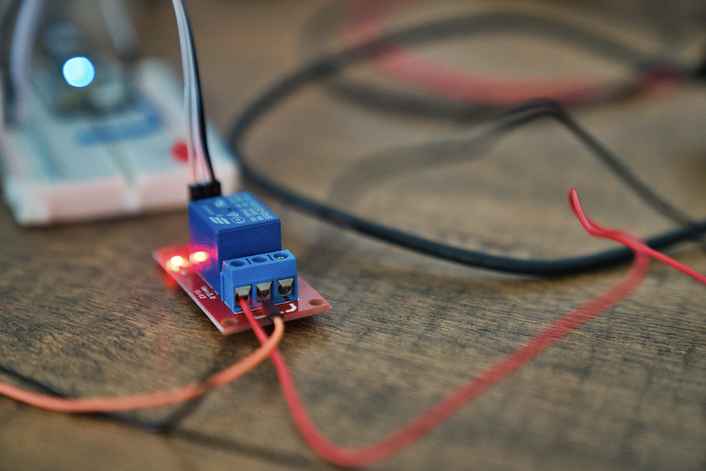
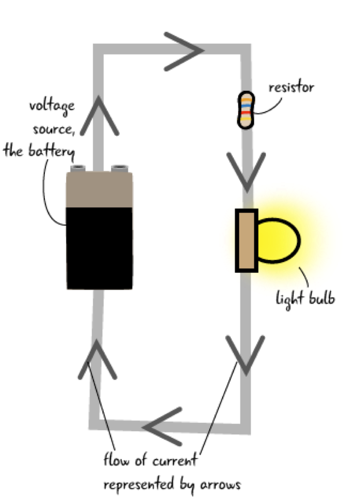

---
# Page settings
layout: default
keywords:
comments: false

# Hero section
title: COMP140 - Lecture Materials 1

# Author box
author:
    title: Matt Watkins
    description: Lecturer in Computing at Falmouth University

# Micro navigation
micro_nav: true

# Page navigation
page_nav:
    next:
        content: Arduino
        url: '../arduino-lm'
---

# Electrical Circuits

The following materials are derived from the *Electrical Circuits lecture*. The video lecture is included at the bottom of the [document](#video-lecture).
{: .callout .callout--warning}

In this lecture we will look at Electrical Circuits and the basics of making  in subsequent lectures we will explore the other elements of the workflow.

## What is electrical current?

Consider a copper wire: matter filled with countless copper atoms. A free electron is floating in a space between atoms, it's pulled and prodded by surrounding charges in that space. In this chaos the free electron eventually finds a new atom to latch on to; in doing so, the negative charge of that electron ejects another electron from the atom. Now a new electron is drifting through free space looking to do the same thing. This chain effect can continue on and on to create a flow of electrons called electric current.

*Fig. 1 - Animation showing the flow of electrons*

In a circuit we have a flow of electrons through a closed circuit for instance a wire or another components, that is induced by an electric field (battery).

*Fig. 2  - Direction of flow*

source:https://learn.sparkfun.com/tutorials/what-is-electricity/allrmar

It is often assumed that electrons flow from the positive end of an electrical field but in fact they flow from the negative end (see Fig.2). We can see how a simple switch can be used to control the flow of electrons in a circuit.

## The Basic Characteristics of Electricity

-   **Voltage (V)** - The relative level of electrical energy between any two points in a circuit. Voltage is measured in Volts(V).
-   **Current (I)** - The amount of electrical energy passing through any point in a circuit. Current is measured in Amps(A).
-   **Resistance (R)** - The amount that any component in the circuit resists the flow of current. Resistance is measured in Ohms(Ω).

*Fig. 3 - Water Analogy*

Like water electricity needs something to drive it and it’s energy is subject to decay over time. The electrical field generated by the battery (1) acts as a pump to drive electrons round the circuit, like a pump in domestic water system. A resistor is like a (2) an upper tank that effectively creates pressure in the system allowing the electrons to flow faster. A bulb or any component that is drawing power for a purpose, this is also known as a load on the system (3), is like a water wheel or a turbine that is drawing energy but at the same time is dissipating it, (4) and then the cycle begins again, with the depleted electrons returning to the battery or pump to be released again with charge.

*Fig. 4 - Water Analogy - Voltage, Current and Resistance*

In this second analogy we can imagine voltage as the head of water in the system creating the pressure. meanwhile the Amps (click) are the amount of energy passing a particular point. The wider the pipe the more energy can flow at one time, but it will also lose power quicker. Resistance (click) is another method to increase the pressure but slow down the flow, this is why resistors are used to control the amount of electrons reaching a component or load. Specifically to stop that component burning out.

## Learning to Read Schematics

*Fig. 5 - Circuit Drawing*

Here you can see the simple diagram from earlier being interpreted into a schematic. Each elements has a specific symbol in the circuit and it has text notation to define type and value. In future example I am replacing the light bulb with an (click) LED as this is what we will be using in our Arduino circuits.

*Fig. 6 - Schematic*

Wiring quickly becomes chaotic and complex and unlike a purely digital project if you make a mistake you can’t control Z or restore a previous version so having a good schematic (click) or diagram is vital to keep track and to adapt as you develop your project.

*Fig. 7 - A Complex Wiring Set-up*

## Common Components

As you start to develop your own custom circuits you will become familiar with these common components and how to use them.

*Fig. 7 - Some Commonly used components*

Resistors - 
LED - is a semiconductor that emits light when current flows through it.
Diodes - Conduct electricity easily in one direction, among more specific behaviors.

<!--stackedit_data:
eyJoaXN0b3J5IjpbMTc4NzgwMjEzNSwxNjE1Mzg1MTEyLDIwNj
c1NTg2OTEsMTM1MjkxODQ3LDE1NTQwMTc5MTcsLTE5ODU5MzUw
ODEsOTcxNTIzMjksMjI5OTM3OTk2LC0yOTM1NDk5NCwtNjU3NT
MzMTE5LDg4MjY4MDYzMCwtMTIyODkzMDkzOV19
-->