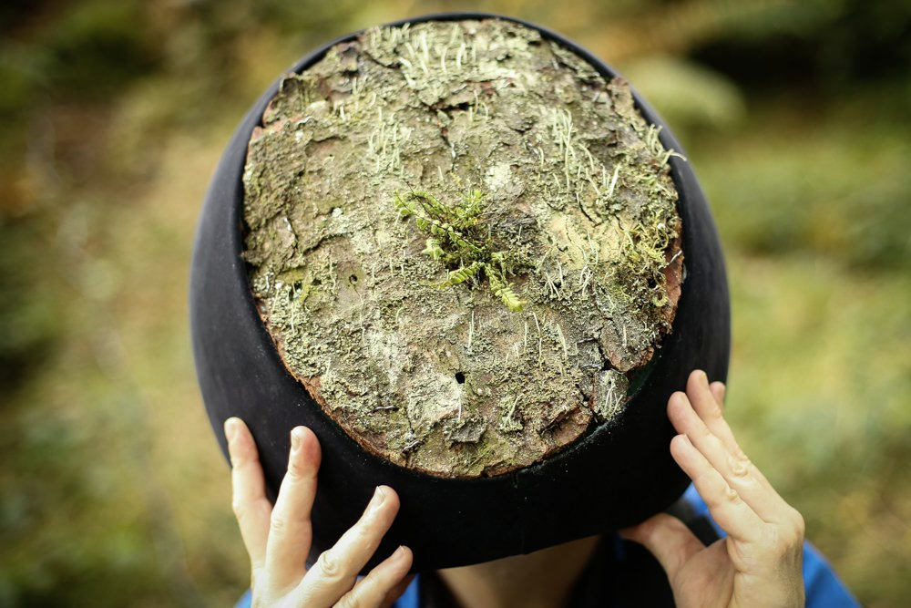

---
# Page settings
layout: default
keywords:
comments: false

# Hero section
title: COMP140 - Research 1
description: 

# Author box
author:
    title: Matt Watkins
    description: Lecturer in Computing at Falmouth University

# Micro navigation
micro_nav: true

# Page navigation
page_nav: false
    
---

# Research Exemplar Projects

*Attribution: Marshmallow Laser Feast  - In the Eyes of the Animal*

Welcome to Week 1 of COMP140. As a bookend to the weeks activities I would like you to research custom game controllers or alt controllers as they are also known, experimental games and playful interactive experiences that have been developed using physical computing and electronics. 

I have provided a series of links to get you started with your research. Consider these stepping stones and from these examples you should be able to link out to even more interesting touch points to get you inspired for making your own creative electronics projects:

## Task

Review any 3 experiences you find from these links or from your own independent research and note down the following information in a Google Doc or similar: 

- Name
- URL
- Screenshot
- brief description
- What you find interesting about it?
- Do this before the seminar session in Week 2

Keep this document, it will form the seed for your project proposal.
{: .callout .callout--info}  

## Inspiration

Here are some links to projects that might provide inspiration for your research. 

### Notable Alt-Controller Games 

[Deep VR](https://www.polygon.com/2015/3/2/8133675/deep-vr-meditation)  
[Space Box](https://www.gamasutra.com/view/news/290700/ALTCTRLGDC_Showcase_Spacebox.php)  
[Line Wobbler](http://wobblylabs.com/projects/wobble)  
[Tie Your Laces](https://twitter.com/wethrowswitches/status/1181557419199094784)  
[GDC Alt-Ctrl 2018 Roundup](https://www.gamasutra.com/altctrlgdc2018)  
[Nintendo Labo](https://www.nintendo.co.uk/Nintendo-Labo/NintendoLabo-1328637.html)   
[Xbox Adaptive Controller](https://www.microsoft.com/en-gb/p/xbox-adaptive-controller/8nsdbhz1n3d8)  

### Experimental Games

*Attribution: Now Play This Festival 2019*

[Copenhagen Games Collective](http://www.copenhagengamecollective.org/)  
[Pain Station](https://www.fursr.com/projects/painstation-2-5)  
[Now Play This](https://nowplaythis.net/history/)  
[Kaho Abe](https://kahoabe.net/portfolio/)  

### Previous Work from Falmouth Students

[Pancake](https://youtu.be/36qeLNNPf7M)  
[Games in a Controller](https://youtu.be/Oqrn3l64mBM)  
[Surgery](https://youtu.be/LiTpkKHJizA)  
[Safe](https://youtu.be/X4wB3AakSvA)  
[Tank](https://youtu.be/AL3LrcRskig)  
[Skateboard](https://youtu.be/Wj4EbOyUejE)  
[Snooker](https://youtu.be/4XFZ4PMoPTE)   

### Other Inspiration

[Instructables](https://www.instructables.com/howto/games/)  
[Marshmallow Laser Feast](https://www.marshmallowlaserfeast.com/)  

