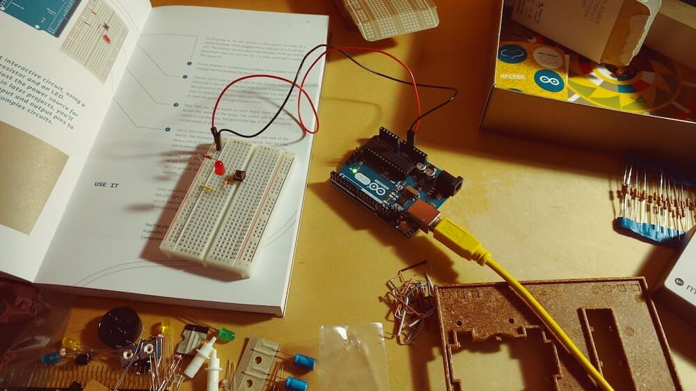
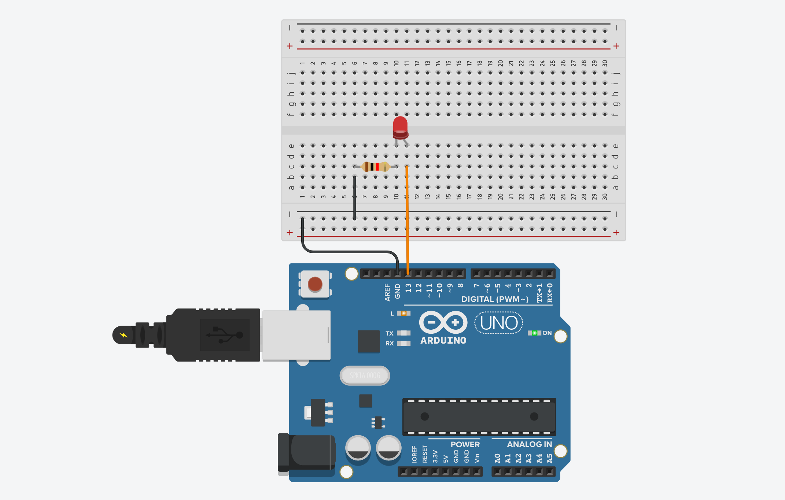

---
# Page settings
layout: default
keywords:
comments: false

# Hero section
title: Making Circuits
description: COMP140 - Lecture Materials 3

# Author box
author:
    title: Matt Watkins
    description: Lecturer in Computing at Falmouth University

# Micro navigation
micro_nav: true

# Page navigation
page_nav:
    prev:
        content: Arduino
        url: '../arduino-lm'
    next:
        content: OOP
        url: '../oop-lm'
---

# Making Circuits



The following materials are derived from the *Making Circuits lecture*. The video lecture is included at the bottom of the [document](#video-lecture).
{: .callout .callout--warning}

In this lecture we will look at how to use TinkerCAD to make simple Electrical Circuits and the basics of your first program in Arduino.

## Using TinkerCAD

We have established some basics of electricity and circuits, so now we're going to put it into practice. Initially
we're going to use a piece of software called [Tinkercad](http://www.tinkercad.com/). 

Tinkercad is a way to simulate electrical circuits, but also to simulate circuits and their use with a range of components as well as Arduino and other microcontrollers. 


*fig 1. - TinkerCAD Interface*

### TinkerCAD Interface

What tinkercad is very good at is simulating. The environment of Arduino so that we can build things with low cost in terms of putting it together and then we can test it. Some key things to take not of in the interface:
1. You can write arduino C++ code (See in fig.1)
2.  and test it through a simulation of how it would work in a physical set-up (See in fig. 1)
3.  You can drag components on to the stage from the right hand inspector (See in fig. 1). 

However, this is just a test environment it's important to actually use your own Arduino and the Arduino IDE in conjunction with the USB connection to your Arduino. This is just a way to
test the process before you implement it for real.


*fig 2. - Simple Circuit*\
**[View Circuit on TinkerCad](https://www.tinkercad.com/things/aefmW5mPE86-simple-electric-circuit/editel?sharecode=bjxDkcj1jYkU3qDBDux5XN-GflpCaIIjGHqfXsWVICQ)**

Here is a simple circuit. We need a source of power. So in this case we're going to use a simple coin battery, and we're going to have a light an LED, and basically all we need to do is wire the two together. To wire something in TInkerCAD just pull away from the pin or terminal of the battery or component and a line will appear. These line are equivalent to the jumper leads you use in a real circuit on a breadboard.

LED's have a longer pin and a shorter pin. The  longer pin is positive (+) and shorter is negative (-). So we wire the LED accordingly. 

Once we have the Led in our circuit we have a put a 'load' on the circuit by introducing the LED which is using power. If you start the simulation you can see that the load is too much for the LED, a questions mark appears warning us thar the LED will burn out if we don't resist the flow of electricity.

### Resistance Calculation

We need to add a resistor. In order to workout which resistor to use, we need to workout the resistance value and that is done by a resistance calculation which is:
  
$$R = \frac{V_S - V_	L}{I_L}$$

- **VS** is the source voltage, measured in volts (V),
- **VL** is the voltage drop across the LED, in Volts (V),
- **IL** is the current through the LED, in Amps (A)
- **R** is the resistance, measured in Ohms (Ω).

This is a variation of **Ohms law**, but applied specifically to LED's. We can use an online calculator to make things easier:

**[https://www.hobby-hour.com/electronics/ledcalc.php](https://www.hobby-hour.com/electronics/ledcalc.php)**

We need to workout:

 - **Supply voltage** . We know that we are using a  Volt coin battery so our supply
voltage is 3 volts.
-  **LED current** The standard load on an LED is about 20 milli amps
The great thing with this this
- **Voltage drop** - This is the voltage being used in the circuit by the LED. Typically, the forward voltage of an LED is between 1.8 and 3.3 volts. It varies by the color of the LED. A red LED typically drops around **1.7 to 2.0 volts**, but since both voltage drop and light frequency increase with band gap, a blue LED may drop around 3 to 3.3 volts.

Once the numbers above are added to the calculator **3v, 20mA** and let's say it's a red LED so its **2v**. The output is this:


*fig 3. - Resistance Calculation from Hobby Hour website*

You won't necessarily have the exact resistor in your Arduino Kit, but you just want to round up to the closest
resistor in your pack when you actually physically wire this together. 


*fig 4. - Simple Circuit with Resistor*\
**[View Circuit on TinkerCad](https://www.tinkercad.com/things/aefmW5mPE86-simple-electric-circuit/editel?sharecode=bjxDkcj1jYkU3qDBDux5XN-GflpCaIIjGHqfXsWVICQ)**

If we start the simulation, we've now got the light coming on, but there's no exclamation mark as we no longer over powering the LED. It's something to be wary of becuause LED's can easily burn out.

### Control Systems - A Switch

We're going to put a switch in there to allow a user to control the flow from the battery to the LED. To turn it on and off.

In this example we are going to change the configuration slightly by including a breadboard. A breadboard is essentially a set of rails in a board that conduct the power through channels either **horizontally** or **vertically** depending on the rail. The rails have plugholes so that components and jumper leads can be plugged in. See the image below to see how this occurs on the board:


*fig 5. - Rails on a Breadboard*

Breadboards allow us to create complex layouts of components without having to solder. It's an electronics sandbox environment.


*fig 6. - Simple Circuit with Switch*\
**[View Circuit on TinkerCad](https://www.tinkercad.com/things/j2mHkxwsdeL-basic-circuit/editel?sharecode=lUW-e_VPCYdwvUkmJTQy4I5D_la_LC-eEi7h7Q3y9gE)**

In the above example we use the horizontal tracks on either side of the breadboard to plug the battery in. The horizontal tracks are marked with **red (+)** and **black (-)**. It is not essential to use them for the positive or negative terminals but using the red and black convention helps to avoid confusion. The reason for using the horizontal tracks means we can plug multiple components into this track across the length of the breadboard and draw power from the power source.

A cable from the battery is plugged into the red and black track on either side of the board anf then cables are connected to the LED and the resistor. However we have one more component to add the mix.

A switch is a means to interrupt the flow of electricity in a basic **single throw** switch it either on or off.  But the switch in the above example is a **double-throw** switch as it has 3 terminals (see below). Terminal 1, Common and Terminal 2


*fig 7. - Double Throw Switch*

When the switch is in one position, the common terminal is connected to the A terminal, so current flows from the common terminal to the A terminal but no current flows to the B terminal. When the switch is moved to its other position, the terminal connections are reversed: current flows from the common terminal to the B terminal, but no current flows though the A terminal. Essentially this means we can use the pins to choose whether the switch starts in the **on position** (Terminal A) or the **off position** (Terminal B).

In the diagram the switch is wired to the right hand pin (terminal B) and the switch is off. So now we have created our first electronic control system.

## Digital Control Systems

The previous example is fine if we are just turning something on and off, but if we want to create more complex lighting states, like an array of lights or a traffic light system we need to be able to control the lights programmtically. This is where Arduino comes in.


*fig 8. - Basic LED Blink setup for Arduino*\
**[View Circuit on TinkerCad](https://www.tinkercad.com/things/2rT5zKePUsa-surprising-fyyran/editel?sharecode=1a0dUSIYQV2HCd1Bdp5-bPyWpYmqhpHqH4GqtnMoWvI)**

Here you can see in this example we now have the Arduino in the mix with **pin 13** of the arduino connected to the (+) positive pin of the LED and the we use **GND pin** from the arduino to connect to the resistor and the (-) negative end of the LED.

So in order to make the Arduino start turning on the light we can simply add this code to the code panel of TinkeCAD. A code   file like this in Arduino is referred to as a **sketch**.

```c++
void setup()
{
  pinMode(LED_BUILTIN, OUTPUT);
}

void loop()
{
  digitalWrite(LED_BUILTIN, HIGH);
  delay(1000); // Wait for 1000 millisecond(s)
  digitalWrite(LED_BUILTIN, LOW);
  delay(1000); // Wait for 1000 millisecond(s)
}
```
The important thing to note here is that ``LED_BUILTIN`` refers to the LED that is built in to the Arduino board as well as pin 13. When you run this sketch not only does it light the LED on our breadboard it also lights the on on the board near pin 13. 

 - ``pinMode`` - Configures the specified pin to behave either as an input or an output. 
- ``digitalWrite`` - Sets the pin to either **on** (HIGH) or **off** (LOW)
- ``delay`` - Is the time elapsed (milliseconds) before the next command in the loop is called.

You can change the pin to something else if you want to use any of the other digital pins on the board. Just remember to change the pinMode or add a new one to reflect this for instance: ``pinMode(10, OUTPUT);``. To make it easier to manage a range of components connected to a range of pins you can assign variables first for the number of the pin:

```c++
int redLED =  10;
int timeDelay = 1000;

void setup()
{
  pinMode(redLED, OUTPUT);
}

void loop()
{
  digitalWrite(redLED, HIGH);
  delay(timeDelay); // Wait for 1000 millisecond(s)
  digitalWrite(redLED, LOW);
  delay(timeDelay); // Wait for 1000 millisecond(s)
}
```
This way a complex set-up becomes easier to understand and easier to modify from a set of initial variables.

## From TinkerCAD to Arduino 

TinkerCAD is great for creating your initial wiring plan and testing Arduino in a simulated environment but it is essential that you start uploading your code to your real Arduino as soon as possible. Hardware sometimes behaves differently when physically wired. 

[**Download the Arduino IDE**](https://docs.arduino.cc/software/ide-v1) 

Once you have the IDE installed open it and you can install your first test program by going to File > Examples > Basics and select Blink. It will open this file:


*fig 9. - Blink Sketch on the Arduino IDE*\

It is almost identical to the version we created in TinkerCAD. To make sure you upload the sketch correctly to the board follow these steps:

- Plug  the USB cable into your comptuer and your Arduino
- GO to *Tools > Board*
- Select **'Arduino Uno'**
- Go to *Tools > Port*
- Select the port that is for your USB device (there's usually only one, but it's worth checking)
- Click the **Upload button** (look like circular button with an arrow point right)

You will get confirmation in the output window at the bottom of the IDE that your sketch has been uploaded correctly and it should start running immediately.

\
*fig 10. - Blink on the Arduino and Breadboard*

## Conclusion

In this lecture I have explained how to user the simulation environment of TinkerCAD to create basic electrical circuits and to control them using a switch. I have also showed how we can use an Arduino to implement digital control methods through code to control components on a breadboard.


## Video Lecture

### Lecture - Making Circuits
<iframe width="100%" height="370" src="https://web.microsoftstream.com/embed/video/ec6162e0-790d-4c88-b05a-ae27a5760597?autoplay=false&showinfo=true" allowfullscreen style="border:none;"></iframe>


<!--stackedit_data:
eyJoaXN0b3J5IjpbNTA4MTkyNzIyLDQ0NTc2MDM4NSwtMTMxNT
M0MzQxNSw1MTE4OTE4NjYsLTg4MTYwMTY4MywtODAyMTA3NzU5
LDE3Mjk0MjQ3MzMsMTY3MDUxODU4NywtMTQxMjg5NjAzLC00Nj
M1NDM5MDksMTU5ODQ4MTUwMiwxMjQ4MTkxNzczLDE0NjkyMDE2
NDEsLTE1Mjk4MjI2MjcsNTk3NzQ1NjQ2LC0xNzg2NTAwMzg1LC
0yMDk1MTI2NjI4LDE0MTA4MjEyNTAsNDQ0MzgyNDgzLDI3NjA4
OTY5Ml19
-->