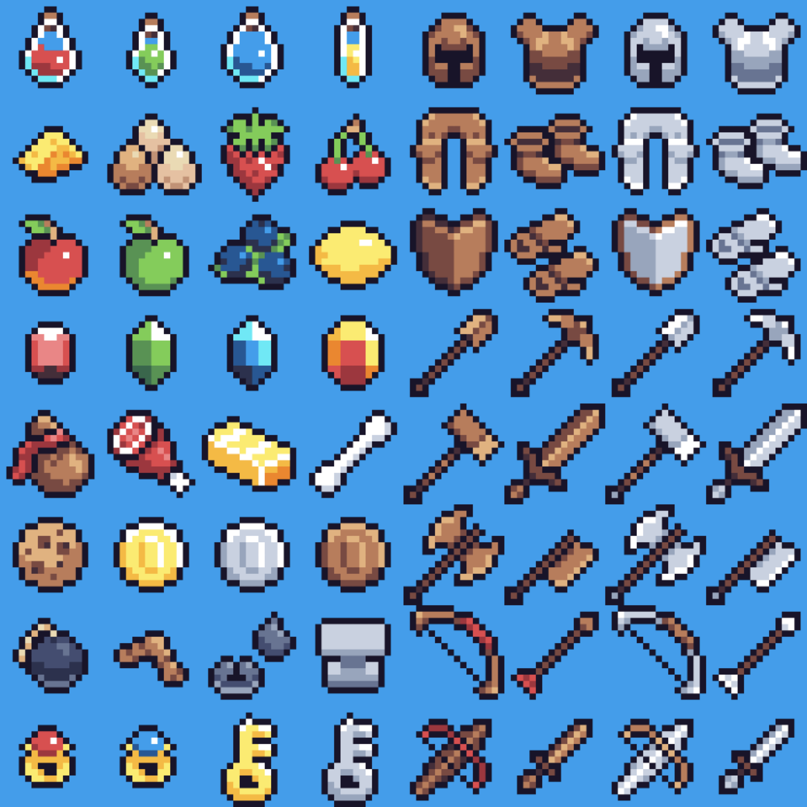
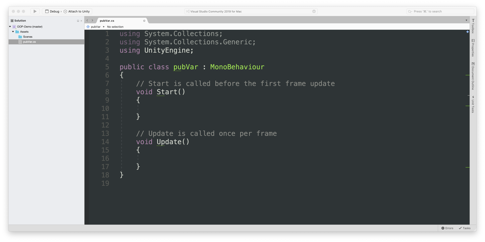

---
# Page settings
layout: default
keywords:
comments: false

# Hero section
title: COMP140 - Lecture Documentation 1

# Author box
author:
    title: Matt Watkins
    description: Lecturer in Computing at Falmouth University

# Micro navigation
micro_nav: true

# Page navigation
page_nav:
    next:
        content: Next page
        url: '../software-architecture-ws'
---

# Object Oriented Programming

## Introduction to OOP

Object-oriented programming (OOP) is a computer programming model that organizes software design around **data, or objects**, rather than **functions and logic**.

 **Object Orientated Programming (OOP)** is the  dominant paradigm in computing and development. Most modern Programming Languages are OOP

-   **C++** - Mixed Paradigm, but supports OOP
-   **C#** - OOP
-   **Java** – OOP
-   **Python** - Mixed Paradigm, but supports OOP
-   **Javascript** - Mixed Paradigm, but supports OOP

### Categorising

OOP's dominance is because of how we humans describe the world. We define and separate things on the basis of categories otherwise known as taxonomy.

Sea and land, sand and soil, plants and animals. Within each category we have subcategories - plants can be further defined by whether they are trees or shrubs and so on.

When designing games we talk about *’enemies’* or *’weapons’* with their own abilities or differences. Each **category** contains **subcategories**.

In OOP we define these categories as **objects** and the subcategory as a **property**. The **potion** object could have the property **colour** which could be set to **blue**.



### Principle Terminology

OOP has a number of key concepts that we need to understand in order to make effective use of it. In this lecture we will look at Objects, Classes, Inheritance, Polymorphim, Abstraction and Encapsulation.

-   **Objects** - is an abstract data type. It can include multiple properties and methods and may even contain other objects.
-   **Classes** - a class is a template definition of the method s and variables in a particular kind of object.
-   **Encapsulation** – It describes the idea of bundling data and methods that work on that data within one unit. It is also used to hide the internal representation, or state, of an object from the outside.
-   **Properties** - a member of an object that controls how one field may be accessed and/or modified.
-   **Composition** – Objects can be composed of other objects
-   **Inheritance** – Objects can be related to other objects
-   **Polymorphism** – Objects can be used via references to their parent class

### OOP in Unity



Probably the easiest way to reference OOP in C# is to look at it’s application in Unity. You have probably seen classes being used in Unity before whenever you create a script file.

A new class is created with the name that you call the file. In this instance a file is called ``pubVar`` and the public class ``pubVar`` is shown at the top of the script.

## Making a Simple Class

You are probably wondering what’s the purpose of a class. Let’s look at an example. We are setting up the variables for a character and then we are going to define these variables for a specific character.
```c#
string name;  
float strength;  
int health;  
bool isAlive;

//Create character
name = “Blackbeard”;  
strength = 25;  
health = 15;  
isAlive = true;
```
Now when we get to thinking about adding a second character it starts to get messy how do we track different variable values for different characters. Do we need to create completely separate variables for each character this seems very wasteful.

This is where **classes** come in.

So we can think of classes as blueprints or templates that we can use to define an object. This class of ours can have (click) member variables and these can be accessed anywhere inside this class. From our class we can create different instances of that class, using a constructor. 
```c#
public class Character  
{  
	string name;  
	float strength;  
	int health;  
	bool isAlive;  
}
```
We use the name of the class as a data type and we can then create new unique variables that contain the properties of that class.
```c#
Character hero = new Character();  
Character enemy = new Character();  
Character guide = new Character();
```
### Classes are Blueprints


A class is a potential object, it is the instructions to create a real object in our code, like a blueprint. Like the relationship between a recipe to make a doughnut and the actual doughnuts that are produced. This is the best way to understand the concept.

In order to access our member variables from outside our class we need to make them public, we do this by adding the public keyword
```c#
public class Character  
{  
public string name;  
public float strength;  
public int health;  
public bool isAlive;  
}
```
and then when you instantiate a new class  you can easily access the variables using the name of the new instance and change them just as you would with normal variables.
```c#
//create an instance of “character”
Character enemy = new Character();

//Access public variables
enemy.name = “Blackbeard”;  
enemy.strength = 25;  
enemy.health = 15;  
enemy.isAlive = true;
```

### Encapsulation - Public vs Private members

Let’s add another concept - Encapsulation. In order to set a variable to public you have to define it using the word ``public`` preceding the variable type. If you want create a private variable you can explicitly define it as such using the word private (click). Private means that the variable can’t be accessed from outside the class. If you don’t include the word private or public the variable is by default private (click). These different states are also known as access modifiers.
```c#
public class  Character  
{  
 public  string name;  
 public  float strength;
 public  int health;

//private member variable, Not available outside the class  
 private  bool isAlive;
//by default member variables are private  
 int score;  
}
```
Remember that we can set the initial variable values inside the class. However if we don’t the default value will be ‘nil’.
```c#
public class Character  
{  
 public string name;  
 public float strength;  
 public int health = 100;  
}
```
### Public Variables in Unity

In unity when we create a public variable in code it is made available to the inspector (click) and we can assign a value to that variable from the unity interface, either by writing a value in or by dragging a corresponding asset or object into the box. (click) As you can see this example contains a variable score and the value zero is displayed in the inspector. The advantage of this is that variables and objects can be changed live in the UI view even while we are running a game, which is invaluable for debugging.
<!--stackedit_data:
eyJoaXN0b3J5IjpbLTIwNjk4Mzc1ODgsMTc3NDgzODY1LC0xOD
YxMTY3MDA3LC0xOTQ1NDU4MDE1LC0zMzYyMzMxMzYsMTE0OTgw
OTgwMyw5ODA2Mjc0ODcsOTM0OTY2MjI2LC0xMzc5NDAxMDgwLC
0xMTE1NDM4NzUxLDE3NDkxNzUyNzEsLTEyMDY1NDk1OTEsLTEy
Nzc0NTQ2MzksNjAxMTE5MjY3LC0xNDE5ODExMjY3XX0=
-->