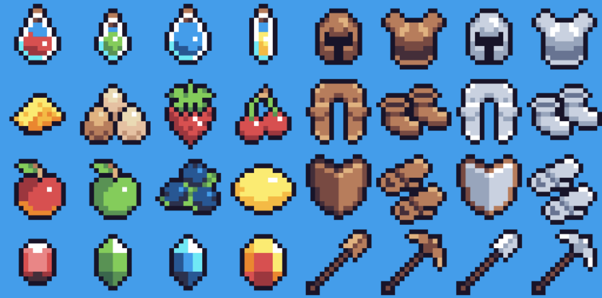

---
# Page settings
layout: default
keywords:
comments: false

# Hero section
title: COMP140 - Lecture Documentation 1

# Author box
author:
    title: Matt Watkins
    description: Lecturer in Computing at Falmouth University

# Micro navigation
micro_nav: true

# Page navigation
page_nav:
    next:
        content: Next page
        url: '../software-architecture-ws'
---

# Object Oriented Programming

## Introduction to OOP

Object-oriented programming (OOP) is a computer programming model that organizes software design around **data, or objects**, rather than **functions and logic**.

 **Object Orientated Programming (OOP)** is the  dominant paradigm in computing and development. Most modern Programming Languages are OOP

-   **C++** - Mixed Paradigm, but supports OOP
-   **C#** - OOP
-   **Java** – OOP
-   **Python** - Mixed Paradigm, but supports OOP
-   **Javascript** - Mixed Paradigm, but supports OOP

## Objects

OOP's dominance is because of how we humans describe the world. We define and separate things on the basis of categories otherwise known as taxonomy.

Sea and land, sand and soil, plants and animals. Within each category we have subcategories - plants can be further defined by whether they are trees or shrubs and so on.

When designing games we talk about *’enemies’* or *’weapons’* with their own abilities or differences. Each **category** contains **subcategories**.

In OOP we define these categories as **objects** and the subcategory as a **property**. The **potion** object could have the property **colour** which could be set to **blue**.



### Principle Terminology

OOP has a number of key concepts that we need to understand in order to make effective use of it. In this lecture we will look at Objects, Classes, Inheritance, Polymorphim, Abstraction and Encapsulation.

-   **Objects** - is an abstract data type. It can include multiple properties and methods and may even contain other objects.
-   **Classes** - a class is a template definition of the method s and variables in a particular kind of object.
-   **Encapsulation** – It describes the idea of bundling data and methods that work on that data within one unit. It is also used to hide the internal representation, or state, of an object from the outside.
-   **Properties** - a member of an object that controls how one field may be accessed and/or modified.
-   **Composition** – Objects can be composed of other objects
-   **Inheritance** – Objects can be related to other objects
-   **Polymorphism** – Objects can be used via references to their parent class

### OOP in Unity


Probably the easiest way to reference OOP in C# is to look at it’s application in Unity. You have probably seen classes being used in Unity before whenever you create a script file.

A new class is created with the name that you call the file. In this instance a file is called ``pubVar`` and the public class ``pubVar`` is shown at the top of the script.

## Classes

You are probably wondering what’s the purpose of a class. Let’s look at an example. We are setting up the variables for a character and then we are going to define these variables for a specific character.
```c#
string name;  
float strength;  
int health;  
bool isAlive;

//Create character
name = "Blackbeard";  
strength = 25;  
health = 15;  
isAlive = true;
```
Now when we get to thinking about adding a second character it starts to get messy how do we track different variable values for different characters. Do we need to create completely separate variables for each character this seems very wasteful.

This is where **classes** come in.

So we can think of classes as blueprints or templates that we can use to define an object. This class of ours can have (click) member variables and these can be accessed anywhere inside this class. From our class we can create different instances of that class, using a constructor. 
```c#
public class Character  
{  
	string name;  
	float strength;  
	int health;  
	bool isAlive;  
}
```
We use the name of the class as a data type and we can then create new unique variables that contain the properties of that class.
```c#
Character hero = new Character();  
Character enemy = new Character();  
Character guide = new Character();
```
### Classes are Blueprints


A class is a potential object, it is the instructions to create a real object in our code, like a blueprint. Like the relationship between a recipe to make a doughnut and the actual doughnuts that are produced. This is the best way to understand the concept.

In order to access our member variables from outside our class we need to make them public, we do this by adding the public keyword
```c#
public class Character  
{  
public string name;  
public float strength;  
public int health;  
public bool isAlive;  
}
```
and then when you instantiate a new class  you can easily access the variables using the name of the new instance and change them just as you would with normal variables.
```c#
//create an instance of “character”
Character enemy = new Character();

//Access public variables
enemy.name = "Blackbeard";  
enemy.strength = 25;  
enemy.health = 15;  
enemy.isAlive = true;
```

## Encapsulation - Public vs Private members

Let’s add another concept - Encapsulation. In order to set a variable to public you have to define it using the word ``public`` preceding the variable type. If you want create a private variable you can explicitly define it as such using the word private (click). Private means that the variable can’t be accessed from outside the class. If you don’t include the word private or public the variable is by default private (click). These different states are also known as access modifiers.
```c#
public class  Character  
{  
 public  string name;  
 public  float strength;
 public  int health;

//private member variable, Not available outside the class  
 private  bool isAlive;
//by default member variables are private  
 int score;  
}
```
Remember that we can set the initial variable values inside the class. However if we don’t the default value will be ‘nil’.
```c#
public class Character  
{  
 public string name;  
 public float strength;  
 public int health = 100;  
}
```
##  Public Variables in Unity


Unity is by its very nature object oriented, so the principles are applied every time you create a script file which automatically creates a class. In Unity when we create a public variable in code it is made available to the inspector and we can assign a value to that variable from the unity interface, either by writing a value in or by dragging a corresponding asset or object into the box. As you can see this example contains a variable score and the value zero is displayed in the inspector. The advantage of this is that variables and objects can be changed live in the UI view even while we are running a game, which is invaluable for debugging.

### Accessing Variables

So if we stretch our slightly tenuous doughnut analogy. The doughnuts on the shelves are **private**  and not accessible to the outside world. The only way to access a **private** variable is to use a **method**.

## Methods


We can use another analogy to describe how methods works, which is that of the factory. A method like a factory is a process that takes an input or multiple inputs to make it work and then it has a return or an output which is the final result of the processes undertaken in the method.  
The analogy slightly breaks down, as it is not always essential for a method to have an input or an output to function. For instance a ``getTime`` methods does not need an input to tell you the time.
```c#
public class  Character  
{  
	public string name;  
	public float strength;
	public int health;
	public void Attack()  
	{  
		Debug.Log("Character attacked");  
	}
}  
```
This shows how effective OOP can be. We can set-up multiple characters and allow them to use the same functions and methods we just address the specific instance of the class. In this case hero. As you can see we use ``void`` as this corresponds with a method or function that has no input parameters.
```c#
public class  Character  
{  
	public  string name;  
	public  float strength;public  int health;

	public int updateHealth(int newHealth)  
	{  
		int health = health + newHealth;  
		return health;  
	}  
}
```
In this example we have created a function in the character class called ``updateHealth`` with an integer parameter called newHealth (click) and we are going to call it via a method.
```c#
Character hero = new Character();  
hero.health = 10;  
int playerHealth = hero.updateHealth(20);
```
Here you can see we created the instance of ``hero`` and set it’s initial health to 10 and subsequently we update that health using a method in the variable that will pass the value of 20 to the ‘hero’ instance of the class. The final value of ``hero.health`` will be 30.
```c#
public class  Character  
{  
	public string name;  
	public float strength;
	public int health;

	public int updateHealthStrength(int newHealth, int newStrength)  
	{  
	int health = health + newHealth;  
	int strength = strength + newStrength;  
	return health;  
	}  
}
```
We can easily add more parameters to our function and call them in the same way we did before.
```c#
Character hero = new Character();  
hero.health = 10;  
int playerHealth = hero.updateHealthAndStrength(20, 15);
```
## Memory allocation of Objects

It is important to note that instantiating new instances of the class as objects as in the example here. Allocates a space in memory for each new instance. Which means each character has a portion of memory allocated to contain the member variables and other elements of the instance.


However if you create new instances of the class that are referencing an existing instance, there will be only one piece of allocated memory, so all the member variables will refer back to the original instance. If hero’s health is 20, then so will enemy’s, guide’s and boss’. It can be easy to make this mistake and end up resetting or changing everything with the same value when you wanted different values.


## Properties

In this example class ``player`` we have a variable called ``health``. Conventionally when we want to share the contents of a variable, in the case of classes we can refer to them as fields we would make it public, but there is a better more secure way.
```c#
public  class  Player
{
	//Member variables can be referred to as  fields.
	private int health;
	//Health is a basic property
	public int Health
	{
		get
		{
			//Some other code
		}
		set
		{
			//Some other code
		}
	}
}
```
In this example class ``player`` we have a variable called ``health``. Conventionally when we want to share the contents of a variable, in the case of classes we can refer to them as fields we would make it public, but there is a better more secure way.

Properties behave more like methods and we can enclose them using curly brackets and we can add other functions inside them. Inside our property we are going to use ``get`` and ``set`` and these are our known as **access modifiers**.

Now you may think this is a complicated way to access a private variable why not just make it public. Lets have a little look at ``get`` and ``set``.

### Access Modifiers


We can use the analogy of a house. If we set our field to ``public`` anyone or any method call can access it. If we set it to ``private`` it is not accessible from the outside. But sometimes we want a method to be able to read something but nothing else. Known as read only. In this case we can ``get`` something. in other instances we want it to be writeable, so we can ``set`` something but not readable, sometimes both. The great thing with get and set is we can control one part of the code without affecting other parts and it makes our code more secure because we are not exposing all variables at all times.
```c#
public  class  Player
{
	//Member variables can be referred to as  fields.
	private int health;
	//Health is a basic property
	public int Health
	{
		get
		{
			return health;
		}
		set
		{
			health = value;
		}
	}
}
```
You can see that the property ``Health`` with a capital imposes modifiers on the private field ``health``. The external method can get a return of the value of the experience field so this is what is read which is get, and the experience field can be written to using the contextual keyword ``value`` which will set the value to whatever is defined in the method that is writing to it. This control of private and public through get and set is an extension to the concept of **encapsulation**.

### Accessing Properties

In a new class called ``game`` We create an instance or an object called ``newPlayer`` from the class ``Player`` and now we can now adjust the field ``health`` through the property ``Health`` in much the same way as we did changing public member variables except in this instance the variable remains private but it has a read write access modifier applied to it.
```c#
public  class  Game
{
	void Start ()
	{
		Player newPlayer = new Player();
		//Properties can be used just like variables
		//Write
		newPlayer.Health = 5;
		//Read
		int x = newPlayer.Health;
	}
}
```
## Inheritance

Inheritance is all about a parent chid relationship. The class ``Fruit`` has it's own variables and methods and these can be accessed by child classes that contain the keyword operator ``:``. ``Banana`` is now a child of ``Fruit`` and so is ``Apple``. Let’s explore this concept a bit more.
```c#
class  Fruit  // base class (parent)
{
	protected  string  foodType = "Fruit"; // Weapon field
	public void eatFruit() // Weapon method
	{
		Console.WriteLine("Eating:" + foodType);
	}
}
class  Banana : Fruit  // derived class (child)
{
	public  string  fruitName = "Banana"; // Fruit field
}
class  Apple : Fruit  // derived class (child)
{
	public  string  fruitName = "Apple"; // Fruit field
}
```
As previously specified inheritance is about classes that inherit the variables and methods of their parent. This is defined by the colon operator. In fact it’s written with the child first and the parent after. In the code example form before we have the parent ``Fruit`` and the child ``banana``. This goes back to our first discussion about OOP being about categorising. Inheritance is all about objects and their relationship. The child has access to both its parents features and its own.

### Parents & Children
```c#
class Main
{
	// Create a myCar object
	Banana myFruit1 = new Banana();
	Apple  myFruit2 = new  Apple();
	
	// Call the eatFruit() method (From the Fruit class) 
	// on the myFruit object
	myFruit1.eatFruit();
	myFruit2.eatFruit();

	// Print value of the fruit type field (from the Fruit class) 
	// and the value of the fruitName from the Banana class
	Console.WriteLine(" name- " + myFruit1.fruitName);
	Console.WriteLine(" name- " + myFruit2.fruitName);
}
```
Here you can see that if we create  a new instance of any of the children we can activate both the parent methods as well as the child ones. As they are inherited. The output would look like this:
```
Eating: Fruit
Eating: Fruit
name- banana
name- apple
```
### Unity & Inheritance from MonoBehaviour


Another way to understand the application of inheritance is how it is represented in Unity. The ``MonoBehaviour`` class is a parent of most scripts, as it is automatically parented when you create a script in Unity. Any child say ``pubVar`` in the example has access to the principle Monobehaviour methods like ``Start()`` and ``Update()`` as well as a range of others.

## Polymorphism

Polymorphism is another way to work with inheritance. Say we have a parent and a series of children. They all have methods of the same name but with different outputs.
```c#
class  Fruit  // Base class (parent)
{
	public  void fruitColour()
	{
		Console.WriteLine("Fruit has many colours");
	}
}
class  Strawberry : Fruit  // Derived class (child)
{
	public  void fruitColour()
	{
		Console.WriteLine2("Red");
	}
}
class  Kiwi : Fruit  // Derived class (child)
{
	public  void fruitColour()
	{
		Console.WriteLine("Green");
	}
}
```
This can give confusing results as the base class or parent overrides the child methods due to inheritance. We can overcome this using **override**.
```c#
class  Game
{
	static  void  Main(string[] args)
	{
		// Create a Fruit object
		Fruit  myFruit = new  Fruit(); 
		// Create a Strawberry object
		Fruit  myStrawberry = new  Strawberry(); 
		// Create a Kiwi object
		Fruit  myKiwi = new  Kiwi(); 

		myFruit.fruitColour();
		myStrawberry.fruitColour();
		myKiwi.fruitColour();
	}
}
```
The output would be this:
```
Fruit has many colours
Fruit has many colours
Fruit has many colours
```
### Override

Using the keyword ``override`` we can effectively allow child methods to override the parent.
```c#
class  Fruit  // Base class (parent)
{
	public  void fruitColour()
	{
		Console.WriteLine("Fruit has many colours");
	}
}
class  Strawberry : Fruit  // Derived class (child)
{
	public  override void fruitColour()
	{
		Console.WriteLine("Red");
	}
}
class  Kiwi : Fruit  // Derived class (child)
{
	public  override void fruitColour()
	{
		Console.WriteLine("Green");
	}
}
```
```c#
class  Game
{
	static  void  Main(string[] args)
	{
		// Create a Fruit object
		Fruit  myFruit = new  Animal(); 
		// Create a Strawberry object
		Fruit  myStrawberry = new  Strawberry();
		// Create a Kiwi object 
		Fruit  myKiwi = new  Kiwi(); 

		myFruit.fruitColour();
		myStrawberry.fruitColour();
		myKiwi.fruitColour();
	}
}
```
The output would then become this:
```
Fruit has many colours
Red
Green
```

## Composition

Another useful extension to inheritance is Composition and the use of Interfaces. When considering a use case it is worth thinking about whether you have general rules or specialist rules.

### Inheritance vs Composition

 It alls depends on whether you want to **Generalise** or **Specialise**
-   **Inheritance** - **Strawberry is a Fruit** but **Fruit is not a Strawberry**
    _A strict tree model_
-   **Composition** - Fruit can be **made up of Kiwi and/or Strawberry**.  
    _You can pick and choose_

Another useful extension to inheritance is Composition and the use of Interfaces. When considering a use case it is worth thinking about whether you have general rules or specialist rules. Inheritance is great when you have a cascading tree of dependencies. The rule of inheritance is that it's a strict model as we’ve seen before where things are all part of a larger whole or tree. Composition is where you have a class that you want to include some but maybe not all of a series of other classes.

### Composition using Interfaces

An Interface defines a contract that must be implemented by a class. The interface doesn’t provide any functionality, just a signature that must be implement by a class which implements the interface. The interface is defined by using ``I`` keyword followed by the name of interface and it has no body but just the method it is linked to. In the example class ``Kiwi`` can now have a series of Interfaces that can be accessed.
```c#
// Interface
interface  IFruit
{
	void  eatFruit(); // interface method (does not have a body)
}
interface  IfruitColour
{
	void  fruitColour();  
}
// Kiwi "implements" the IFruit and IfruitColour interface
class  Kiwi : IFruit, IfruitColour
{
	public  string  foodType = "Fruit";
	public void eatFruit()
	{
		Console.WriteLine("Eating:" + foodType);
	}
	public  string  fruitType = "Kiwi";
	public  void  fruitColour()
	{
		Console.WriteLine("This "+fruitType +"is Green");
	}
}
```
```c#
class  Game

{

// Create a myCar object

Kiwi myKiwi = new Kiwi();

  

// Call the methods invoked by the interface

Kiwi.eatFruit();

Kiwi.fruitColour();

  

  

  

}
``
<!--stackedit_data:
eyJoaXN0b3J5IjpbMTM1NDUxMzU4LC02NDc2NzA5NSwyODA3ND
Q1MjMsLTE4Mzg0MDc5MzAsLTIxMDI4Njg5OTEsNzgyOTIzMjkz
LDg0OTA1MjE1LDEyMTgyNTgxNTMsNjk3OTM1NTE5LC0yMTg1Nz
g0NCwxMDE0NzI2MDYsLTE0NTA3NTg3MzEsMzc3MjMxOTAxLC01
MTY1NjY5NzYsNjgwNjk1MTI3LDE0OTQxNjUyNjYsMTc3NDgzOD
Y1LC0xODYxMTY3MDA3LC0xOTQ1NDU4MDE1LC0zMzYyMzMxMzZd
fQ==
-->