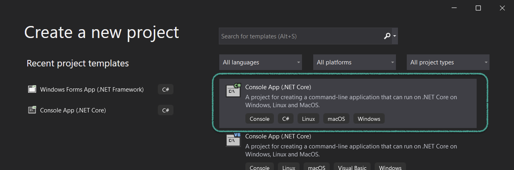
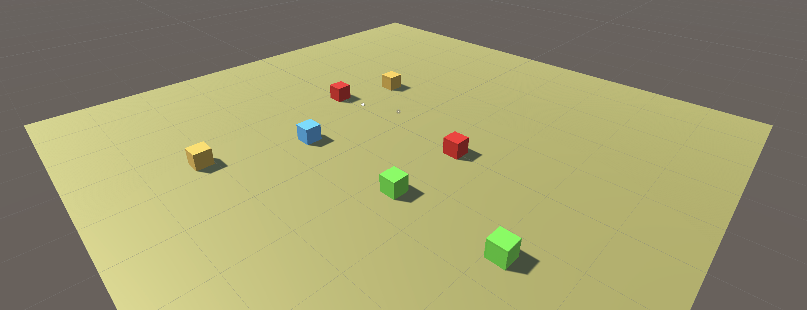

---
# Page settings
layout: default
keywords:
comments: false

# Hero section
title: COMP140 - Worksheet 1

# Author box
author:
    title: Matt Watkins
    description: Lecturer in Computing at Falmouth University

# Micro navigation
micro_nav: true

# Page navigation
page_nav:
    next:
        content: Next page
        url: '../software-architecture-ws'
---

# Object Oriented Programming

This workshop is divided into to 2 parts where we will explore the use of code in Visual Studio and Unity. Complete each task in your own time. We will review solutions at the halfway point.

## EXERCISE 1 - OOP in **Visual Studio**
### 1. Who Let the Dogs Out?



Create a console app project in VISUAL STUDIO
1. Create a C# program that requests 5 names of ``Dog`` from the user and stores them in an array of objects of type ``Dog``. To do this, first create a dog class that has a name member variable of type ``string``.
2. Your input should be: ``Labrador, Poodle, Wolf, Fox, Pug.`` 
3. Your **output** should be: 

```
A pack of wild dogs emerged out of the wilderness. 
Amongst their number was:
A Labrador
A Poodle
A Wolf
A Fox
A Pug
```
You should use a loop to iterate through the array. Your Dog class needs a method to return the value of name. 
You should use ``console.ReadLine`` to input the value.
{: .callout .callout--info}

Let's expand on the previous exercise. 

1. Create 2 new classes called ``Wild`` and ``Domestic``. 
2. Once again use the loop to iterate output values.
3. Use inheritance to inherit the parent class file name. Your should also have a new property called Behaviour which contains the behaviour of each class of dog. It should be both readable and writable.
4. The **output** should be something like this:

```
The Labrador wags its tail!
The Wolf bares its teeth!
```
and so on…

### 2. Making Smoothies

Create a new application called **Smoothie Calculator**. We are going to use classess to manage different methods and properties.

1. Create a class ``Smoothie`` and do the following:
2. Create a property called ``Ingredients``.
3. Create a ``GetCost`` method which calculates the total cost of the ingredients used to make the smoothie.
5. Create a ``GetName`` method which gets the ingredients and puts them in alphabetical order into a nice descriptive sentence.
6. If there are multiple ingredients, add the word "Fusion" to the end but otherwise, add "Smoothie". 
7. Finally there should be a method called ``makeSmoothie`` that outputs the name, ingredients and costs of a smoothie based on inputted ingredients. 

Remember to change "-berries" to "-berry". 
{: .callout .callout--info}

See the examples below for hints about structuring your properties and methods:

``s1 = Smoothie(new string[] { "Banana" })``  
``s1.Ingredients ➞ { "Banana" }``  
``s1.GetCost() ➞ "£0.50"``  
``s1.GetPrice() ➞ "£1.25"``  
``s1.GetName() ➞ "Banana Smoothie"``  
``s2 = Smoothie(new string[] { "Raspberries", "Strawberries", "Blueberries" })``  
``s2.ingredients ➞ { "Raspberries", "Strawberries", "Blueberries" }``  
``s2.GetCost() ➞ “£3.50"``  
``s2.GetName() ➞ "Blueberry Raspberry Strawberry Fusion"``  

The price list:

| Ingredient | Price |
| ----------- | ----------- |
| Strawberries | 1.50 |
| Banana | 0.50 |
| Mango | 2.50 |
| Blueberries | 1.00 |
| Raspberries | 1.00 |
| Apple | 1.75 |
| Pineapple | 3.50 |

The **output** should be 3 sample smoothie combinations and their price.

## EXERCISE 3 - OOP in **Unity**
### Animal Kingdom

Based on the Tavern example given create your own auto generated game scene. This time you are going to be making ‘Animal Kingdom’ a generic rip off of ‘Animal Crossing’. You are going to create a village populated by 10 random animals with their own behaviours.



1. You need to create a class ``Village``
2. Create an ``Animal`` class and this will have child classes for the different animals in the village. 
3. Decide on different *variables/fields* and *properties* for your animals. Some should be in the animal class and *inherited* by the chid class and some are overridden by the children.
4. At least one filed should be protected using ``get`` and ``set``.
5. Some of the properties should appear in your game as *physical elements* of game objects. As in the example above you could create different *colours* for animals. Develop some or all of these features:
    1. **Shape** (different primitive or models)
    2. Create different **random movement** for each class.
    3. A **greeting**. (this can be either audio or text)
    4. Perhaps when the animals **collide** they could utter their greeting then change direction
6. The scene should be initiated by the ``Village class``. 
7. Your prototype game system should be built using objects and classes and make use of *properties, constructors, encapsulation, inheritance* and *polymorphism*.

## VIDEO LECTURE

It is assumed that you have watched the video lecture before this workshop. If not you should find time to watch them during the week.
{: .callout .callout--warning}

### Lecture - OOP Part 1
<iframe width="640" height="360" src="https://web.microsoftstream.com/embed/video/555f6127-55e3-4951-80ff-21e3003d08b2?autoplay=false&showinfo=true" allowfullscreen style="border:none;"></iframe>

### Lecture - OOP Part 2
<iframe width="640" height="360" src="https://web.microsoftstream.com/embed/video/133b71d2-d972-44eb-b841-0d77473af393?autoplay=false&showinfo=true" allowfullscreen style="border:none;"></iframe>

