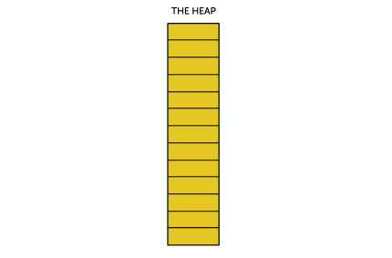

---
# Page settings
layout: default
keywords:
comments: false

# Hero section
title: 10. Optimisation & Performance
description: COMP140 - Lecture Materials 10

# Author box
author:
    title: Matt Watkins
    description: Lecturer in Computing at Falmouth University

# Micro navigation
micro_nav: true

# Page navigation
page_nav:
    prev:
        content: States & Transistions
        url: '../cybernetics-lm'
---

# 10. Optimisation & Performance


The following materials are derived from the *Optimisation & Performance lecture*. The video lecture is included at the bottom of the [***page***](#video-lecture).
{: .callout .callout--warning}

-   Explain the role of optimisation in the development of software
-   Identify the role of hardware in performance.
-   Assess various techniques to optimise your code
-   Apply these methods using specific tools.

## Introduction

One of the important aspect of programming is **optimising** for **performance**. We need to understand the **hardware** our products will be deployed onto, We need to understand the **programming languages** we use. We also need to understand the **frameworks, platforms** or **game engines** we develop for. And finally we need to understand the **tools** we can use to tune **performance**.

## Memory

The most fundamental factor in understanding how we can fine tune our projects is to identify the role played by memory.

**Memory** in most modern programming languages is allocated in two spaces

-   **Dynamic memory** (allocated with new) is allocated on the **Heap** and will grow in size
-   **Stack memory** (everything that doesn’t use new) is allocated on the **Stack** and is fixed size

Let's further clarify the differences between the **two types**:

|STACK| HEAP |
|--|--|
|The memory is allocated at the **compile time**.| The memory is allocated at the **runtime**.|
|In static memory allocation, while executing a program, **the memory cannot be changed**.| In dynamic memory allocation, while executing a program, the **memory can be changed**.|
|Static memory allocation is preferred in an **array**.  | Dynamic memory allocation is preferred in the **linked list**. |

### Stack vs Heap

*fig.1 - Visualising Address Space*

This is a visualisation of the 2 types of memory, However you should be aware that his doesn’t reflect any real space. Stack and Heap are memory abstractions, there is no physical difference between them. However in order to address the allocation of memory - address space was created. Each type of memory has its own address and is divided into different segments, hence the diagram we are going to look at. 

1. Stack deals with the removal and addition of objects from the top this is why it is referred to as a stack and this is why we have put it at the bottom of the diagram here. You will remember the principle of LIFO (last in first out) from our discussion of data structures. 
2. Heap memory on the other hand is dynamic memory and it changes as the program runs. Its only limitation is the available free space. 
3. Heap is slower than stack because it has to use a pointer which is stored on the stack to locate the stored object in heap. 
4. This is known as a reference type. 
5. An object in stack holds it’s own reference type and is known as a value type. 
6. Finally we have the code that is not making use of memory at runtime.

### STACK - Impacts on Programming
-   When you allocated values types (int, float, bool, short, char etc), these allocated on the stack
-   Values allocated on the stack are local, these are deallocated when they drop out of scope
-   Values passed into functions are copied onto the stack
-   The **stack is of fixed size – 1MB for C#**

### HEAP - Code Example
```c#
void  Update() {
	int  x = 10;
	int  y = 10;
	Vector2  pos = Vector2(x, y);
} //<-- x, y and pos drop out of scope here
```

### HEAP - Impacts on Programming
1.  Heap memory is allocated dynamically
2.  Any type allocated using the new keyword are allocated on the heap
3.  We as programmers have responsibility for allocating on the heap
4.  But ... in **C#** the Heap Memory is managed by the **Garbage Collector  
    **– In C++ we have to allocate and deallocate on the Heap!

### HEAP - Code Example
```c#
public  class  MonsterStats {
	private  int  health;
	private  int  strength;
	public  MonsterStats ( ) {
		health = 100;
		strength = 10; 
	}
	public  void  ChangeHealth (int  h) {
		health += h ;
	}//<- h drops out of scope here
	void  ChangeStrength(int  s ) {
		strength += s;
	}//<- s drops out of scope here
}

void Start( ) {
	//Create an instance of the class on the Heap
	MonsterStats  new  stats = MonsterStats();
	stats.ChangeHealth(10);
	stats.ChangeStrength(-2);
}
```

### Data Types and Memory in C#

1.  **Values types** such as int, float, etc are allocated on the **Stack**
2.  **Struct’s** are custom **values types** so are allocated on the **Stack** (except on a few cases)
3.  **Reference Types** are allocated on the **Heap** and include **class, interface** and **delegate types**

## Strings

Strings act and look like value types but are actually reference types

-   This means we need to be careful in allocating new strings
-   And each time we create a new string using concatenation (+)
-   If we are creating lots of new strings we should use the `StringBuilder` class

### String Builder - Code Example
```c#
//We need to use the namespace - System.Text
using  namespace  System.Text
//Create the string builder with a capacity of - 1024 and max capacity of 1024
StringBuilder  sb = new  StringBuilder(1024,1024);
//Append some text
sb.Append("Name: ");
sb.Append("Meera");
sb.Append("Health: ");
sb.Append(100);
//Get the String from the String Builder
string  s = sb.ToString();
```

## Memory Management

### Garbage Collection

C# uses **garbage collection** to clean up **deallocated objects** that have been allocated on the heap  
  
This is an automatic process and has been tuned for maximum performance  
  
**However** you should understand how this process works and create code which ensures that garbage collection **only runs when needed**

### How Garbage Collection Works

When garbage collection is triggered the garbage collector deems every object in the graphs as garbage. The garbage collector then recursively traverses each graph looking for reachable objects. Every time the garbage collector visits an object, it tags it as reachable. Because the graphs represent the relationships between clients and objects, when the garbage collector is done traversing the graphs, it knows which objects were reachable and which were not. Reachable objects should be kept alive. Unreachable objects are considered deallocated and therefore garbage, and therefore destroying them does no harm.


*fig.2 - Visualising Garbage Collection*

Next, the garbage collector scans the managed heap and disposes of the unreachable objects by compacting the heap and overwriting the unreachable objects with reachable one. The garbage collector moves reachable objects down the heap, writing over the garbage, and thus frees more space at the end for new object allocations. All unreachable objects are purged from the graphs.

### Caching
#### BAD Code Example
```c#
void  Update() {
	//Get Health Component and check health
	Health health = GetComponent<Health>();
	if (health.IsDead()) {
		//Do Something
	}
}
```
The above code allocates on the heap and gets deallocated every update, causing not only unnecessary allocation but deallocation via the Garbage Collector.

If our code repeatedly calls expensive functions that return a result and then discards those results, this may be an opportunity for optimization. Storing and reusing references to these results can be more efficient. This technique is known as **caching**.

 If you call functions which allocate memory on the heap:

    Find()

    GetComponent()

    Object.FindObjectOfType

Note: Consider moving these out of **Update** functions and retrieve in the **Start** function.

#### GOOD Code Example
```c#
private  Health  health;  
void Start() {
	health = GetComponent<Health>();
}
void  Update() {
	if (health.IsDead()) {
		//Do Something
	}
}
```

## Video Lecture

<iframe width="100%" height="370" src="https://web.microsoftstream.com/embed/video/f40015bb-d506-4ffc-9a7a-8e90069ffdae?autoplay=false&showinfo=true" allowfullscreen style="border:none;"></iframe>

<!--stackedit_data:
eyJoaXN0b3J5IjpbMTAzMDk4ODM4OCwzNjYzNjI4MDcsMTU1Nj
U1MDMyNCwyMjUzMzI3OTgsLTE4NDY1ODY5MTUsMTUxMTM2MTI4
MywxMDgxMDg1OTIxXX0=
-->