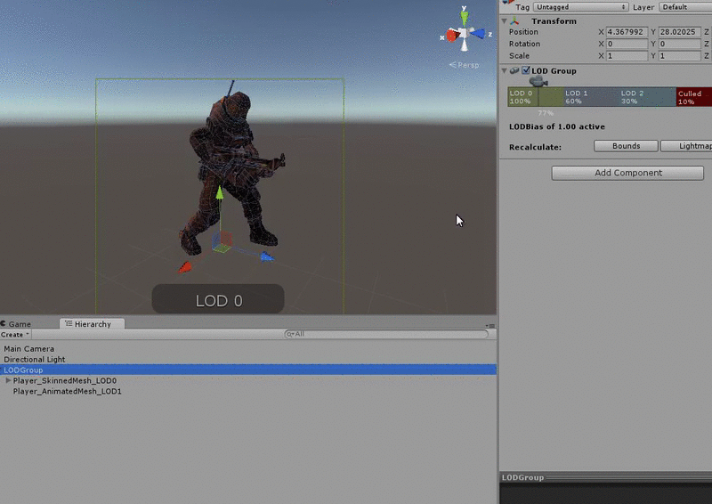

---
# Page settings
layout: default
keywords:
comments: false

# Hero section
title: 10. Optimisation & Performance
description: COMP140 - Lecture Materials 10

# Author box
author:
    title: Matt Watkins
    description: Lecturer in Computing at Falmouth University

# Micro navigation
micro_nav: true

# Page navigation
page_nav:
    prev:
        content: States & Transistions
        url: '../cybernetics-lm'
---

# 10. Optimisation & Performance


The following materials are derived from the *Optimisation & Performance lecture*. The video lecture is included at the bottom of the [***page***](#video-lecture).
{: .callout .callout--warning}

-   Explain the role of optimisation in the development of software
-   Identify the role of hardware in performance.
-   Assess various techniques to optimise your code
-   Apply these methods using specific tools.

## Introduction

One of the important aspect of programming is **optimising** for **performance**. We need to understand the **hardware** our products will be deployed onto, We need to understand the **programming languages** we use. We also need to understand the **frameworks, platforms** or **game engines** we develop for. And finally we need to understand the **tools** we can use to tune **performance**.

## Memory

The most fundamental factor in understanding how we can fine tune our projects is to identify the role played by memory.

**Memory** in most modern programming languages is allocated in two spaces

-   **Dynamic memory** (allocated with new) is allocated on the **Heap** and will grow in size
-   **Stack memory** (everything that doesn’t use new) is allocated on the **Stack** and is fixed size

Let's further clarify the differences between the **two types**:

|STACK| HEAP |
|--|--|
|The memory is allocated at the **compile time**.| The memory is allocated at the **runtime**.|
|In static memory allocation, while executing a program, **the memory cannot be changed**.| In dynamic memory allocation, while executing a program, the **memory can be changed**.|
|Static memory allocation is preferred in an **array**.  | Dynamic memory allocation is preferred in the **linked list**. |

### Stack vs Heap

*fig.1 - Visualising Address Space*

This is a visualisation of the 2 types of memory, However you should be aware that his doesn’t reflect any real space. Stack and Heap are memory abstractions, there is no physical difference between them. However in order to address the allocation of memory - address space was created. Each type of memory has its own address and is divided into different segments, hence the diagram we are going to look at. 

1. Stack deals with the removal and addition of objects from the top this is why it is referred to as a stack and this is why we have put it at the bottom of the diagram here. You will remember the principle of LIFO (last in first out) from our discussion of data structures. 
2. Heap memory on the other hand is dynamic memory and it changes as the program runs. Its only limitation is the available free space. 
3. Heap is slower than stack because it has to use a pointer which is stored on the stack to locate the stored object in heap. 
4. This is known as a reference type. 
5. An object in stack holds it’s own reference type and is known as a value type. 
6. Finally we have the code that is not making use of memory at runtime.

### STACK - Impacts on Programming
-   When you allocated values types (int, float, bool, short, char etc), these allocated on the stack
-   Values allocated on the stack are local, these are deallocated when they drop out of scope
-   Values passed into functions are copied onto the stack
-   The **stack is of fixed size – 1MB for C#**

### HEAP - Code Example
```c#
void  Update() {
	int  x = 10;
	int  y = 10;
	Vector2  pos = Vector2(x, y);
} //<-- x, y and pos drop out of scope here
```

### HEAP - Impacts on Programming
1.  Heap memory is allocated dynamically
2.  Any type allocated using the new keyword are allocated on the heap
3.  We as programmers have responsibility for allocating on the heap
4.  But ... in **C#** the Heap Memory is managed by the **Garbage Collector  
    **– In C++ we have to allocate and deallocate on the Heap!

### HEAP - Code Example
```c#
public  class  MonsterStats {
	private  int  health;
	private  int  strength;
	public  MonsterStats ( ) {
		health = 100;
		strength = 10; 
	}
	public  void  ChangeHealth (int  h) {
		health += h ;
	}//<- h drops out of scope here
	void  ChangeStrength(int  s ) {
		strength += s;
	}//<- s drops out of scope here
}

void Start( ) {
	//Create an instance of the class on the Heap
	MonsterStats  new  stats = MonsterStats();
	stats.ChangeHealth(10);
	stats.ChangeStrength(-2);
}
```

### Data Types and Memory in C#

1.  **Values types** such as int, float, etc are allocated on the **Stack**
2.  **Struct’s** are custom **values types** so are allocated on the **Stack** (except on a few cases)
3.  **Reference Types** are allocated on the **Heap** and include **class, interface** and **delegate types**

## Strings

Strings act and look like value types but are actually reference types

-   This means we need to be careful in allocating new strings
-   And each time we create a new string using concatenation (+)
-   If we are creating lots of new strings we should use the `StringBuilder` class

### String Builder - Code Example
```c#
//We need to use the namespace - System.Text
using  namespace  System.Text
//Create the string builder with a capacity of - 1024 and max capacity of 1024
StringBuilder  sb = new  StringBuilder(1024,1024);
//Append some text
sb.Append("Name: ");
sb.Append("Meera");
sb.Append("Health: ");
sb.Append(100);
//Get the String from the String Builder
string  s = sb.ToString();
```

## Memory Management

### Garbage Collection

C# uses **garbage collection** to clean up **deallocated objects** that have been allocated on the heap  
  
This is an automatic process and has been tuned for maximum performance  
  
**However** you should understand how this process works and create code which ensures that garbage collection **only runs when needed**

### How Garbage Collection Works

When garbage collection is triggered the garbage collector deems every object in the graphs as garbage. The garbage collector then recursively traverses each graph looking for reachable objects. Every time the garbage collector visits an object, it tags it as reachable. Because the graphs represent the relationships between clients and objects, when the garbage collector is done traversing the graphs, it knows which objects were reachable and which were not. Reachable objects should be kept alive. Unreachable objects are considered deallocated and therefore garbage, and therefore destroying them does no harm.


*fig.2 - Visualising Garbage Collection*

Next, the garbage collector scans the managed heap and disposes of the unreachable objects by compacting the heap and overwriting the unreachable objects with reachable one. The garbage collector moves reachable objects down the heap, writing over the garbage, and thus frees more space at the end for new object allocations. All unreachable objects are purged from the graphs.

### Caching
#### BAD Code Example
```c#
void  Update() {
	//Get Health Component and check health
	Health health = GetComponent<Health>();
	if (health.IsDead()) {
		//Do Something
	}
}
```
The above code allocates on the heap and gets deallocated every update, causing not only unnecessary allocation but deallocation via the Garbage Collector.

If our code repeatedly calls expensive functions that return a result and then discards those results, this may be an opportunity for optimization. Storing and reusing references to these results can be more efficient. This technique is known as **caching**.

 If you call functions which allocate memory on the heap: `Find()`
`GetComponent()` `Object.FindObjectOfType`

Note: Consider moving these out of **Update** functions and retrieve in the **Start** function.

#### GOOD Code Example
```c#
private  Health  health;  
void Start() {
	health = GetComponent<Health>();
}
void  Update() {
	if (health.IsDead()) {
		//Do Something
	}
}
```
### Garbage Collection Tips
#### Allocation
Don’t allocate on the heap in **Update** functions (use **caching**)  
Also consider calling function on a **timer** if you need to allocate frequently, this will reduce the amount of allocations in **update**
#### Update vs Timer - Call only when needed
```c#
void  Update()
{
	ExampleExpensiveFunction();	
}
```
```c#
private  int  interval = 3;
void  Update()
{
	if (Time.frameCount % interval == 0)
	{
		ExampleExpensiveFunction();
	}
}
```
In the first example this might be a memory intensive function we are calling but we don’t need to call it every frame so we can use **modulo** `%` to call it every 3 seconds this makes performance better.

#### Reuse Collections
Don’t initialise collections using the **new keyword** in the **Update** function

• Initialise on the **Start** function and call the **Clear** function of the collection if you need to fill with new data

• This all holds true for some Unity functions that return **arrays** such as `FindGameObjectsWithTag`

## Unity Performance Tips

### Limit the use of Loops
```c#
void  Update()
{
	for (int i = 0; i < myArray.Length; i++)
	{
		if (exampleBool)
		{
			ExampleFunction(myArray[i]);
		}
	}
}
```
In this example a for loop is being executed unnecessarily while a boolean remains false.
```c#
void  Update()
{
	if (exampleBool)
	{
		for (int i = 0; i < myArray.Length; i++)
		{
			ExampleFunction(myArray[i]);
		}
	}
}
```
If we switch the for loop with the if statement we achieve much more efficient code.
### Object Pooling
Object pooling is a technique where, instead of creating and destroying instances of an object, objects are temporarily deactivated and then recycled and reactivated as needed. Although well known as a technique for managing memory usage, object pooling can also be useful as a technique for reducing excessive CPU usage.

 \
*Fig. 3 - Keep many objects in the pool and respawn* 

The **object pool p
attern** is a software creational design pattern that uses a set of initialised objects kept ready to use – a "*pool*" – rather than allocating and destroying them on demand. In this example you can imitate the effect of infinite objects by moving object that are out of the camera a view into the pool and simply re spawning them in a new location to fall back into the scene

### Culling
Unity contains code that checks whether objects are within the frustum of a camera. If they are not within the frustum of a camera, code related to rendering these objects does not run. The term for this is frustum culling.

We can take a similar approach to the code in our scripts.
```c#
void  Update()
{
	UpdateTransformPosition();
	UpdateAnimations();
}
```
In the following simplified example code, we have an example of a patrolling enemy. Every time `Update()` is called, the script controlling this enemy calls two example functions: one related to moving the enemy, one related to its visual state.
```c#
private  Renderer  myRenderer;
void  Start()
{
	myRenderer = GetComponent<Renderer>();
}
void  Update()
{
	UpdateTransformPosition();
	if (myRenderer.isVisible)
	{
		UpateAnimations();
	}
}
```
In the following code, we now check whether the enemy's renderer is within the frustum of any camera. The code related to the enemy's visual state runs only if the enemy is visible.

### Level of Detail (LOD)


*Fig. 4 - LOD system for graphics and models in Unity* 

Level of detail, also known as LOD, is another common rendering optimisation technique. Objects nearest to the player are rendered at full fidelity using detailed meshes and textures. Distant objects use less detailed meshes and textures. A similar approach can be used with our code. For example, CLICK we may have an enemy with an AI script that determines its behaviour. Part of this behaviour may involve costly operations for determining what it can see and hear, and how it should react to this input. We could use a level of detail system to enable and disable these expensive operations based on the enemy's distance from the player. In a Scene with many of these enemies, we could make a considerable performance saving if only the nearest enemies are performing the most expensive operations.

Unity's CullingGroup API allows us to hook into Unity's LOD system to optimise our code. `CullingGroup  group = new  CullingGroup();`

### Profiler


Unity has it’s own Profiler tool you can use to get performance information about your application. You can connect it to devices on your network or devices connected to your machine to test how your application runs on your intended release platform. You can also run it in the Editor to get an overview of resource allocation with specific reference to the CPU, memory, renderer, and audio while you’re developing your application.

I won’t go through it here but it is recommended you explore it during the process of developing your projects. You can find more information about using it [here](https://docs.unity3d.com/Manual/profiler-profiling-applications.html). 

OP

## Video Lecture

<iframe width="100%" height="370" src="https://web.microsoftstream.com/embed/video/f40015bb-d506-4ffc-9a7a-8e90069ffdae?autoplay=false&showinfo=true" allowfullscreen style="border:none;"></iframe>

<!--stackedit_data:
eyJoaXN0b3J5IjpbMTExMDc1MDQ1Nyw4ODY0MzIzNTUsMzY2Mz
YyODA3LDE1NTY1NTAzMjQsMjI1MzMyNzk4LC0xODQ2NTg2OTE1
LDE1MTEzNjEyODMsMTA4MTA4NTkyMV19
-->