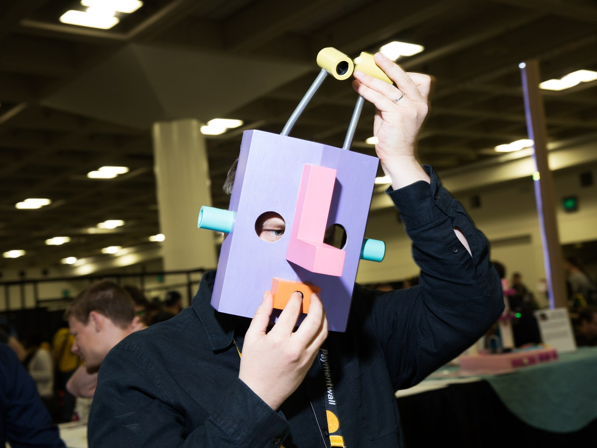

---
# Page settings
layout: default
keywords:
comments: false

# Hero section
title: COMP140 - Research 3
description: 

# Author box
author:
    title: Matt Watkins
    description: Lecturer in Computing at Falmouth University

# Micro navigation
micro_nav: true

# Page navigation
page_nav: false
    
---
# Complete your Project Proposal

*fig.1 - Homies :  This game by Sam Sheffield is played by donning a freaky wooden mask and obeying the commands of a "bossy inner voice." In a twist on Simon, the game tells you to pick your nose, suck your thumb, poke yourself in the eye, et cetera, and you have to do these things to the mask to keep playing. Buttons in the nostrils and eyeholes register your presses.*

## Introduction

Welcome to Week 3 of COMP140. This week we expect you to have developed your brief for your project and it should be pushed to a forked repo of Assignment 2 located here:

[https://github.falmouth.ac.uk/Games-Academy/COMP140-Project](https://github.falmouth.ac.uk/Games-Academy/COMP140-Project)

Ideally we would like you to use **Markdown** to create your 1 page proposal. This is editable both in Github and in a standard code editor. For details of how to write Markdown go here.  [https://www.markdownguide.org/basic-syntax/](https://www.markdownguide.org/basic-syntax/)

## Requirements

Write a **1 page proposal** for a novel game/experience and control system:  

-   Describe the game design that will form the basis for your interface
-   illustrate basic research into electronic component and physical form factors for controllers
-   analyse the design of the controller in detail
-   list the key electronic components of your controller
-   and list the key user stories*.  

*By user stories we mean the features or key tasks that you can envisage taking place in your project build.
{: .callout .callout--warning}

You should have a **completed proposal** that meets all the requirements above and in **Assignment 2** on the workspace. Please ensure you have a version to share with you programming tutor this week.

## Ideation Techniques

Are you struggling to come up with an idea? There are methods that can unlock your creative potential. Finding ideas can be challenging in the first instance and using a few techniques can become an essential part of your toolbox as creative developer. I have listed a range of tools to use in the pursuit of original thinking.

Even if you have already developed your idea, you will find these approaches invaluable in focussing and redirecting your creative energies: 

1.  **Five Design Sheet** - FdS is a great methodology to use for quick ideation that is also very practical. The best feature of all is that it requires very little introduction, and possibly the best tool to use in discussions with clients who are often not versed in the technological aspects of a project.  
    [http://fds.design](http://fds.design)
    
3.  **Crazy Eights** - Crazy 8’s is a core Design Sprint method. It is a fast sketching exercise that challenges people to sketch eight distinct ideas in eight minutes. The goal is to push beyond your first idea, frequently the least innovative, and to generate a wide variety of solutions to your challenge.  
    [https://uxdesign.cc/how-to-do-crazy-8s-remotely-223d7fbd5e98](https://uxdesign.cc/how-to-do-crazy-8s-remotely-223d7fbd5e98)
    
4.  **Oblique Strategies** - A card-based method for promoting creativity jointly created by musician/artist [Brian Eno](https://en.wikipedia.org/wiki/Brian_Eno) and multimedia artist [Peter Schmidt](https://en.wikipedia.org/wiki/Peter_Schmidt_(artist)), first published in 1975. Each card offers a challenging constraint intended to help people break [creative blocks](https://en.wikipedia.org/wiki/Writer%27s_block) by encouraging [lateral thinking](https://en.wikipedia.org/wiki/Lateral_thinking).  
    [https://www.joshharrison.net/oblique-strategies](https://www.joshharrison.net/oblique-strategies)
    
5.  **Opposite Thinking** - Opposite thinking will help you to challenge their assumptions about the problem and possible solutions and come up with non-obvious ideas. Opposite thinking is more than just an ideation tool, it's a mindset.  
    [Opposite-Thinking-Worksheet](https://murally.blob.core.windows.net/uploads/falgam7012238/1602750970018.pdf?se=2021-02-07T16:00:00Z&sp=r&sv=2018-03-28&sr=b&rscc=public,%20max-age=600&sig=UGrPcr2enpIyksiDtGvWQVA5Oj2+wTuNYb+Ph+Tfc90=)

**Note:** Please ensure you read the **assignment briefs, both 1 and 2** as well as the **contracts** to be sure you have understood all the expectations of the project and it’s deliverable elements. If you have questions about any aspect of COMP140, don’t hesitate to contact me or your programming tutor
<!--stackedit_data:
eyJoaXN0b3J5IjpbLTEwNTI3NDU2MTYsMTIzNjU4MzMwNCwtNz
U2ODEyNjkwLDEwNTU5ODk0MDgsMTEzMzcwNzM3NCwtNTQxNTc1
MjM0XX0=
-->