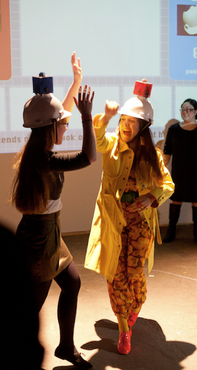

---
# Page settings
layout: default
keywords:
comments: false

# Hero section
title: COMP140 - Research 2
description: 

# Author box
author:
    title: Matt Watkins
    description: Lecturer in Computing at Falmouth University

# Micro navigation
micro_nav: true

# Page navigation
page_nav: false
    
---

# Develop your Project Proposal

Welcome to Week 2 of COMP140. This week we want you to consolidate the research from the previous week and develop your own response to the brief in Assignment 1.  What do you want to create as a custom control system? What game or experience do you want to control?  

*Fig. 4 - Attribution: Hit Me! at Eyebeam Futures 2011  Photo by Shalin Scupham

## Task

Write a **1 page proposal** for a novel game/experience and control system:  

-   Describe the game design that will form the basis for your interface
-   illustrate basic research into electronic component and physical form factors for controllers
-   analyse the design of the controller in detail
-   list the key electronic components of your controller
-   and list the key user stories*.

*By user stories we mean the features or key tasks that you can envisage taking place in your project build.
{: .callout .callout--info}

  **Please have a draft idea ready to share with your tutor in your seminar session.**
<!--stackedit_data:
eyJoaXN0b3J5IjpbNDIxNTg0NjU3XX0=
-->