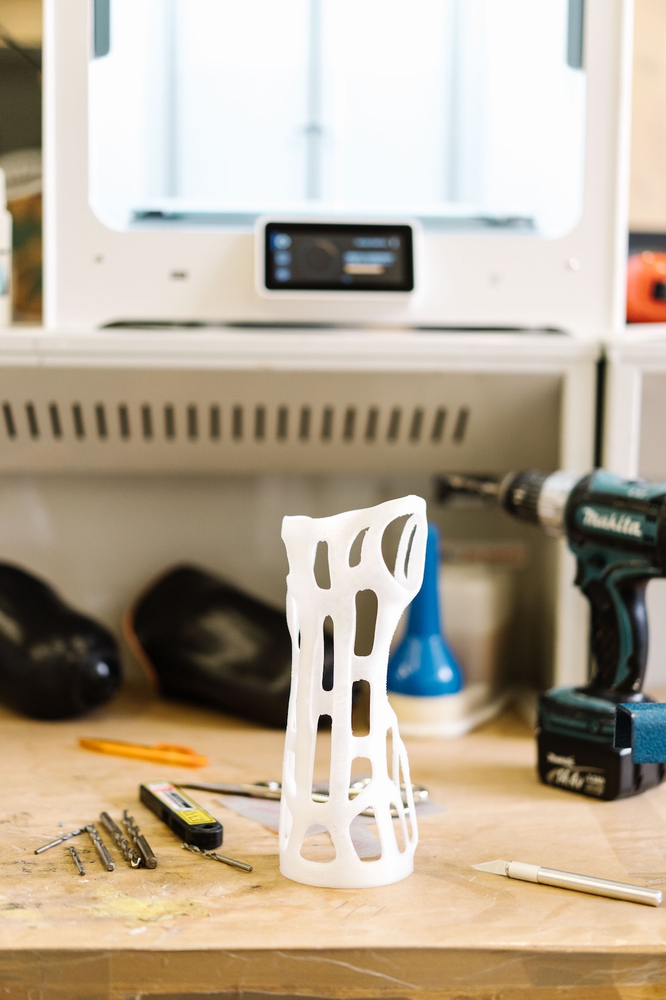

---
# Page settings
layout: default
keywords:
comments: false

# Hero section
title: Worjsrj
description: COMP140 - Week 6

# Author box
author:
    title: Matt Watkins
    description: Lecturer in Computing at Falmouth University

# Micro navigation
micro_nav: true

# Page navigation
page_nav: false

---

# Rapid Prototyping

*fig. 1 - Image Attribution - Photo by [Tom Claes](https://unsplash.com/@tomspentys?utm_source=unsplash&utm_medium=referral&utm_content=creditCopyText) on [Unsplash](https://unsplash.com/@tomspentys?utm_source=unsplash&utm_medium=referral&utm_content=creditCopyText)*

This week is your opportunity to start developing your individual creative computing project.

**Focus on the most difficult aspects of your build**:

-  **Order the relevant electronics**, sensors, and modules you need. If you still have questions about components ask me (Matt), Ben or your programming tutor.
-   Do a **rough working model** of your control system. Wire it up using Arduino/Uduino/Unity. Does it work?
-   Does it **interact with your Unity** (or other) interface as expected? Move some game objects around using some digital or analogue input
-   Is the **data mapping** correctly? If it's an analog input, say a heat sensor, does the incoming data move game objects or trigger actuators as expected?
-   Do **virtual components** react in a way that **feels meaningful** as you manipulate your control system?
-   What does the **user experience** feel like?
-   If the **feel isn't right**, consider what needs to be done to improve the interface.
-  How are your components going to be **housed**? Have you thought about **enclosures** or 3D printed elements?*

*This week you will be doing a **workshop** in **Fusion 360** to give you a basic understanding of how to use software to create 3D physical objects that you can 3D print or even laser cut.
{: .callout .callout--info}

## Activity for the Week

 
**Build a basic prototype**

You should be building on the foundations of your programming skills. After you have developed your proposal, poster and UML diagrams you should create a prototype that demonstrates these elements:

1.  A **control system** - you can input values into your game/experience from some custom control system composed of sensors that responds to user actions.
2.  An **interface** - your inputs are reflected as outputs to the screen or to some other output or actuator.
3.  **Feedback** - a user should be able to receive ongoing feedback as a result of their actions.
4.  **Updated documentation**  - change these as your system progresses as a result of your research.

In **week 7** we will be expecting to see a **basic prototype** in your seminar groups.
{: .callout .callout--warning}
<!--stackedit_data:
eyJoaXN0b3J5IjpbLTEzNzMyMzQwMDgsMjg1MDU3MTI4LC0xMz
E2MzEzODE2LDEyNjk5MTQwNDUsNDc0MjQ3ODk4LC01NzUwMDE5
MzJdfQ==
-->