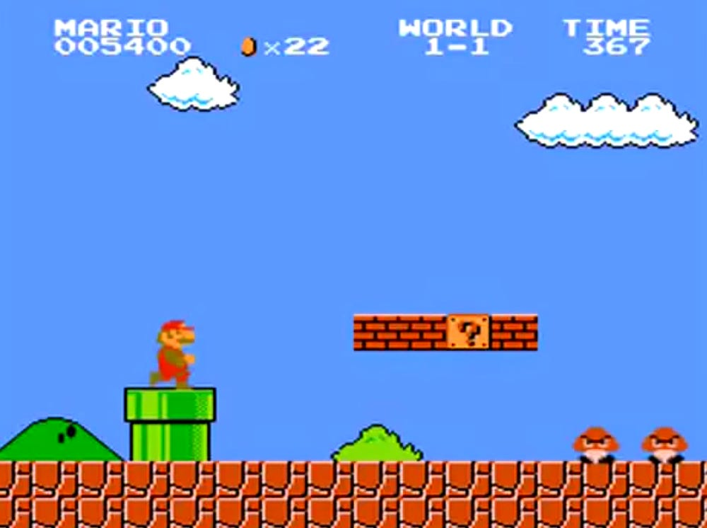
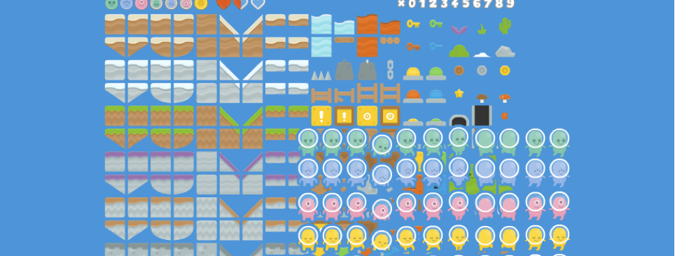

---
# Page settings
layout: default
keywords:
comments: false

# Hero section
title: Research Week
description: COMP140 - Worksheet 3

# Author box
author:
    title: Matt Watkins
    description: Lecturer in Computing at Falmouth University

# Micro navigation
micro_nav: true

# Page navigation
page_nav:
    prev:
        content: Software Architecture
	        url: '../software-architecture-ws'
        next:
        content: Data Structures
        url: '../data-structures-ws'
---

# Research Week

This week is a consolidation of your skills in programming and Arduino. Please expand on the exercise you began last week to complete a design document and a simple level of a prototype game.

## Exercise

**Design A Basic Mario Platformer**

Based on your insight into SOLID with specific reference to: Single Responsibility Principle, Open Closed Principle and Liskov Substitution principle work in teams of 3-5 to design and develop a platformer based on the following image

*Attribution: A screenshot from Nintendo's 1985 classic video game Super Mario Bros.*

You are not designing Mario, but you are using this as a template for the kind of game. Essentially it should be a 2D sprite based side scrolling platform game.
 
1.  Develop a **design specification document** for your game. Break down all the key functionality into encapsulated classes. You should design the key classes and relationships that would be in the platformer:
	- We are not expecting you to use any formal notation at this stage but we expect you to create a diagram that represents an overview of all the relationships. 
	- Think about the classes, variables and functions that will support the game

We will explore the use of UML in a later session but for now try out the basics here at [diagrams.net](http://diagrams.net)
{: .callout .callout--info}

2.  Develop a basic prototype of your game (one level) in Unity that uses the specification outlined in the document.
	- Your game should employ the class structure and hierarchy from your document.
	- Use the following assets (see below) in your game - [Kenney Assets](https://kenney.nl/assets?s=platformer)

*Screenshot of Kenney Assets available on Unity Asset Store .*

3.  Deliverables for week 5 workshop:
	- A **document** that plots the relationship between your classes
	- You should bring a **working game in Unity to the workshop** where you can demonstrate the construction of your classes and objects in your game to the group.

## Research

As you have a week free of taught sessions take this as an important opportunity to start researching the **components** that you need for your custom robot, controller or control system and start the process of rapid prototyping. Things to consider:

 1. Physical systems don't always behave the way you think they will. 
 2. Start building mockups using components to see what **signal data** you are recieving from a **sensor** and if it corresponds to what you wer expecting
 3. Are your **actuators** - motors, servos, LCD screens or Unity game object behaviours working as expected.
 4. Mock up some analogue sensors to stand in for your game or experience inputs and see how they work over a serial connction using **Uduino** and test some of your initial preconceptions.

## Concluding Directed Practice

Archie Andrews has provided this **video** to cover the elements we didn't get round to in the workshop on **Uduino** last week:

<iframe width="100%" height="400" src="https://www.youtube.com/embed/x5ZUvXkvch0" title="YouTube video player" frameborder="0" allow="accelerometer; autoplay; clipboard-write; encrypted-media; gyroscope; picture-in-picture" allowfullscreen></iframe>

For the majority of you Uduino will play a vital role in your project so familiarsing yourself with it's methods at this stage is essential.

<!--stackedit_data:
eyJoaXN0b3J5IjpbMTIwMjIyMTIzNSwtMTYzNjI2MzIzNiwxOT
k2MjgwNTA3LC02MDI1OTEwMDQsLTIwNjY2Nzc5MTgsLTIwNzQw
MDcwMzksLTYzNzU1MjIwMl19
-->