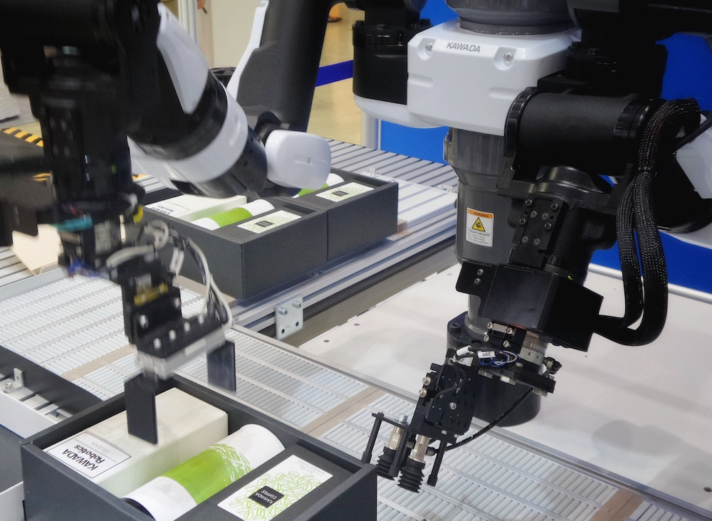

---
# Page settings
layout: default
keywords:
comments: false

# Hero section
title: Lecture 3
description: ROB210 - Lecture Materials 3

# Author box
author:
    title: Matt Watkins
    description: Lecturer in Computing at Falmouth University

# Micro navigation
micro_nav: true	

# Page navigation
page_nav:
    prev:
        content: Self Regulating Systems
        url: '../self-regulating-systems-lm'
    next:
        content: Actuation
        url: '../actuation-lm'
---

# 1. The Robot in Space

The following materials are derived from the *The Robot in Space*. The video lecture is included at the bottom of the [*document*](#video-lecture).
{: .callout .callout--warning}

## 1. Rigid Bodies
## 2. Degrees of Freedom
## 3. Joint Space
## 4. Global Frame of Reference.

<!--stackedit_data:
eyJoaXN0b3J5IjpbLTEwODAzMzAwMCwtNDgwNTU5ODg4LC0xNz
Y5OTE3NzcyLDEyMDMwMzMyMTAsNDc5ODk5NDM0LDIwMzMzNDYz
NjIsMTUxMzQ3OTk1NF19
-->