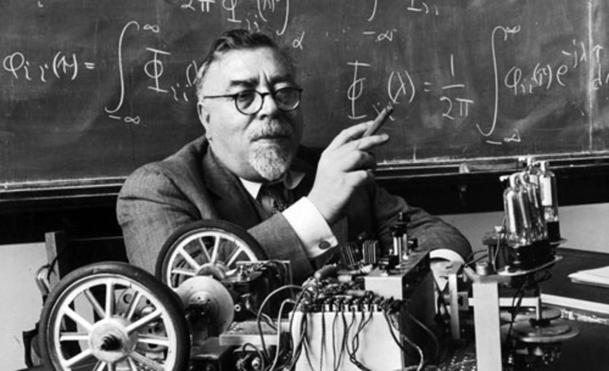

---
# Page settings
layout: default
keywords:
comments: false

# Hero section
title: Lecture 2
description: ROB210 - Lecture Materials 2

# Author box
author:
    title: Matt Watkins
    description: Lecturer in Computing at Falmouth University

# Micro navigation
micro_nav: true

# Page navigation
page_nav:
    prev:
        content: Introduction to Cybernetics
        url: '../intro-cybernetics-lm'
   next:
        content: The Robot in Space
      url: '../robot-in-space-lm'
---

# 2. Self Regulating Systems	

The following materials are derived from the *Self Regulating Systems*. The video lecture is included at the bottom of the [*document*](#video-lecture).
{: .callout .callout--warning}

## 1. Feedback
## 2. Second Order Self Regulation
## 3. Abstraction of Braitenburg vehicle
## 4. Introduction to PID

<!--stackedit_data:
eyJoaXN0b3J5IjpbLTM0Mjk3MDgzMiwzNjI2NTY4NiwtNDQzMz
Q1MTk0LC0xNjMzNzkxNjU2LDQ2OTE1NzM3OSwtMjEwNjE4NjY3
MF19
-->