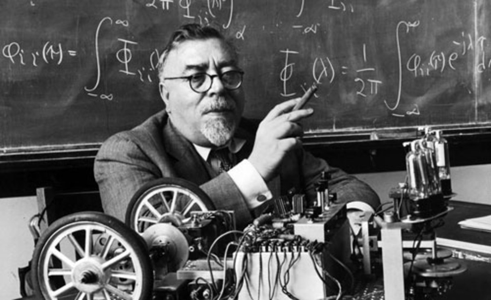

---
# Page settings
layout: default
keywords:
comments: false

# Hero section
title: Lecture 3
description: ROB210 - Lecture Materials 3

# Author box
author:
    title: Matt Watkins
    description: Lecturer in Computing at Falmouth University

# Micro navigation
micro_nav: true

# Page navigation
page_nav:
    prev:
        content: Introduction to Cybernetics
        url: '../intro-cybernetics-lm'
    next:
        content: The Robot in Spce
        url: '../robot-in-space-lm'
---

# 1. The Robot in Space

The following materials are derived from the *Introduction to Cybernetics*. The video lecture is included at the bottom of the [*document*](#video-lecture).
{: .callout .callout--warning}

## 1. Rigid Bodies
## 2. Degrees of Freedom
## 3. Joint Space
## 4. Global Frame of Reference.

<!--stackedit_data:
eyJoaXN0b3J5IjpbLTIxMDYxODY2NzBdfQ==
-->