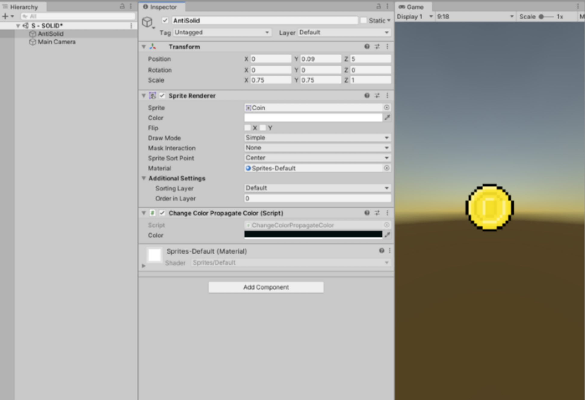
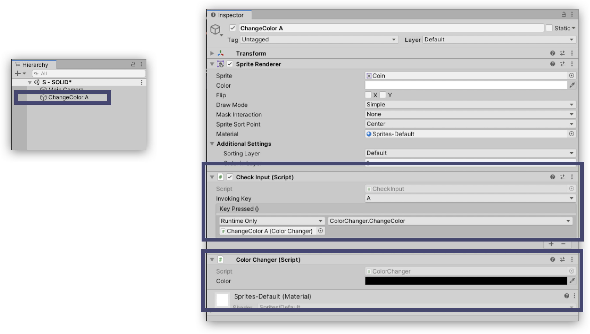
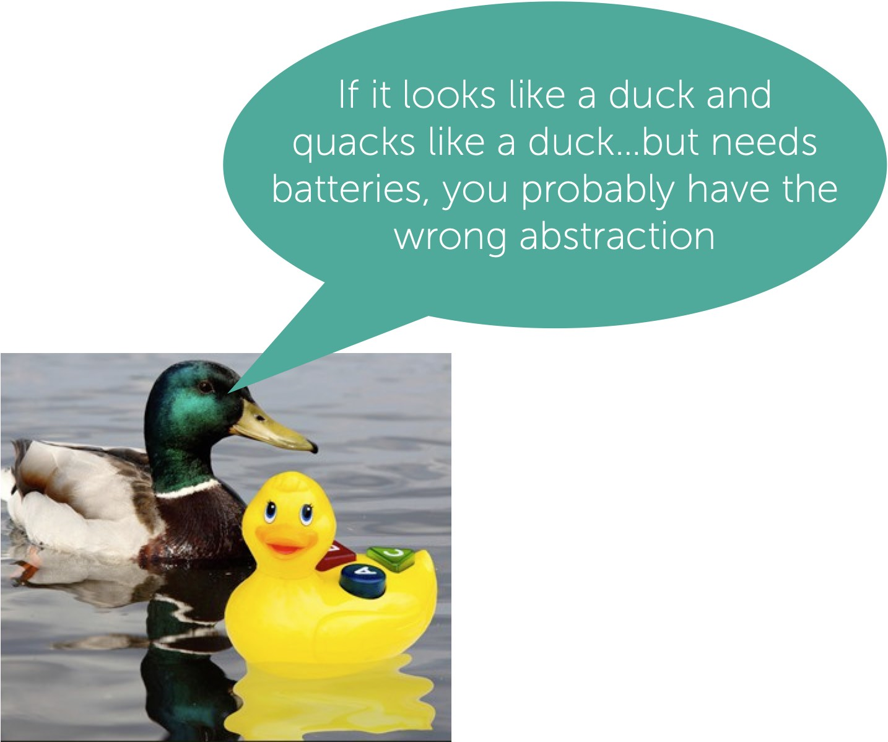
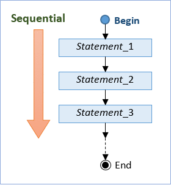
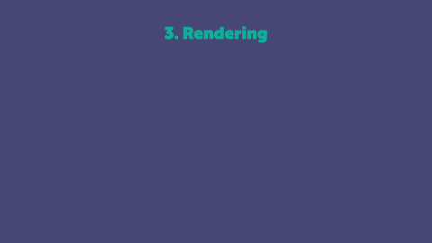

---
# Page settings
layout: default
keywords:
comments: false

# Hero section
title: COMP140 - Lecture Materials 5

# Author box
author:
    title: Matt Watkins
    description: Lecturer in Computing at Falmouth University

# Micro navigation
micro_nav: true

# Page navigation
page_nav:
    prev:
        content: OOP
        url: '../oop-lm'
    next:
        content: UML
        url: '../uml-lm'
---

# Software Architecture

The following materials are derived from the *Software Architecture lecture*. The video lecture is included at the bottom of the [document](#video-lecture).
{: .callout .callout--warning}

## So what is Software Architecture

A way of establishing **patterns** for the development of software.  These architectural patterns are a description of the **relationship** types and **elements** as well as the **constraints** or **limitations** in the system being built. Patterns are usually **reusable solutions** to common problems.

Ralph Johnson a famous programmer and professor at the University of Illinois, who co-authored one the essential books on programming called *Design Patterns*. He questions this idea of architecture, arguing that there was no objective way to define what was fundamental, or high level and consequently there was no formal notion of established structure implied by the word architecture and that a better way to describe this approach is the:

***‘shared understanding that the expert developers have of the system design’***
***The decisions you wish you could get right early in a project'***

Johnson also cryptically said this:
  
***“Architecture is about the important stuff. Whatever that is”***

### Networks of Dependency

As we write code and our projects scale the interconnecting parts can become confusing. We sometimes generate dead ends or unnecessary code that causes our applications to slow down or to become needlessly complex, this waste is known in programmer circles as - **cruft**! 

So having some basic principles to help to design the link between objects, classes and functions is incredibly useful. We want to limit the proliferation of cruft.

## Introducing SOLID

**SOLID** is basically 5 principles, which will help to create a good software architecture. You can see that all design patterns are based on these principles. SOLID is basically an acronym of the following:

-   **S** is single responsibility principle (SRP)
-   **O** stands for open closed principle (OCP)
-   **L** Liskov substitution principle (LSP)
-   **I** interface segregation principle (ISP)
-   **D** Dependency injection principle (DIP)

In this lecture we are going to focus on the **first 3** and finally we are also going to look at **Order of Execution** as it links to how the SOLID principles work.

1.  **Single Responsibility Principle -** every class in a computer program should have responsibility over a single part of that program's functionality, which it should encapsulate.
2.  **Open Closed Principle -** software entities (classes, modules, functions, etc.) should be open for extension, but closed for modification.
3.  **Liskov’s Substitution Principle** - if poodle is a subtype of dog, then objects of type dog in a program may be replaced with objects of type poodle without altering any of the desirable properties of that program
4.  **Order of Execution / Game Loop -** The flow between processes in software and hardware.

You can see how features of OOP from the previous lecture form a major part of SOLID principles. Specifically objects encapsulation, classes and objects.

##  Single Reponsibility Principle

**“…it is almost always incorrect to begin the decomposition of a system into modules on the basis of a flowchart. We propose instead that one begins with a list of difficult design decisions or design decisions which are likely to change. Each module is then designed to hide such a decision from the others.”**
David R Parnas - [On the Criteria To Be Used in Decomposing Systems into Modules](https://www.win.tue.nl/~wstomv/edu/2ip30/references/criteria_for_modularization.pdf) 1972

We can think of software much like a company and as most software is developed to serve business functions this is a perfect analogy. In the piece of code below the class ``Employee`` is serving methods for pay, archiving and reporting. In a company if the pay is not calculated properly the CEO of the company is responsible for it’s impact on the business, if the information is not saved then the CTO or Chief Technical Officer is responsible for failing to save records correctly. If the hours are not reported correctly then CFO the chief financial officer id responsible, as money is mis-spent.
```c#
public class Employee {
	public Money calculatePay();
	public void save();
	public String reportHours();
}
```
We can apply this same principle to a game example:
```c#
public class Game {
	public Health calculateHealth();
	public void updateUI();
	public String reportDamage();
}
```
If we use **Unity**, this example shows a class that logs and prints to the console. It is perfect because it has one simple task, it is not trying to do anything beyond the scope of its name.
```c#
using  UnityEngine;
public static class Logger
{
	public static void PrintToConsole(object  content)
	{
	Debug.Log(content);
	}
}
```
### Unity Example
Lets explore this further in an example which is adapted from this medium article:
[https://medium.com/unity-hub/unity-solid-s-single-responsibility-6707d9569e73](https://medium.com/unity-hub/unity-solid-s-single-responsibility-6707d9569e73)



#### Example 1 - without Single Responsibility

Above you can see there's a picture of an icon, which is a pixel art sort coin, and we're going to create a script which is going to change the color of this icon. So the basic example here is a public class called ``ChangeColorPropagateColor``,
and already this feels a bit weird. It's like it's trying to do too many things at once. We define the renderer and then we assign the renderer to the object and then we use the ``Update`` to track the ``Input.GetKeyDown`` to see if somebody presses the key in order to change the color, and then we use a random generator there using a random range to generate the colour. of the icon.

```c#
public  class  ChangeColorPropagateColor : MonoBehaviour
{
	public Color color;
	private SpriteRenderer _spriteRenderer;
	private SpriteRenderer _spriteRenderer1;
	private void Start()
	{
		_spriteRenderer1 = gameObject.GetComponent<SpriteRenderer>();
		_spriteRenderer = gameObject.GetComponent<SpriteRenderer>();

	}
	void Update()
	{
		if (Input.GetKeyDown(KeyCode.F))
		{
			_spriteRenderer.color = new  Color(Random.Range(0,1.0f), Random.Range(0, 1.0f),Random.Range(0, 1.0f),1);
			color = _spriteRenderer1.color;
			Debug.Log(color);
		}
	}
}
```
But there is a **better way** to do this.

#### Example 2 - with Single Responsibility

We break this up into different classes and seperate *.cs* files, the first class is the ``ColorHandler`` and this is going to generate a random color. So we're essentially just separating this out. 

```c#
public static class ColorHandler
{
	public static Color GenRandColor()
	{
	return new Color(Random.Range(0, 1.0f), Random.Range(0, 1.0f), Random.Range(0, 1.0f), 1);
	}
}
```
Then we've got the ``CheckInput``. This is going to use ``KeyCode InvokeKey`` and this is going to be defined by an object which is connected to the actual icon itself, and so then it will detect the keypress based on a chosen property of whichever key is being pressed.
```c#
public class CheckInput : MonoBehaviour
{
	public KeyCode InvokingKey;
	public UnityEvent keyPressed;
	void Update()	
	{
	if (Input.GetKeyDown(InvokingKey))
		{
		keyPressed.Invoke();
		}
	}
}
```
And then finally, there's ``ColorChanger`` and this is basically calling the random colour from the previous example, and then it's going to apply that color to whichever game object its attached to.

```c#
using UnityEngine;

public class ColorChanger : MonoBehaviour
{
	public Color color;
	public void ChangeColor() {
		color = ColorHandler.GenRandColor();
		ApplyColor(color);
	}
	private void ApplyColor(Color  clr)
	{
		gameObject.GetComponent<SpriteRenderer>().color = clr;
	}
}
```

If the icon image is a game object in a scene, then we attach the two scripts to the object, the check input which will check what is being pressed and then the color changes to changes to the color you have defined.



The great thing about this is that it is totally reusable. At any point you can change what key is being pressed or what colour the obect will be. You can also duplicate it and use a range of different objects triggered in different ways with different colours. Everything becomes modular and although the differeny elements interact, each class is only performing one specfici defined task - it has a single responsibility.

## Open Closed Principle

The **Open Closed Principle (OCP)** is the SOLID principle which states that the software entities (classes or methods) should be open for extension but closed for modification.


Basically, we should strive to write a code that doesn’t require modification every time a customer changes its request. Providing such a solution where we can extend the behavior of a class (with that additional customer’s request) and not modify that class, should be our goal most of the time.

### Example 1 -  without Open Closed

In this example there is a class that creates the properties for a developer report and then a salary calculator that will got through the instance of developer report and calculate the total salaries for all developers.

```c#
public class DeveloperReport
{
	public int Id { get; set; }
	public string Name { get; set; }
	public string Level { get; set; }
	public int WorkingHours { get; set; }
	public double HourlyRate { get; set; }

}
```
```c#
public class SalaryCalculator
{
	private readonly IEnumerable<DeveloperReport> _developerReports;
	public  SalaryCalculator(List <DeveloperReport> developerReports)
	{
		_developerReports = developerReports;
	}

	public  double  CalculateTotalSalaries()
	{
		double totalSalaries = 0D ;
		foreach (var  devReport  in  _developerReports)
		{
			totalSalaries += devReport.HourlyRate * devReport.WorkingHours;
		}
		return  totalSalaries;
	}
}
```
### Example 2 -  with Open Closed

If we create an abstract class (as mentioned in the [OOP lecture](../oop-lm) we can develop a child classes for the different type of employee that inherits properties of the base or parent. Each class can have its own calculation logic. If we need to add more employee type we can easily extend the principal with more children.

```c#
public abstract class BaseSalaryCalculator
{
	protected DeveloperReport DeveloperReport{ get; private  set; }
	public BaseSalaryCalculator(DeveloperReport developerReport)
	{
		DeveloperReport = developerReport;
	}
	public abstract double CalculateSalary();
}
```

```c#
public class SeniorDevSalaryCalculator : BaseSalaryCalculator
{
	public SeniorDevSalaryCalculator(DeveloperReport report)
		:base(report)
	{
	}
	public override double CalculateSalary() => DeveloperReport.HourlyRate * DeveloperReport.WorkingHours * 1.2;
}
```

```c#
public class JuniorDevSalaryCalculator : BaseSalaryCalculator
{
	public JuniorDevSalaryCalculator(DeveloperReport  developerReport)
		:base(developerReport)
	{
	}
	public override double CalculateSalary() => DeveloperReport.HourlyRate * DeveloperReport.WorkingHours;
}
```
There is a *new OOP concept* here called ``base``. The ``base`` keyword is used to access members of the base class from within a derived class. It is a way to call a method on the base class that has been overridden by another method.
You can find more information on it's application here: [https://docs.microsoft.com/en-us/dotnet/csharp/language-reference/keywords/base](https://docs.microsoft.com/en-us/dotnet/csharp/language-reference/keywords/base)
{: .callout .callout--info}

We can now perform the calculation with a simple loop and each instance has the definition of its child but also it’s parent without having to create an exception for each. So basically, our SalaryCalculator class is now closed for modification and opened for an extension, which is exactly what OCP states.

```c#
public class SalaryCalculator
{
	private readonly IEnumerable<BaseSalaryCalculator>_developerCalculation;
	public  SalaryCalculator(IEnumerable<BaseSalaryCalculator> developerCalculation)
	{
		_developerCalculation = developerCalculation;
	}
	public double CalculateTotalSalaries()
	{
		double totalSalaries = 0D;
		foreach(var  devCalc  in  _developerCalculation0
		{
			totalSalaries += devCalc.CalculateSalary();
		}
		return  totalSalaries;
	}
}
```

##  Liskov Substitution Principle

The **Liskov Substitution Principle (LSP)** is a Substitutability principle in object-oriented programming Language. This principle states that, if S is a subtype of T, then objects of type T should be replaced with the objects of type S.



In other words, we can say that objects in an application should be replaceable with the instances of their subtypes without modifying the correctness of that application.

For example, the father is a teacher whereas his daughter is a doctor. So, in this case, the daughter can’t simply replace her father even though both belong to the same family.

### Example 1 -  without Liskov Substitution

Let's first understand one example without using the LSP in C#. In the following example, first, we create the ``Apple`` class with the method ``GetColor``. Then we create the ``Banana`` class which inherits the ``Apple`` class as well as overrides the ``GetColor`` method of the ``Apple`` class. The point is that a ``Banana`` cannot be replaced by an ``Apple``, which results in printing the colour of ``Apple`` as ``Banana`` as shown here.

```c#
class Program
{
	static void Main(string[] args)
	{
		Apple apple = new Banana();
		Console.WriteLine(apple.GetColor());
	}
}

public class Apple
{
	public virtual string  GetColor()
	{
		return "Green";
	}
}

public class Banana : Apple
{
	public override string GetColor()
	{
		return "Yellow";
	}
}
```

### Example 1 -  with Liskov Substitution

Let’s change the previous example to follow LSP. First, we need a generic base class such as ``Fruit`` for both ``Apple`` and ``Banana``. Now you can replace the ``Fruit`` class object with its subtypes either ``Apple`` and ``Banana`` and it will behave correctly.
```c#
class Program
{
	static  void  Main(string[] args)
	{
		Fruit fruit = new Banana();
		Console.WriteLine(fruit.GetColor());
		fruit = new Apple();
		Console.WriteLine(fruit.GetColor());
	}
}

public  abstract  class  Fruit
{
	public  abstract  string  GetColor();
}
public  class  Apple : Fruit
{
	public  override  string  GetColor()
	{
		return "Green";
	}
}
public  class  Banana : Fruit
{
	public  override  string  GetColor()
	{
		return "Yellow";
	}
}
```
## SOLID Conclusions
The purpose of these principles of SOLID is to give us a set of basic rules to inform the construction of code. To provide a guide as the features and the requirements of our software mushroom. It is often difficult to know when to refactor as we scale but these principles give us a framework on which to make these decisions.

-   **Single responsibility principle (SRP)**
-   **Open closed principle (OCP)**
-   **Liskov substitution principle (LSP)**
-   Interface segregation principle (ISP)
-   Dependency injection principle (DIP)

**I have only covered the first 3 in this lecture** but please use the reading list to explore the other two. They will provide you with invaluable tools for becoming a better programmer.

## Order of Execution & Game Loops

We can design our code in perfect discrete modules but we also have to contend with the flow of events at runtime. Is our code in right place and is it using the hardware efficiently. This is where (read) comes in. 

Order of execution refers to the way that the machine processes through the code that you have written. Conventionally this occurs on the same order you have written in it, sequentially or **synchronously**. But certain elements occur in closed loops, such as iterators like, for loops and also some code branches to accommodate multiple parallel processes. This is known as **asynchronous**. We will return to this shortly. Let’s now look at Unity and the **game loop**.

Note - Other applications, engines and frameworks may have a slightly different *order of execution* and you should make yourself aware of the specifics of each. However the following is common to many realtime graphic software environments.
{: .callout .callout--info}

Types of code execution:

-   **Synchronous** – current line of code is executed before moving on to the next line
-   **Asynchronous** – parallel processing

Programming languages execute code in **sequential** order . However **branching** and **iterators** can change the order.



### Game Loops

The most basic game loop does three things:

-   **Handle Input**
-   **Update the state of the game**
-   **Render the game to the screen**

It does these actions once per frame (30 or 60 times per second)

We can consider a gameloop as pseudo code like this:

```c#
bool  running = true;  

while (running) {
	handleInput();
	update();
	render();
}
```
We can see that key functions are handled in a specific order

### 1.  - Handling Input

At this stage of the update you should grab the input from the user:
```
– Input.GetButtonDown(“Fire1”) 
– Input.GetKeyDown(KeyCode.Space)
– Input.mousePosition
```
If you are using ``Input.GetButton`` or ``Input.GetAxis``, these have to be configured in the **Input Manager**.  You can use the values from the input to update the state of the game

### 2. - Update Game State

This is where your game logic is implemented:
- Physics
- AI
- Game play  
       
In Unity the update is split in two:
- physics update (**FixedUpdate**)
- game update (**Update**)

### 3. - Rendering

This is where the current state of the game is drawn:
- Anything visual will be rendered to the **backbuffer**
- When drawing is complete, the backbuffer and the **frontbuffer** is swapped
- This will display the current state of the game to the player



### Order of Execution of Game Functions

If you want a more detailed view of the order of exection and the architecture of Unity there is a useful diagram [here](https://docs.unity3d.com/Manual/ExecutionOrder.html) which is part of Unity's online manual. 

In summary the key functions and their order in **Monobehaviour** are these:

On loading of a scene, the following methods gets called in Monobehaviour  
- ``– Awake()`` : Called before any Start  
- ``– OnEnable()`` : Called before any Game Object is enabled
- ``– OnLevelWasLoaded()`` : Called when the level is loaded

### Asychronous - Coroutines

You have may have heard mention of a **coroutine** in the previous slides or in your last study block.
```c#
void Fade()
{
	for (float ft = 1f; ft >= 0; ft -= 0.1f)
	{
		Color  c = renderer.material.color;
		c.a = ft;
		renderer.material.color = c;
	}
}
```
We would expect this to fade some colour in a material in Unity. However, the function will execute in its entirety within a single frame update. The intermediate values will never be seen and the object will disappear instantly. This is where a coroutine comes in.
```c#
IEnumerator Fade()
{
	for (float ft = 1f; ft >= 0; ft -= 0.1f)
	{
		Color  c = renderer.material.color;
		c.a = ft;
		renderer.material.color = c;
		yield return null;
	}
}
```
A coroutine is like a function that has the ability to **pause execution** and return control to Unity but then to continue where it left off on the following frame. The ``IEnumerator`` defines it as co-routine and and ``yield return null``, tells it where to stop until the next frame. Coroutines are ways of optimising and controlling the order of execution in the game loop.

## Conclusion

As we have seen in this lecture Software Architecture is about the structure and framework of your software as demonstrated by the 5 principles of **SOLID** which will help you to create a good software architecture.  But alongside these principles it is important to take into account the **Order of Execution** as this has an effect on how and when features of your application are deployed at run-time. Remember to factor in this loop when designing your projects and to use work arounds like coroutines to ensure effects and features are visible to your users and players and not lost or stalled  because events are occuring in fractions of a second.

## Video Lecture

### Lecture - Software Architecture
<iframe width="100%" height="360" src="https://web.microsoftstream.com/embed/video/369c1f31-5eef-4a19-926e-08dbc37a494c?autoplay=false&showinfo=true" allowfullscreen style="border:none;"></iframe>

<!--stackedit_data:
eyJoaXN0b3J5IjpbMTkzMzc5OTk4LC0xMjE0NTA2Njc4LC0zNj
gyNjAzNzEsLTE1MjkzNTI0MDQsMTA5NTY4ODcxOSw2MDQxMTMw
MjIsMTQ1NTY4NTY0NywzMTQyMjQ1MjcsMTA4ODgyOTkzNSwtOT
U2OTMwMzg0LDE0OTA2MzI2NzYsLTE5MjkzNDI0NzMsLTIxMzAy
MTQ5NjAsNTE3OTg1Nzg1LC05ODI4MDg4MzYsOTczMjUwMTY1LD
U0OTQ1NjE3OCwtNTI3MjYxMTM5LDEyMTQ5NTE4MTYsLTE0OTAz
MDEwNzhdfQ==
-->