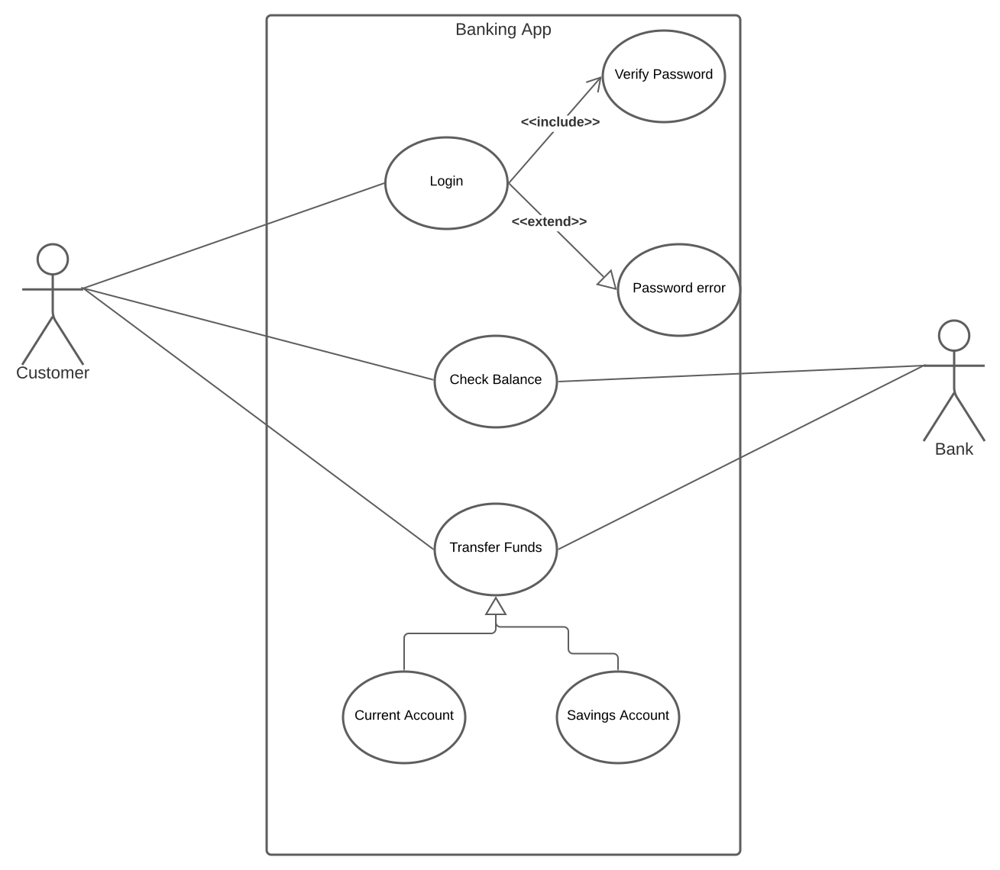
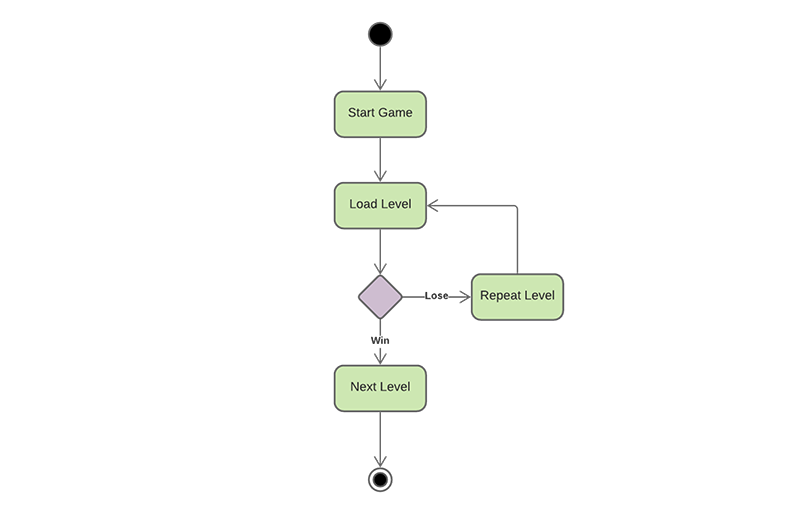
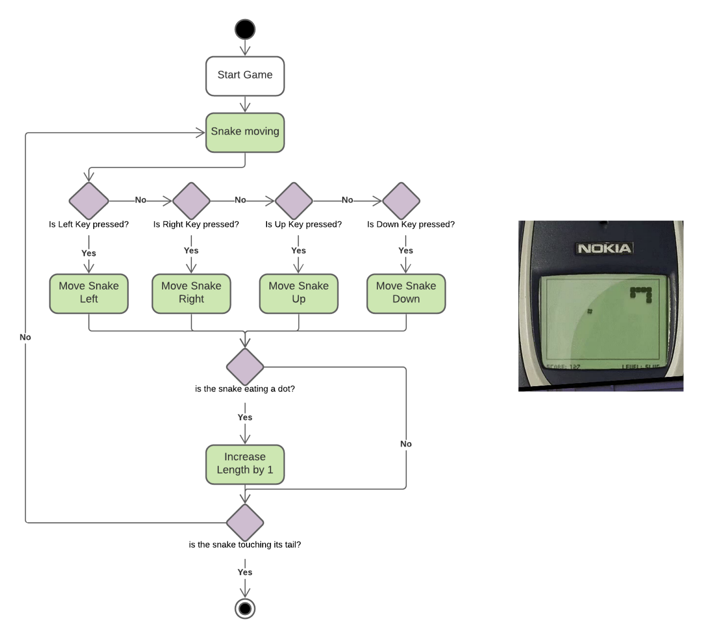

---
# Page settings
layout: default
keywords:
comments: false

# Hero section
title: COMP140 - Lecture Materials 6

# Author box
author:
    title: Matt Watkins
    description: Lecturer in Computing at Falmouth University

# Micro navigation
micro_nav: true

# Page navigation
page_nav:
    prev:
        content: Software Architecture
        url: '../software-architecture-lm'
    next:
        content: Data Structures
        url: '../data-structures-lm'
---

# Unified Markup Language

The following materials are derived from the *UML lecture*. The video lecture is included at the bottom of the [document](#video-lecture).
{: .callout .callout--warning}

## What is UML?
UML is a **visual notation system** which can be used to design software. It was first devised in **1996** by Booch, Jacobson and Rumbaugh. The goal was to **unify/standardise** all the various modelling languages and diagrams used in Software Development. In **2005**, ISO published UML as an **international standard**. **UML 2.0** is the most current version, with **14 different diagram types** defined as being part of UML.

*fig.1 - Booch, Jacobson and Rimbaugh, the devisors of UML*

### Why use UML?

-   UML offers us a **standardised way of designing** software
-   It allows us to **think through our systems** before committing them to code
-   It offers a **shared language** between programmer and other disciplines including **clients**

### Diagram Families

*fig.2 - UML types*

UML can be divided into **2 types**:

1. **Behaviour Diagrams**
– Describes what happens in a system, this includes interactions between users and the system
– Or the current system and other external systems

2. **Structure Diagrams**
– Describes what is contained in the system
– Typically used to model the system

## Behavioural Diagrams

### 1. Use Case Diagram

Use Case diagrams typically details the user’s interaction with the system. In essence it details the **Use Case** of the **System** and the **Actors** which interact with the system

– NB. These Actors could be other systems!
{: .callout .callout--info}

- Created using terms that a layperson could understand
- Can be used to capture and communicate User Requirements
- This is often the first diagram created for a system
- An attempt to represent the key features of a system and it's goals.

*fig.3 - Use Case Diagram - Banking App*

The above diagram describes as system for a mobile banking app.  

 1. The **bounding box** describes everything contained within the system and outside it are the actors which are the customer or user and the bank itself (which could equally refer to an employee or the system itself). 
2. In the **ellipses** we have the **features** of the system - Login, Check Balance etc. 
3. The **lines** connecting them represent interactions between the actors and the system and are called **associations**.  
4. Finally a line with an **arrow** signifies a **generalisation**  which denotes a parent/child relationship. Tne arrow always points towards the parent.

#### Include and Extend
The extend relationships are important because they show optional functionality or system behaviour. The ``<<extend>>``
relationship is used to include optional behavior from an extending use case.  Whereas an ``<<include>>`` use case includes the functionality described in another use case as a part of its business process flow. 

*fig.4 - Include and Extend*

In the above example *Barney* includes a **noise** when he **burps** but he can choose to extend the process by saying **"excuse me"**.

*fig.5 - Pokemon GO Use Case*

In this example which takes Pokemon GO as a starting point. We can see a the key features of the game but we can also see how a trapping is included in a Poke Stop but catching is an extension it is dependent on a set of certain parameters being met.

I have included this third-party video which will provide you with further insight into the purpose of use-case diagrams:

<iframe width="100%" height="315" src="https://www.youtube.com/embed/zid-MVo7M-E" title="YouTube video player" frameborder="0" allow="accelerometer; autoplay; clipboard-write; encrypted-media; gyroscope; picture-in-picture" allowfullscreen></iframe>
*fig.6 - Use Case Diagrams explained by LucidChart*

### 2. Activity Diagram

Activity Diagrams describe **behaviour** composed of a collection of **tasks**. This is used to model the flow of work and/or data in a system. This type of diagram supports choice, iteration and concurrency. You can think of this diagram as a structured **Flow Chart**.

#### Key Diagram Symbols

*fig.7 - The main symbols in an Activity Diagram*

Activity Diagrams describe how activities are coordinated to provide a service which can be at **different levels of abstraction**. Typically, an event needs to be achieved by some operations, particularly where the operation is intended to achieve a number of different things that require coordination, or how the **events in a single use case relate to one another**, in particular, use cases where **activities may overlap and require coordination**. It is also suitable for modeling how a collection of use cases coordinate to represent business workflows. For example the process of purchasing, distributing and recieving an online shop order.

The basic layout of an activity diagram

\
*fig.9 - Layout of an Activity Diagram (image attribution: www.visual-paradigm.com)*

The below example is a simple demonstration how a game works at the highest level. The players progression through the game is measured by this basic activity:

*fig.10 - Top Level Game Activity Diagram*

We can be more detailed and prescriptive in defining the entire game loop. This is invaluable for translating a mechanic into a logical process that can be deployed by a programmer. In the below example the game 'Snake' is broken into a looping procedure which defines key bindings, events and feedback.

*fig.11 - Nokia Classic Game 'Snake' as an Activity Diagram*

### 3. State Diagram

State Diagrams are used to model the possible **states** of your applications. They sometimes also known as **state machine diagrams**. This allows you to not only to model the states but the flow of **events** and **transitions** between states. It is useful for modelling the following in games:  
- AI Finite State Machines
- Game States
- Animation Systems

*fig.12 - The main symbols in a State Diagram*

Below is an example of state diagram that describes an airport check-in process. We can see the use of parallel or concurrent processes with the use of a black bar:

*fig.13 - The main symbols in a State Diagram*

On of the classic uses for a state diagram is to plot the various **states** of a **character animation**. It is useful a to understand how each animation cycle proceeds to others managed in a controller.

\*fig.14 - State Diagram for Character Animation*

It is also an effective method of visualising **finite state machines** for **embedded systems.** We can manage the process flow of a system. A system where particular inputs cause particular changes in state can be represented using finite state machines. This example describes the various states of a turnstile. Inserting a coin into a turnstile will unlock it, and after the turnstile has been pushed, it locks again. Inserting a coin into an unlocked turnstile, or pushing against a locked turnstile will not change its state.

\*fig.15 -Finite State Machine (image attribution: Wilipedia) *

A state diagrams helps to represent the changes in the state of a washing machine.

\*fig.16 -State Machine for a Washing Machine (image attribution: www.sparxsystems.com)*

### 4. Sequence Diagrams

UML Sequence Diagrams are **interaction diagrams** that detail how operations are carried out. They capture the interaction between objects in the context of a collaboration. Sequence Diagrams are **time focussed** and they show the order of the interaction visually by using the vertical axis of the diagram to represent time what messages are sent and when.

-   This can be used to model the flow of logic in a system
-   This is useful to see how the user interacts with the system
-   How the data flows between different parts of the system
-   These diagrams are often time focused with the vertical axis used to represent time

*fig.17 - The main symbols in a Sequence Diagram*

*fig.18 - A Sequence Diagram of a game of 'Pong'*

I have included this third-party video which will provide you with further insight into the purpose of sequence diagrams:

<iframe width="100%" height="315" src="https://www.youtube.com/embed/pCK6prSq8aw" title="YouTube video player" frameborder="0" allow="accelerometer; autoplay; clipboard-write; encrypted-media; gyroscope; picture-in-picture" allowfullscreen></iframe>

## Structural Diagrams

### Class Diagrams

Class Diagrams are used to model object-orientated systems. It is the one diagram which can be directly translated into code. It has entities which represent classes with functions and variables:
 - List item
 - Interfaces  
 - Enumerations

It can also be used to model relationships between classes like:
- Dependency
- Association
- Aggregation
- Composition
- Inheritance  
- Realisation/Implementation

#### Defining Classes

*fig.19 - Class Diagram Boxes*

In the above example we can see 3 examples of the the main symbols used in a class diagram:

 1. The **first** box in the image above is a **high level view** of a class. A way to simply plot all the names of classes in a given system.
 2. The **second** box includes **fields**(variables) and the **methods** or operators in our class. You can see how the **encapsulation** of these elements is defined by the prefix (**+**) for **public**, (**-**) for **private** and (**#**) for protected
 3. The **third** box shows how to define an **interface** this is achieved by the use of a greater than or lesser than symbols in the title `<<interface>>`
 4. I have also provided some **examples** of the class symbols with dummy content that could be applied to a game example.

#### Linking Classes Together

*fig.19 - Arrows Connecting Classes*

Boxes containing classes are joined by arrows which declare the relationship between the classes. Each ending to an arrow defines a specific relationship.

*fig.20 - Class Diagram Terms'*

 - **Association** - An enemy can have a weapon or not and it can have multiple so it's relationship is *zero to many* (**0..***). This is known as **multiplicity**. Conversely a specific weapon can only have a relationship with one enemy which is *one to one*, defined as (**1**). An association has a descripion of the relationship between the classes added to the line itself as in '**has a**' in the example. A character *has a* weapon.
 -  **Inheritance** - Like a family tree a child can inherit through a tree, tracing it's properites back to it's originating parent.
 - Implement is specific to Interfaces it means in the example that the **player** implements the **jumper** interface. All interfaces are preceeded by an I = **IJumper**

*fig.21 - Class Diagram terms'*

*fig.22 - A Sequence Diagram of a game of 'Pong'*

link to Mario [chart](https://lucid.app/lucidchart/13ad9686-b153-4ff8-8e30-24401ad1bdb0/edit?viewport_loc=-349,-16,2558,1205,ImEcv_L7YKPY&invitationId=inv_26341ea9-d6a6-4da3-b0f4-3392d2a99e99)

<iframe width="100%" height="315" src="https://www.youtube.com/embed/UI6lqHOVHic" title="YouTube video player" frameborder="0" allow="accelerometer; autoplay; clipboard-write; encrypted-media; gyroscope; picture-in-picture" allowfullscreen></iframe>

## Tools for making UML

1. **Diagram** - [http://www.diagram.net](http://www.diagram.net)
2. **Lucid Chart** - [https://www.lucidchart.com](https://www.lucidchart.com)
3. **Gliffy** - [http://www.gliffy.com](http://www.gliffy.com)

There are many more you can use but these are some of the best.

Many of the above options are freemium. You may have a limited number of diagrams you can make or a time limit for use. Just be aware of the pay wall when using these tools.
{: .callout .callout--warning}

## Video Lecture

### Lecture (Part 1) - UML
<iframe width="100%" height="360" src="https://web.microsoftstream.com/embed/video/bb0a1d5b-fae6-499b-8252-59f2c418cb51?autoplay=false&showinfo=true" allowfullscreen style="border:none;"></iframe>

### Lecture (Part 2) - UML
<iframe width="100%" height="360" src="https://web.microsoftstream.com/embed/video/5221fa0a-1604-4fca-89f5-a46fd69d37d8?autoplay=false&showinfo=true" allowfullscreen style="border:none;"></iframe>
<!--stackedit_data:
eyJoaXN0b3J5IjpbLTYzNzY0NDAyMCwtMTk2MjUzMzg1NywtMT
I5MjU3MTA4NywtNTkwNDc2NTA3LDE1OTgyNjc5MjgsLTg3MDEz
NzcwNCwtNzA5NDYzMDk2LDc5NDkzMjA4LC0xODcwNTc1MjU0LD
E0MzE4OTg1NDIsODc4MDcxMzEsLTUwMDk5MjgzMSwxODE5OTYw
MTM4LDEzNTA4NDg4MjcsMTI1MzcxMjA1MCwzNzk1ODEwMjMsLT
UxMTU4MDQxNiw1NzM1ODE1NjgsMTE1MTkxOTYwMiwtMjAzMTI0
OTZdfQ==
-->